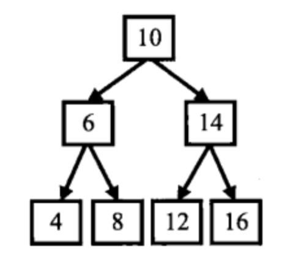

# 数字

## 1，快速找出数组中两个数字，相加等于某特定值的组合
这个算法题的描述如下：快速找出一个数组中的两个数字，让这两个数字之和等于一个给定的值。目前我假设数组中的都是各不相等的整数。

算法描述如下：
（0）首先对原数组进行排序，成为递增数组；
（1）对排序后的数组头部i [0]和数组尾部j [n-1]相加，判断是否等于100，等于100则打印，然后执行（3），否则执行（2）；
（2）如果相加小于100，则i++,j不变。如果相加大于100，则i不变，j--；继续执行（1）；
（3）数组下标i++，j--，继续执行（1）；
（4）当i==j，退出程序。

## 2，二级数据中查找
题目：在一个二维数组中，每一行都按照从左到右递增的顺序排序，每一列都按照从上到下递增的顺序排序。请完成一个函数，输入这样的一个二维数组和一个整数，判断数组中是否含有该整数。

例如，在下面中找数字 7，能找到，则返回 true；找数字 5，找不到，返回 false。

| 1 | 2 | 8 | 9 |
|---|---|---|---|
| 2 | 4 | 9 | 12 |
| 4 | 7 | 10 | 13 |
| 6 | 8 | 11 | 15 |

Todo

## todo，替换空格

### 题目
请实现一个函数，将一个字符串中的每个空格替换成“%20”。例如，当字符串为We Are Happy.则经过替换之后的字符串为We%20Are%20Happy。

### 解法
O(n)的解法

1.先遍历一次字符串，这样就能统计出字符串中空格的总数，并可以由此计算出替换之后的字符串的总长度。
以前面的字符串"We arehappy."为例，"We are happy."这个字符串的长度是14（包括结尾符号'\0'），里面有两个空格，因此替换之后字符串的长度是18。

2.从字符串的后面开始复制和替换。
准备两个指针，P1和P2。P1指向原始字符串的末尾，而P2指向替换之后的字符串的末尾。接下来向前移动指针P1，逐个把它指向的字符复制到P2指向的位置，直到碰到第一个空格为止。接着向前复制，直到碰到第二、三或第n个空格。

# 树

## 树的基本

前序遍历：先访问根结点，再访问左子结点，最后访问右子结点。二叉树的前序遍历是：10、6、4、8、14、12、16

特点：
- 取出的结点中，第一结点就是根结点。
- 根结点后面，先输出所有左子树的结点，然后再输出所有右子树的结点。

中序遍历：先访问左子结点，再访问根结点，最后访问右子结点。二叉树的中序遍历是：4、6、8、10、12、14、16

特点：
- 中序遍历的数据，是按大小顺序取得的。
- 根结点左边的都是它的左子树里的数据，右边的都是他右子树里的数据。左/右子树中的结构，也符合这个规则。
- 先输出左子树的所有结点，再输出根结点，最后输出所有右子树的所有结点。

后序遍历：先访问左子结点，再访问右子结点，最后访问根结点。二叉树的后序遍历是：4、8、6、12、16、14、10

特点：
- 先把左子树里的数据都访问完，再访问右子树里的数据，最后访问根结点。
