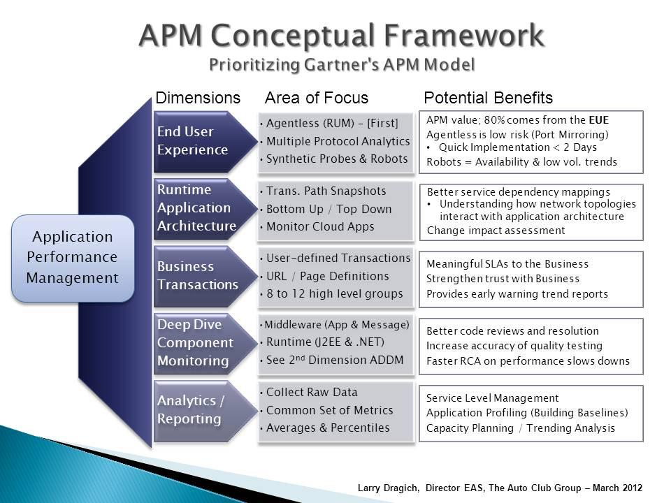

# 一、什么是 APM？
APM（Application Performance Management）即`应用性能管理`。主要是针对`应用性能`和`用户体验`的监测、优化，提高企业IT应用的可靠性和质量，保证用户得到良好的服务。

它是由 Gartner 归纳抽象出的一个`管理模型`。注意，这个管理模型的由来，是经过大量调研与分析后的归纳与抽象，这些切实需求由来已久，IT从业者们对它的理解与实践也几乎是从IT诞生至今就已开始，这并不是一次发明。

# 二、APM 都包含哪些层次？

## 1，End User Experience
这个维度关注的是`终端用户对应用性能的真实体验`。

可能一个电影播放服务的性能优化做得很棒，但是用户打开浏览器或打开APP，发现点播某个电影时却慢得离谱，问题会出在哪里呢?用户不清楚点击播放按钮之后，发生的一切事情，用户只是感知到了慢、不能播放、往复播放等等很多不好的体验，用户反馈了问题或投诉了，产品和研发不能准确重现，问题来了。

也许用户浏览器太过陈旧，也许是某个JS脚本的兼容性问题，也许用户本地网络丢包严重、首字节响应时间很长，也许是服务器集群网络不稳定等待，太多也许了。而这些猜测是，最不好把控的，就是用户客户端环境，Server端好比自家的菜地，菜好菜赖总是清楚的，可再好的菜卖到饭馆，厨子怎么样菜农怎么知道?

帮助应用管理者准确、详尽地了解真实的用户体验是什么样子，这是APM首先要解决的问题。下面是一个从终端用户来了解体验的例子：

## 2，Runtime Application Architecture
这个维度关注的是`运行时应用程序架构`。

这个维度注意两个具体点：
- 完整的性能架构图
- 针对于某次故障请求的真实请求链路拓扑
例如：负载均衡一共分发了N台机器作为集群，但承接某次具体请求的是集群中的某些机器，那么，是哪些机器?它们当时的性能是什么样子?请求顺序是怎样的?

## 3， Deep Dive Component Monitoring
这个维度关注的是`深度`。

**对于开发人员：**
比如接到了上海用户的反馈，登录慢，不响应。这其中可能出现问题的环节太多了：
- CDN可能有问题
- Web Server或DB Server负载可能过高、业
- 代码中可能有bug
- 中间件可能不响应
- 甚至任何一个环节的物理磁盘或物理网卡可能出现了故障，等等

到底是哪个环节出了问题呢？

**对于测试人员：**
一个接口修改后，需要进行性能测试的话：
- 这个接口之前的测试数据是什么
- 旧版本和新版本比较，哪里快了，哪里慢了
- 想了解代码逻辑的话，调用链是怎样的

这里有几个难点：
1. 在不修改用户代码的前提下，取得代码运行时性能数据;
2. 终端用户数据、运行时性能数据、物理指标数据、服务运行指标数据，有效关联;
3. 有太多需关注的点，怎样方便快捷地部署采集端;
4. 不影响或很少影响原应用性能。

## 4，Analytics / Reporting
这个维度关注的是`如何从数据中取得有价值的部分`。

简单地讲，APM对数据有两点要求：
1. 数据处理要及时，必要时候要做到实时的处理，问题可能随时都会发生;
2. 数据的分析报告要精确，大量的数据本身是无价值的，按照业务模型进行精确分析、预测才有其价值体现。(例如：云眼)

## 5，其它
### 机器学习
再有就是利用`机器学习`来提高问题的可预测性。因为 APM 数据是天然的大数据，非常适合使用机器学习来判断问题。例如：阈值的设置和节假目是有关联的，使用历史数据学习得到的动态阈值替代静态阈值，更及时地发现重大隐患或故障。

### 运维自动化
有了准确和稳定的 APM 后，运维自动化工作才能有效的进行。根据指标和报警，来进行服务的动态扩缩容等操作。

# 二、APM 逻辑构成？
## Tracing、Logging 和 Metrics
从逻辑的角度来看，APM 主要由 3 部分构成：
- Tracing
- Logging
- Metrics

### Tracing
Tracing 主要是针对 request，处理 request 相关的信息。例如：
- RPC 调用链的调用关系、各个调用的时间 和 参数 等等。
- 实际执行的 SQL 文本 以及 SQL 执行时间。
- MQ 的消息内容，或生产端和消费端都是谁。

Tracing 算是 APM 的核心，因为很多指标都需要从 Tracing 中的数据来取得。

### Logging
Logging 主要是指各个服务和中间件输出的 event log。可能都是 Error log，但 event 可能会有不同，例如：MQ 的 Error log 和 Service 的 Error log 就是不同的 event。还有，使用 log 来做一些审计相关的处理。

### Metrics
Metrics 主要是对一些数据的聚合。原始数据以`时间段`为单位进行聚合，然后以下面的几种方式来表现出来：
- Counter（记数器）：记录发生的事件的个数。例如：所有请求数、出错请求数。
- Guage（仪表盘）：记录会根据时间进行波动的指标。例如：线程池里线程的个数。
- histogram（柱状图）：recording observations of scalar quantities of events。例如：请求时长。

可以看出，Metrics 更多是和 Tracing 和 Logging 的组合。

## Tracing、Logging 和 Metrics 的组合

## 1，Tracing 和 Metrics
Tracing 和 Metrics 组合是指` Request 相关的 metrics`，例如：
- request duration 的平均值。
- reuqest 的个数。

## 2，Logging 和 Metrics
Logging 和 Metrics 的组合是指`对于 Event 的 Aggregation`。例如，就像我们的云眼，统计每分钟 Error 的个数。

## 3，Tracing 和 Logging
Tracing 和 Logging 的组合是指`Reqeust 相关的 event`。当分析问题时，如果不能从调用链看出问题的所在，可以看看这个 Request 在整个流程中，都发生了什么。例如：使用 trace id 来定位所有 event log。

# 三、相关方都如何使用 APM
## 开发人员
1，调用链。SQL 文本，时间，Redis 时间等。
2，异步调用链。异步接口，或者 MQ。
3，快速定位问题。
- 通过大盘，快速看到现在哪个服务状态有问题。
  - 服务状态是单个机器有问题，还是所有都有问题。
  - 是具体什么问题？进程没有了，还是其它呢？例如：磁盘，内存，还是其它？
- 通过监控查看问题。
  - 应用级监控中，有一个时间的访问时间非常高，或者有一个请求访问时间非常高的话，想知道这是哪个请求。想通过点击这个点，查看这个请求的调用链。

## 测试人员
todo 
## 运维人员
todo 

# 下一步
1，都有哪些开源组件可以使用。为什么使用这些组件。
2，先做哪些功能，后做哪些功能。例如：tracing。
3，tracing 都要做哪些相关功能。
4，其它。