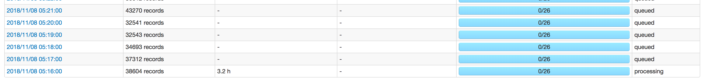
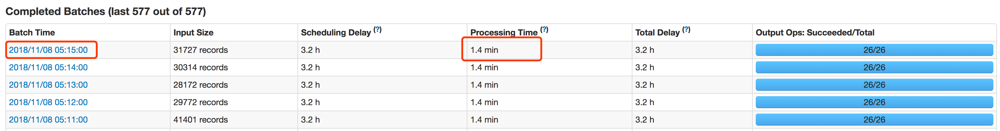
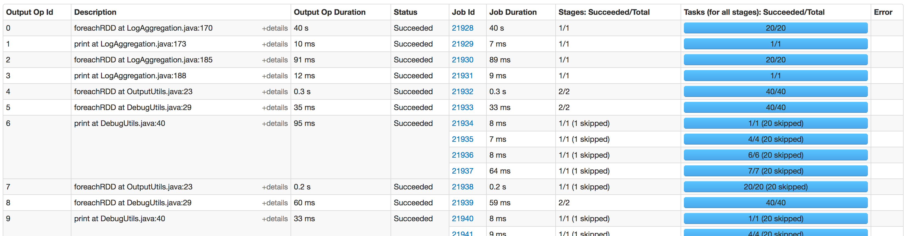

# 一、学习
## 1，安装Spark，并了解基础操作
首先安装上Spark，再执行一下基础操作，就可以了。这里的目的是通过Spark的Shell，了解一下Spark的基础操作。接下来看看文章下面的一些概念和作用什么的就可以，不用看的太细。

- [Spark快速入门指南 - Spark安装与基础使用](http://dblab.xmu.edu.cn/blog/spark-quick-start-guide/)


## 2，了解如何使用Java编写Spark程序
（1）先看一下官方的文档。如果对于不了解Spark的人来说，直接看官方文档可能很难理解，所以在官方文档下面有一个中文版的官方文档。

- [Spark编程指南(官方英文版)](http://spark.apache.org/docs/latest/programming-guide.html#initializing-spark)
- [Spark编程指南(中文版)](https://strongyoung.gitbooks.io/spark-programming-guide/content/)

（2）在看官方文档时，会看到关于RDD中使用Closure的问题，对于这个问题可以看一下下面3个文档来了解一一下。

- [理解Spark中的闭包(closure)](http://blog.csdn.net/u014729236/article/details/46662181)
- [Spark——共享变量](http://www.solinx.co/archives/570)
- [Spark 3. RDD 操作一 基础 ，放入方法，闭包，输出元素, 使用 K-V 工作](http://www.jianshu.com/p/ea41a6d02f34)

（3）在看官方文档时，可能还会看到一些Driver、Node、Partition等词汇。想了解关于Spark的一些基础概念的话，可以看下面的文章。

- [Spark里几个重要的概念及术语](http://blog.csdn.net/oopsoom/article/details/23857949)：这个文章对基本概念作了简单说明。
- [『 Spark 』2. spark 基本概念解析](http://litaotao.github.io/spark-questions-concepts)：这个文章对基本介绍的比较多，而且这个博客的其它博文，对基础概念大部都做了很详细的介绍。可以看看其它的文章。
- [Distributed Systems Architecture](https://0x0fff.com/spark-architecture-shuffle/)：这个文章里有很多关于Spark结构的图，介绍的看起来挺详细的。而文章里还有其它文章的链接，想详细知道的可以看看。
还有一个关于Spark架构的PPT和它的讲演视频：
- [Spark Architecture Video](https://0x0fff.com/spark-architecture-video/)
- [Spark Architecture PPT](https://0x0fff.com/spark-architecture-talk/)

（4）在看官方文档时，会看到一些Map和Reduce的API，下面的文章，让你能快速知道这个API的用法。

- [Spark RDD API详解(一) Map和Reduce](https://www.zybuluo.com/jewes/note/35032)

## 3，启动 spark 方法。
### （1）学习文章
- [运行您的第一个 Spark 应用](http://cwiki.apachecn.org/pages/viewpage.action?pageId=2886790)：装完环境后，测试 spark 环境是否可用
- [Spark集群安装和使用](http://blog.javachen.com/2014/07/01/spark-install-and-usage.html)：spark on yarn
- [YARN 上运行 Spark 应用](http://cwiki.apachecn.org/pages/viewpage.action?pageId=2886869)： spark on yarn 原理

### （2）常用命令
1，上传 jar 到 hdfs
hdfs dfs -put spark-test-1.0-SNAPSHOT.jar hdfs://nameservice1/test/sjp/monitor/spark-test.jar
2，启动 spark
spark2-submit --class test.SparkStreamingServiceDemo5 --deploy-mode cluster --master yarn hdf//nameservice1/test/sjp/monitor/spark-test.jar cloud_aggregation cm_input cm_output 10.31.187.4:9092


# 二、经验
## 1，安装完 YARN 后，安装 Spark 是否还需要 worker？
个人感觉不用。因为原来 Work 的工作，都由 NodeManager 来处理了。
- [Spark(一): 基本架构及原理](https://www.cnblogs.com/tgzhu/p/5818374.html)
- [Spark Standalone架构设计要点分析](http://shiyanjun.cn/archives/1545.html)：对 standalone 模式和原理讲的挺好的。

## 2，停止正在运行在 yarn 上的 spark 程序。
1，使用下面的命令找出对应的 application。`yarn application -list`
2，杀死 application。`yarn application -kill application_1537252157889_00023`
参考：[如何使用 Curl 停止 Spark 中某个正在运行的 Yarn 作业](https://docs.azure.cn/zh-cn/articles/azure-operations-guide/hdinsight/aog-hdinsight-apache-spark-howto-kill-yarn-job-via-curl)

## 3，关于 Spark 程序的打包
15，在打包时，使用 maven-shade-plugin 打包，org.apache.spark group 的依赖设置成 `<scope>provided</scope>`，这些包不用打包，在环境上都有。
jar 大小可以减少很多，包含 spark-core_2.11、spark-streaming_2.11、spark-streaming-kafka-0-10_2.11 的包有 100多M，不包含只有 500K。其它的 jar 还是要包含的。
参考：[利用maven-shade-plugin打包包含所有依赖jar包](https://blog.csdn.net/kezhong_wxl/article/details/77622097)

为了避免每次spark上传很大的依赖包，还可以把大部分依赖放到hdfs上,然后在spark_default中指明spark.yarn.jars到hdfs目录

## 4，本地程序调试，不使用 setMaster
VM options中输入“-Dspark.master=local”

## 5，如何在Windows中使用Intellij idea搭建远程Hadoop开发环境？
https://www.zhihu.com/question/50820730/answer/124755135
https://blog.csdn.net/qq_31806205/article/details/80451743

## 6，spark 设置 hadoop 等配置方法

**1，在程序内部设置（测试过）**
sparkConf.set("spark.hadoop.dfs.replication", "1");

**2，命令行设置（没有测试过）**
spark-submit --conf spark.hadoop.fs.s3a.access.key=value

**3，在程序内，读 hdfs-site.xml 等配置文件（没有测试过）**
基本方法就是把这些文件放到 classpath 下，方法有 2 个。
- 方法1:
把 hdfs-site.xml 文件放到 resources 目录下。
- 方法2:
[Custom Hadoop Configuration for Spark from Python (PySpark)?](https://stackoverflow.com/questions/29571644/custom-hadoop-configuration-for-spark-from-python-pyspark)

更多参考：[Spark Configuration](https://spark.apache.org/docs/latest/configuration.html)

## 7，使用 saveAsHadoopFile 时生产 _SUCCESS 文件问题
使用 saveAsHadoopFile 保存文件时，有时候会产生 _SUCCESS 文件。使用下面的设置就可以不产生这个文件：
> sparkConf.set("spark.hadoop.mapreduce.fileoutputcommitter.marksuccessfuljobs", "false");

参考：[How to avoid _success file in Mapreduce Output Folder.](http://bigdatafindings.blogspot.com/2015/07/how-to-avoid-success-and-log-files-in.html)
我产生 _SUCCESS 文件的原因。


## 8，把 JavaPairDStream 输出到多个文件
（1）如果要输出到多个文件到指定目录，并且指定文件名的话，需要自己实现输出类。这个输出类要继承 MultipleOutputFormat 类。MultipleOutputFormat 是输出到多个文件的类，但如果要输出成我们指定的文件名的话，需要自己实现一些方法。

（2）在输出时，可以使用两个方式：
- Dstream.saveAsHadoopFiles：这种方式加上面的 MultipleOutputFormat 实现类，可以完成我们的需要。但必须还要输出以 "prefix-TIME_IN_MS[.suffix]" 为名字的文件夹，而且是必须输出。
- JavaRDD.saveAsHadoopFiles：可以不必须输出临时文件夹。但要输出一个 _SUCCESS 文件。设置`sparkConf.set("spark.hadoop.mapreduce.fileoutputcommitter.marksuccessfuljobs", "false")` 可以避免输出这个文件。

（3）在输出时，如果要输出到同一个文件中的话，可使用 rdd.coalesce(1) 把数据重新分区。如果 rdd 已经是 reduceByKey 这种已经分区完成的 rdd 的话，并且要按 key 相同的输出到一个文件的话，应该可以不使用  rdd.coalesce(1) 。要注意：如果不同的分区的数据，要交差输出到不同的文件的话，可能会有问题。

coalesce 功能是重新分区，相当于 repartition(x, true)。
```
pair.foreachRDD(rdd->{
    if (rdd.count() != 0) {
        rdd.saveAsHadoopFile("hdfs://localhost:9000/test/", String.class, String.class, RDDMultipleAppendTextOutputFormat.class);
//                rdd.coalesce(1).saveAsHadoopFile("hdfs://localhost:9000/test/", String.class, String.class, RDDMultipleAppendTextOutputFormat.class);

    }

});
```

参考：
- [how to make saveAsTextFile NOT split output into multiple file?](https://stackoverflow.com/questions/24371259/how-to-make-saveastextfile-not-split-output-into-multiple-file)：讲了为什么要使用 rdd.coalesce(1) 
- [spark-streaming多目录追加写](https://blog.csdn.net/ukakasu/article/details/80067068)：参考这个写的 writer 代码。
- [spark streaming 实现根据文件内容自定义文件名，并实现文件内容追加](https://blog.csdn.net/qq_19917081/article/details/56841299)：这个是 java 版本的一个实现。修改的类太多。不像上面那个符合设计要求。

## 9，Idea 开发时常配置的参数
在进行 Idea 开发时，需要配置一些本地开发用的参数。如果这些参数用代码写到程序中，在到生产环境使用时，忘记需要注释掉会很麻烦。所以，把一些参数在 Idea 的`Run/Debug Configurations`中进行设置，不会影响代码。常用配置如下：

### (1)在 VM Option：
- -Dspark.master=local ：设置本地启动
- -Dspark.hadoop.dfs.replication=1 ：设置 hadoop 写的数据的副本为 1 份。一般在自己机器上安装 hadoop 时，都是单 dataNode 的。如果不设置这个，Append 数据时可能会产生一个错误。
- -Dspark.hadoop.fs.default.name=hdfs://localhost:9000 ：设置 Hadoop 的 默认服务名。一般在自己机器上安装 hadoop 时，如果在这里设置些项目的话，使用`hdfs:///xxx`方式的话，会报错。如果写命名`hdfs://nameserver/xxx`的话不会报错，但这样程序的可移植性就低了。

## 10，注意进行 cache
请看下面的代码，下面的代码逻辑很简单：1，生成 pair  2，保存 pair。如果像下面这样做的话，`生成 pair` 代码里面的`System.out.println("pair called");`会输出 4 遍。但如果在`生成 pair`和`保存pair`代码之间加 `pair.cache` 的话，就会只输出 2 遍。这说明，不进行 cache 的话，保存时使用 pair 时候，又进行了一次和`生成 pair`一样的过程。所以要注意使用 cache 功能。

```
// 生成 pair
JavaPairDStream<String, String> pair = messages.map(ConsumerRecord::value)
        .mapToPair(log -> {
            System.out.println("pair called");
                return new Tuple2<>("", "");
            }
        });
// 保存 pair
pair.foreachRDD(rdd->{
    long rddCnt = rdd.count();
    if (rddCnt != 0) {
        rdd.saveAsHadoopFile("", String.class, String.class, CustomClass.class);
    }
});

```

可能又会想，如果把`生成`和`保存`操作，像下面这样连上写，会不会只生成 2 遍呢？经过测试，也会生成 4 遍。所以，要注意进行 cache。
```
// 生成并保存 pair
	messages.map(ConsumerRecord::value)
        .mapToPair(log -> {
            System.out.println("pair called");
                return new Tuple2<>("", "");
            }
        }).foreachRDD(rdd->{
			    long rddCnt = rdd.count();
			    if (rddCnt != 0) {
			        rdd.saveAsHadoopFile("", String.class, String.class, CustomClass.class);
			    }
		});
```


## 11，在 transform 中 print
spark 的设计是在 transform 时，我们想打印 transform 过程中的值。在本地测试时是可以看到的，但在 yarn cluster 模式下，看不到 print 的内容。例如：
```
JavaPairDStream<String, String> servicePair = messages.map(ConsumerRecord::value)
        .filter(log -> log.contains("\"logType\":\"service\""))
        .mapToPair(log -> {
            try {
                // 下面的输出，不会输出到 driver 的 stdout log 中，会输出到 Exectutor Log 中。
                System.out.println("service log:" + log);
                String key = ...省略...;
                return new Tuple2<>(key, ...省略...);
            } catch (Exception e) {
                e.printStackTrace();
                return new Tuple2<>("", "");
            }
        });
```

原因应该是，yarn cluster 收集的 stdout log 是 driver 的输出，不是 Executor 的输出。transform 中的 print 输出，输出到了 Exectutor log 中。想看 Executor log 的话，可以从 spark 的 WebUI 中看到。进入 WebUI 后，选择上面菜单栏中的`Executors`，然后可以看到 Executors 列表。在列表中，最后一列是 log 列，可以选择看 stdout 或 stderr log。

这篇文章 [Spark losing println() on stdout](https://stackoverflow.com/questions/33225994/spark-losing-println-on-stdout) 是 print 看不到相关的一篇文章，点赞最多的回答可能不是正确的，但每个回答下面的评论非常好，可以看看。

## 12，关于 Spark Streaming 中 LocationStrategies 的设置
- LocationStrategies.PreferBrokers()：仅仅在你 spark 的 executor 在相同的节点上，优先分配到存在  kafka broker 的机器上；
- LocationStrategies.PreferConsistent()：大多数情况下使用，一致性的方式分配分区所有 executor 上。（主要是为了分布均匀）
- LocationStrategies.PreferFixed()：如果你的负载不均衡，可以通过这两种方式来手动指定分配方式，其他没有在 map 中指定的，均采用 preferConsistent() 的方式分配；

## 13，什么样的类需要声明 接口？
- 在 Driver 里声明的`类实例`，在 Excecutor 里使用时，这个`类`需要声明 Serializable 接口。
- 不需要实例化的`工具类`，不需要声明 Serializable 接口。
- 每个实例都是在 Executor 上合建的类，不需要声明 Serializable 接口。

参考：
- [Spark 中的序列化陷阱](https://segmentfault.com/a/1190000012353884)
- [Spark中的序列化机制](https://blog.csdn.net/u011491148/article/details/46910803)

## 14，流式统计的几个难点
[流式统计的几个难点](https://segmentfault.com/a/1190000003048757)

## 15，Spark Streaming 数据进行排序
使用 transform 或 transformToPair 进行排序。transform 可以把 rdd 转化成我们想要的类型，所以 transform 方法的 Function 需要返回一个 rdd。注意：这个 Function 是 spark 类包中的接口。
```
JavaPairDStream<Integer,String> sortedStream = swappedPair.transformToPair(
    new Function<JavaPairRDD<Integer,String>, JavaPairRDD<Integer,String>>() { 
     @Override 
     public JavaPairRDD<Integer,String> call(JavaPairRDD<Integer,String> jPairRDD) throws Exception { 
        return jPairRDD.sortByKey(false); 
        } 
}); 
```

## 16，聚合时保存数据里，最小那个时间字段
在聚合时，我们可能会想聚合一类数据，这类数据都有时间字段，聚合后我们想保留此类数据中，最小那个时间。做法如下：

1. 我们把数据转成 pair，把时间字段放到 pair 的 value 里，做为 value 的一部分。例如：Tuple2<Integer, String>，Integer 是要统计的数值。
2. 使用 reduceByKey 聚合数据。
```
.reduceByKey((v1, v2) -> {
    // 保存小的时间
    String smallDate = v1._2.compareTo(v2._2) < 0 ? v1._2 : v2._2;
    return new Tuple2<Integer, String>(
            v1._1 + v2._1, // reduce 个数相加
            smallDate);
});
```

## 17，如果解决数据倾斜
- [Spark性能优化指南——高级篇](http://lxw1234.com/archives/2016/05/663.htm)
- [Spark性能调优](https://www.jianshu.com/p/4c584a3bac7d)
- [超实用的Spark数据倾斜解决姿势，学起来！](https://dbaplus.cn/news-73-1460-1.html)

## 18，Spark Streaming WebUI 使用说明
https://github.com/jaceklaskowski/spark-streaming-notebook/blob/master/spark-streaming-webui.adoc

## 19，aggregate 的理解
[Spark的fold()和aggregate()函数](https://www.jianshu.com/p/15739e95a46e)

## 20，Yarn 的 Executor 的 CPU 和 内存如何设置
- [Spark On YARN内存和CPU分配](https://blog.csdn.net/fansy1990/article/details/54314249)
- 设置 CPU 核数（yarn.nodemanager.resource.cpu-vcores）时，大数据组的方式是设置成：`( CPU core size - 1) * 2`，让程序竞争使用。

## 21，User class threw exception: org.apache.spark.SparkException: Job aborted due to stage failure:  java.io.FileNotFoundException: Too many open files

- 去掉过多的 print。
- 加大内存。
- ~~把 spark.shuffle.manager 设置成 SORT~~ 。 Spark 2.0 Hash Based Shuffle退出历史舞台，只有 SortShuffleManager。
- 修改 partition 数量。用`rdd.getNumPartitions()`查看有多少个 paritition。用`someBigSDF.repartition()`设置 partition 数量。
- 看系统的配置。`/etc/security/limits.conf`中配置了 fd 数量，以 “*” 开头的部分是对所有用户的。再看看其它应用或框架在启动时，有没有设置这些，或者在`/etc/security/limits.d`下加一些配置。
- 注意 CDH 中各个 role 的 `Maximum Process File Descriptors` 是否配置了。这里配置了的话，应该是在系统之上影响 fd 数量。
- [Fixing a “Too many open files” exception](https://www.codacy.com/blog/fixing-a-too-many-open-files-exception/)：这里有些建议，还有看 fd 数量的方法，没有测试这个方法。

自己的修改：
- 内存从 2000 加大到 2500
- 去掉 rdd.print() 等输出

## 22，Spark Streaming job 延迟
### 什么是延迟呢？
假如我们设置成`每 1 分钟执行一次`的话，如果数据在 1 分钟中处理完成，就那算没有延迟。如果 1 分钟内没有完成，那下 1 分钟的数据的处理无法进行（如果发生延迟，上一个时间点的数据处理没有完成，spark 会继续接收下一个时间点的数据，但不会处理数据）。

### 如果判断是否发延迟呢？
是否发生延迟，可以通过 WebUI 的 Streaming 页面中的 `active batches`可以看出。如果`Scheduling Delay`栏里时间超过设置的执行批次的时间，并且有很多 job 的状态是`queued`状态的话，应该是延迟了。



### 如果判断发生延迟的原因？
在 Completed Batches 或 Active Batches 里面，看 Processing Time 多的 batch。然后点`具体的 Batch Time`可以查看执行 job 的时间。


从下面的第一行就可以看出花费了 40s，点击`+details`还可以查看使用是哪部分代码。


这样就可以定位代码了，然后在本地对代码进行修改和测试，是看看是为代码为什么花费时间长，能不能减少。

另外，上图中有的 job 状态是 skipped，这是什么意思呢？这个代表有的 RDD 处理已经使用了 cache，不需要重新计算了。看 RDD 是否使用了 cache，也可以在 transform 中加入 print 代码，然后在本机启动，看看输出多少次 print 代码。如果 3 个 rdd action 处理时，都出现了 transform 中的 print 代码，说明 transform 被执行了多次。

### 解决的问题
#### 1，json 转对象使用大量 cpu，增加 cpu cores
通过上面的方法，判断出是 json 对象转换时花的时间特别多，但每个 container 只给了 2 cores。把 cores 增加到 5 个后，问题没有了。也可以修改 json 对象转换的类，但感觉效率增加不会太多。

#### 2，有时候耗时多，有时候耗时少
在命令行中增加参数：`--conf spark.dynamicAllocation.enabled=false`，禁止自动调整 executor 后好了。因为现在环境是，在 yarn 上运行多个 spark 程序，可能各个程序之间动态调整造成不稳定。

## 23，控制 executor 不自动增长
在 submit 作业时，设置 executor 的数量，但启动后 executor 实际数量比设置的多。这是因为 Spark On YARN 模式的 Spark Application 根据 Task 自动调整 Executor 数，要启用该功能，需做以下操作：
```
spark.dynamicAllocation.enabled true
spark.shuffle.service.enabled true
spark.dynamicAllocation.minExecutors 1 #最小Executor数 
spark.dynamicAllocation.maxExecutors 100 #最大Executor数 
```
> 有文章说还需要配置 yarn.nodemanager.aux-services.spark_shuffle.class，但在 yarn 2.6.0 上，这个配置好像被去掉了。

如果 spark 设置中，设置了可以自动增加的话，它可能就会增长。可两个办法让 executor 不自动增加。

方法1:
在命令行中增加参数：`--conf spark.dynamicAllocation.enabled=false`

方法2:
修改上面的操作，让自动调整不生效。


# Spark
## 一、Spark 与 hadoop
Hadoop有两个核心模块，分布式存储模块HDFS和分布式计算模块Mapreduce。spark本身并没有提供分布式文件系统，因此spark的分析大多依赖于Hadoop的分布式文件系统HDFS。Hadoop的Mapreduce与spark都可以进行数据计算，而相比于Mapreduce，spark的速度更快并且提供的功能更加丰富

## 二、Spark 名词
- Application：Spark中的Application和Hadoop MapReduce中的概念是相似的，指的是用户编写的Spark应用程序，内含了一个Driver功能的代码和分布在集群中多个节点上运行的Executor代码
- Driver Program：Spark中的Driver即运行上述Application的main()函数并且创建SparkContext，其中创建SparkContext的目的是为了准备Spark应用程序的运行环境。在Spark中由SparkContext负责和ClusterManager通信，进行资源的申请、任务的分配和监控等；当Executor部分运行完毕后，Driver负责将SparkContext关闭。通常用SparkContext代表Driver
- Executor：Application运行在Worker节点上的一个进程，该进程负责运行Task，并且负责将数据存在内存或者磁盘上，每个Application都有各自独立的一批Executor。在Spark
 on Yarn模式下，其进程名称为CoarseGrainedExecutorBackend，类似于Hadoop MapReduce中的YarnChild。一个CoarseGrainedExecutorBackend进程有且仅有一个executor对象，它负责将Task包装成taskRunner，并从线程池中抽取出一个空闲线程运行Task。每个CoarseGrainedExecutorBackend 能并行运行Task的数量就取决于分配给它的CPU的个数了
       
- Cluster Mananger：指的是在集群上获取资源的外部服务，目前有：
  * Standalone：Spark原生的资源管理，由Master负责资源的分配；
  * Hadoop Yarn：由YARN中的ResourceManager负责资源的分配；
       
- Worker：集群中任何可以运行Application代码的节点，类似于YARN中的NodeManager节点。在Standalone模式中指的就是通过Slave文件配置的Worker节点，在Spark
 on Yarn模式中指的就是NodeManager节点     
- Job：包含多个Task组成的并行计算，往往由Spark Action催生，一个JOB包含多个RDD及作用于相应RDD上的各种Operation
- Stage：每个Job会被拆分很多组Task，每组任务被称为Stage，也可称TaskSet，一个作业分为多个阶段     
- Task：被送到某个Executor上的工作任务

## 三、Spark 架构
spark 架构都是 Driver 通过 Cluster Manager 申请资源（Executor），然后 Driver 直接和 Executor 进行通信，Driver 分配 Task 给 Exectuor 去执行。

例如，下图就是前面说明的流程。SparkContext 就是 Driver，Driver 先去资源管理器（也就是 Cluster Manager）申请资源。Cluster Manager 分配它所管理的资源。然后资源直接和 Driver 进行通信，向 Driver 注册并申请 Task 进行执行。


<br>
Cluster Manager 的主要作用就是分配资源，分配完资源后，资源就直接和 Driver 进行工作。这种架构的好处是，Cluster Manager 是可以替换的，可以使用 Spark 自带的 Cluster Manager、Yarn、Mesos 等 Cluster Manager。下图就是架构的概括图，根据不同的 Cluster，各个部分的名称也不一样，稍后介绍每个 Cluster 。


这种架构的特点是：
- 每个Application获取专属的executor进程，该进程在Application期间一直驻留，并以多线程方式运行Task。这种Application隔离机制是有优势的，无论是从调度角度看（每个Driver调度他自己的任务），还是从运行角度看（来自不同Application的Task运行在不同JVM中），当然这样意味着Spark Application不能跨应用程序共享数据，除非将数据写入外部存储系统。
- Spark与资源管理器无关，只要能够获取executor进程，并能保持相互通信就可以了
提交SparkContext的Client应该靠近Worker节点（运行Executor的节点），最好是在同一个Rack里，因为Spark Application运行过程中SparkContext和Executor之间有大量的信息交换。
- Task采用了数据本地性和推测执行的优化机制

### 1，Spark standalone
Standalone模式使用Spark自带的资源调度框架，采用Master/Slaves的典型架构，选用ZooKeeper来实现Master的HA。框架结构图如下:


独立集群管理器支持两种部署模式。在这两种模式中，应用的驱动器程序运行在不 同的地方。
- 在客户端模式中(默认情况)，驱动器程序会运行在你执行 spark-submit 的机 器上，是 spark-submit 命令的一部分。这意味着你可以直接看到驱动器程序的输出，也 可以直接输入数据进去(通过交互式 shell)，但是这要求你提交应用的机器与工作节点间有很快的网络速度，并且在程序运行的过程中始终可用。
- 在集群模式下，驱动器程序会作为某个工作节点上一个独立的进程运行在独立集群管理器内部。它也会连接主节点来申请执行器节点。在这种模式下，spark-submit 是“一劳永逸”型，你可以在应用运行时关掉你的电脑。

你还可以通过集群管理器的网页用户界面访问应用的日志。向 spark- submit 传递 --deploy-mode cluster 参数可以切换到集群模式。

这种架构的具体的执行流程如下：


1. SparkContext连接到Master，向Master注册并申请资源（CPU Core 和Memory）
2. Master根据SparkContext的资源申请要求和Worker心跳周期内报告的信息决定在哪个Worker上分配资源，然后在该Worker上获取资源，然后启动StandaloneExecutorBackend；
3. StandaloneExecutorBackend向SparkContext注册；
4. SparkContext将Applicaiton代码发送给StandaloneExecutorBackend；并且SparkContext解析Applicaiton代码，构建DAG图，并提交给DAG Scheduler分解成Stage（当碰到Action操作时，就会催生Job；每个Job中含有1个或多个Stage，Stage一般在获取外部数据和shuffle之前产生），然后以Stage（或者称为TaskSet）提交给Task Scheduler，Task Scheduler负责将Task分配到相应的Worker，最后提交给StandaloneExecutorBackend执行；
5. StandaloneExecutorBackend会建立Executor线程池，开始执行Task，并向SparkContext报告，直至Task完成
6. 所有Task完成后，SparkContext向Master注销，释放资源

### Spark on Yarn
Spark on YARN模式根据Driver在集群中的位置分为两种模式：一种是YARN-Client模式，另一种是YARN-Cluster（或称为YARN-Standalone模式）。Yarn-Client模式中，Driver在客户端本地运行，这种模式可以使得Spark Application和客户端进行交互，因为Driver在客户端，所以可以通过webUI访问Driver的状态，默认是http://hadoop1:4040访问，而YARN通过http:// hadoop1:8088访问。

#### YARN-client


1. Spark Yarn Client向YARN的ResourceManager申请启动Application Master。同时在SparkContent初始化中将创建DAGScheduler和TASKScheduler等，由于我们选择的是Yarn-Client模式，程序会选择YarnClientClusterScheduler和YarnClientSchedulerBackend
2. ResourceManager收到请求后，在集群中选择一个NodeManager，为该应用程序分配第一个Container，要求它在这个Container中启动应用程序的ApplicationMaster，与YARN-Cluster区别的是在该ApplicationMaster不运行SparkContext，只与SparkContext进行联系进行资源的分派
3. Client中的SparkContext初始化完毕后，与ApplicationMaster建立通讯，向ResourceManager注册，根据任务信息向ResourceManager申请资源（Container）
一旦ApplicationMaster申请到资源（也就是Container）后，便与对应的NodeManager通信，要求它在获得的Container中启动CoarseGrainedExecutorBackend，CoarseGrainedExecutorBackend启动后会向Client中的SparkContext注册并申请Task
4. client中的SparkContext分配Task给CoarseGrainedExecutorBackend执行，CoarseGrainedExecutorBackend运行Task并向Driver汇报运行的状态和进度，以让Client随时掌握各个任务的运行状态，从而可以在任务失败时重新启动任务
5. 应用程序运行完成后，Client的SparkContext向ResourceManager申请注销并关闭自己

#### YARN-Cluster
在YARN-Cluster模式中，当用户向YARN中提交一个应用程序后，YARN将分两个阶段运行该应用程序：
- 第一个阶段是把Spark的Driver作为一个ApplicationMaster在YARN集群中先启动；
- 第二个阶段是由ApplicationMaster创建应用程序，然后为它向ResourceManager申请资源，并启动Executor来运行Task，同时监控它的整个运行过程，直到运行完成


1. Spark Yarn Client向YARN中提交应用程序，包括ApplicationMaster程序、启动ApplicationMaster的命令、需要在Executor中运行的程序等。
2. ResourceManager收到请求后，在集群中选择一个NodeManager，为该应用程序分配第一个Container，要求它在这个Container中启动应用程序的ApplicationMaster，其中ApplicationMaster进行SparkContext等的初始化。
3. ApplicationMaster向ResourceManager注册，这样用户可以直接通过ResourceManage查看应用程序的运行状态，然后它将采用轮询的方式通过RPC协议为各个任务申请资源，并监控它们的运行状态直到运行结束。
4. 一旦ApplicationMaster申请到资源（也就是Container）后，便与对应的NodeManager通信，要求它在获得的Container中启动CoarseGrainedExecutorBackend，CoarseGrainedExecutorBackend启动后会向ApplicationMaster中的SparkContext注册并申请Task。这一点和Standalone模式一样，只不过SparkContext在Spark Application中初始化时，使用CoarseGrainedSchedulerBackend配合YarnClusterScheduler进行任务的调度，其中YarnClusterScheduler只是对TaskSchedulerImpl的一个简单包装，增加了对Executor的等待逻辑等
5. ApplicationMaster中的SparkContext分配Task给CoarseGrainedExecutorBackend执行，CoarseGrainedExecutorBackend运行Task并向ApplicationMaster汇报运行的状态和进度，以让ApplicationMaster随时掌握各个任务的运行状态，从而可以在任务失败时重新启动任务。
6. 应用程序运行完成后，ApplicationMaster向ResourceManager申请注销并关闭自己。

#### Yarn Client 和 Yarn Cluster 区别
理解YARN-Client和YARN-Cluster深层次的区别之前先清楚一个概念：Application Master。在YARN中，每个Application实例都有一个ApplicationMaster进程，它是Application启动的第一个容器。它负责和ResourceManager打交道并请求资源，获取资源之后告诉NodeManager为其启动Container。从深层次的含义讲YARN-Cluster和YARN-Client模式的区别其实就是ApplicationMaster进程的区别。
- YARN-Cluster模式下，Driver运行在AM(Application Master)中，它负责向YARN申请资源，并监督作业的运行状况。当用户提交了作业之后，就可以关掉Client，作业会继续在YARN上运行，因而YARN-Cluster模式不适合运行交互类型的作业。
- YARN-Client模式下，Application Master仅仅向YARN请求Executor，Client会和请求的Container通信来调度他们工作，也就是说Client不能离开。

### Spark Standalone 和 Spark on Yarn 区别
相同点：
- Client 模式下，Driver 在启动命令的本机上。
- Cluster 模式下，Driver 是在 Cluster Manager 管理的结点上（Spark 的 Worker 或 Yarn 的 Node Manager）。

不同点：
- Cluster Manager 和 资源结点：
  * Spark Standalone 架构上，Cluster Manager 叫做 `Master`，资源结点叫做`Worker`。
  * Spark on Yarn 架构上，Cluster Manager 叫做 Resource Manager，资源结点叫做`NodeManager`。


参考：
[Spark(一): 基本架构及原理](https://www.cnblogs.com/tgzhu/p/5818374.html)：这个最全，把 spark 架构、standalone、spark on yarn 架构结构都说了。
[Spark的运行架构分析（一）之架构概述](https://blog.csdn.net/Gamer_gyt/article/details/51822765)：第一篇文章拿出来一部分，加上自己的理解和讲解。
[深入理解spark之架构与原理](https://my.oschina.net/sunzy/blog/1617071)：第一篇文章拿出来一部分，加上自己的理解和讲解。


# Spark Job, Stage, Task
# 前提
>正在做 Spark 程序，但对 Job、Stage、Task 等还不算了解，上网找了一些文章，自己把这些文章中的东西总结一下，方便自己记忆。


什么是 Job，Stage 和 Task 呢？单单进行说明，不是很好理解，下面根据程序进行一下说明。程序如下：

**1，程序功能**
输入的字符串，按空格进行切割，然后统计每个单词的个数。也就是经典的`WordCounting`。

**2，程序流程**
- 1，输出字符串
- 2，进行按空格切割，生成 pair，最后进行统计每个单词数量
- 3，收集然后进行输出

**3，程序代码**
```

import org.apache.spark.SparkConf;
import org.apache.spark.api.java.JavaPairRDD;
import org.apache.spark.api.java.JavaRDD;
import org.apache.spark.api.java.JavaSparkContext;
import scala.Tuple2;

import java.util.Arrays;

public class HelloWorld {
    public static void main(String[] args) {

        SparkConf conf = new SparkConf().setAppName("HelloWorld");
        JavaSparkContext sc = new JavaSparkContext(conf);
        // 1，输出字符串
        JavaRDD<String> lines = sc.parallelize(Arrays.asList("pandas", "i like pandas"));
        // 2，进行按空格切割，生成 pair，最后进行统计每个单词数量
        JavaPairRDD<String, Integer> wordsPairs = lines
                .flatMap(
                        line -> Arrays.asList(line.split(" ")).iterator())
                .mapToPair(
                        word -> new Tuple2<String, Integer>(word, 1))
                .reduceByKey(
                        (x, y) -> x + y);
        // 3，收集然后进行输出
        wordsPairs.foreach(wordPair -> System.out.println(wordPair));

    }
}
```

# 一、关于 Job？
## 1，Job 是什么？
可以认为是 Spark RDD 里面的 action，每个 action 会生成一个 job 。在上面的代码中只有一个 action：
> wordsPairs.foreach();

如果我们在加一个`wordsPairs.foreach()`，那么就会有两个 action，也就是会有两个 job。

> 注意：foreachRDD 也是 action。 

## 2，Job 在哪里可以看到
在 Spark WebUI 的 jobs 栏里可以看到，每一个 Job 都是一行。如下图：


## 二、关于 Stage
### 1，什么是 stage？
stage 是从 job 划分出来的。每个 job 可能会划分成多个 stage，这些 stage 按一定顺序执行。例子中，会划分成两个 stage：
- stage 1：`1，输出字符串`和`2，进行按空格切割，生成 pair，最后进行统计每个单词数量`，会被划分成 stage 1。
- stage 2：`3，收集然后进行输出`会被划分成 stage 2。

为什么会被划分成 2 个 stage 呢？在这前，我们需要了解一下关于 RDD 的一些知识。

### 2，关于 RDD 的依赖
RDD 之间是有依赖关系的，每个 RDD 可能是通过其它 RDD 生成的。例如：代码中的 wordPairs RDD 就是通过 lines 生成的。
 
RDD 依赖的分类主要分为两类：
- 窄依赖（也叫narrow依赖）
- 宽依赖（也叫shuffle依赖/wide依赖）

**窄依赖（也叫narrow依赖）**
窄依赖指父RDD的每一个分区最多被一个子 RDD 的分区所用，表现为：（分别对应下图左部的上、下两个图例）
- 一个父 RDD 的分区对应于一个子 RDD 的分区
- 两个父 RDD 的分区对应于一个子 RDD 的分区。

map、filter、union 都属于窄依赖。

**宽依赖（也叫shuffle依赖/wide依赖）**
从父RDD角度看：一个父 RDD 被多个子 RDD 分区使用。父RDD的每个分区可以被多个子 RDD分区依赖。

从子RDD角度看：依赖上级RDD的所有分区，无法精确定位依赖的父 RDD 分区，相当于依赖所有父分区（例如reduceByKey）。如下图右边部分。

groupByKey 等属于宽依赖。
> 宽依赖都需要“混洗”（shuffle），所以也叫 shuffle 依赖


### 3，为什么要分成`窄依赖`和`宽依赖`
Spark之所以将依赖分为`窄依赖`和`宽依赖`：

(1) `窄依赖`可以支持在同一个集群Executor上，以pipeline管道形式顺序执行多条命令，例如在执行了map后，紧接着执行filter。分区内的计算收敛，不需要依赖所有分区的数据，可以并行地在不同节点进行计算。所以它的失败恢复也更有效，因为它只需要重新计算丢失的parent partition即可，

(2) `宽依赖` 则需要所有的父分区都是可用的，必须等RDD的parent partition数据全部ready之后才能开始计算，可能还需要调用类似MapReduce之类的操作进行跨节点传递。从失败恢复的角度看，`宽依赖` 牵涉RDD各级的多个parent partition。


### 4，如何划分 stage
#### （1）划分 stage 的方法
先根据` transformation 操作` 还是 `action 操作`划分。对于` transformation 操作`，再根据`窄依赖`还是`宽依赖`再进行划分。
> DAGScheduler: 根据Job构建基于Stage的DAG（Directed Acyclic Graph有向无环图)，并提交Stage给TaskScheduler。

总结下：
- 对于 transformation 操作，以`宽依赖`为分隔，分为不同的 Stages。宽依赖会划分到第后面的 stage 里。
  * 窄依赖：tasks会归并在同一个stage中，（相同节点上的task运算可以像pipeline一样顺序执行，不同节点并行计算，互不影响）
  * 宽依赖：前后拆分为两个stage，前一个stage写完文件后下一个stage才能开始
- 对于 action 操作：和其他tasks会归并在同一个stage（在没有shuffle依赖的情况下，生成默认的stage，保证至少一个stage）。

#### （2）划分结果
所以上面的程序中的过程，可以分成两个 stage ：
- stage 0：parallelize、flatMap 和 mapToPair 。这些都是`窄依赖`
- stage 1：reduceByKey 和 foreach。reduceByKey 是`宽依赖`所以分到第后面的 stage 里，因为 foreach 前有 reduceByKey 的 stage，所以放到这个 stage 里。

首先 Stage0 进行了shuffle write。如果设置了 partition，那么就会根据 parition 的数量生成 task，task 互相独立，并不需要依赖彼此做完或者怎样，所以他们在一个stage里面并发执行。
然后 stage1 是依赖之前的 stage0 完成 shuffle 的，reduceByKey开始需要 ShuffleRead stage0的计算结果。

具体例子参考：[Spark基础入门（二）--------DAG与RDD依赖](https://blog.csdn.net/silviakafka/article/details/54574653)。这个文章中的说明和小例子都很好。本文很多都是 copy 这个文章。


#### （3）其它细节
**1）依赖划分**
实际应用提交的Job中RDD依赖关系是十分复杂的，依据这些依赖关系来划分stage自然是十分困难的，Spark此时就利用了前文提到的依赖关系，调度器从DAG图末端出发，逆向遍历整个依赖关系链，遇到`宽依赖`就断开，遇到`窄依赖`就将其加入到当前stage。stage中task数目由stage末端的RDD分区个数来决定，RDD转换是基于分区的一种粗粒度计算，一个stage执行的结果就是这几个分区构成的RDD。

**2）依赖数据存储**
另外，由于`宽依赖`必须等 RDD 的 `父 RDD partition 数据`全部准备好之后才能开始计算，因此 spark 的设计是让`父 RDD`将结果写在本地，完全写完之后，通知后面的RDD。后面的RDD则首先去读之前的本地数据作为input，然后进行运算。

由于上述特性，将shuffle依赖就必须分为两个阶段(stage)去做：
- 第一个阶段(stage)需要把结果shuffle到本地，例如reduceByKey，首先要聚合某个key的所有记录，才能进行下一步的reduce计算，这个汇聚的过程就是shuffle
- 第二个阶段(stage)则读入数据进行处理。

同一个 stage 里面的 task 是可以并发执行的，下一个 stage 要等前一个 stage 都做完。（和mapreduce的reduce需要等map过程是一样的）

**为什么要写在本地**
后面的RDD多个partition都要去读这个信息，如果放到内存，如果出现数据丢失，后面的所有步骤全部不能进行，违背了之前所说的需要parent RDD partition数据全部ready的原则。为什么要保证parent RDD要ready，如下例，如果有一个partition未生成或者在内存中丢失，那么直接导致计算结果是完全错误的：

写到文件中更加可靠。Shuffle会生成大量临时文件，以免错误时重新计算，其使用的本地磁盘目录由spark.local.dir指定，缓存到磁盘的RDD数据。最好将这个属性设定为访问速度快的本地磁盘。可以配置多个路径到多个磁盘，增加IO带宽

在Spark 1.0 以后，SPARK_LOCAL_DIRS(Standalone, Mesos) or LOCAL_DIRS (YARN)参数会覆盖这个配置。比如Spark On YARN的时候，Spark Executor的本地路径依赖于Yarn的配置，而不取决于这个参数。

## 三，关于 Task
Task 就是被送到 executor 上的工作单元。每个Job会被拆分成`多组Task`， 作为一个TaskSet， 也就是 Stage。

一般来说，一个 rdd 有多少个 partition，就会有多少个 task，因为每一个 task 只是处理一个 partition 上的数据。Task简单的说，就是在一个数据 partition 上的单个数据处理流程。 例如：

> TASKSedulter: 将TaskSET提交给worker运行，每个Executor运行什么Task就是在此处分配的。TaskScheduler维护所有TaskSet，当Executor向Driver发生心跳时，TaskScheduler会根据资源剩余情况分配相应的Task。另外TaskScheduler还维护着所有Task的运行标签，重试失败的Task。

 Spark上分为2类task。
 - ShuffleMapTask：根据`宽依赖`中的`分区算法（partition）`，把 RDD 中的数据分到不同的分区上的 Task。
 - ResultTask：把结果发回给 Driver 的 Task。


## 四、关于 Partition
在从 stage 划分 task 时，是根据 partition 的数量分成多少个 task。这些 task 的都是同类型的 task，也就是说处理逻辑是相同的。分成多个 task 的目的是处理不同的数据，不同数据的划分就是根据 partition 来划分的。

我们可以指定 `分区数量`和`具体的分区实现`来进行分区：
- 指定`分区数量`：noParLines.repartition(2)
- `具体的分区实现`：省略。

**但是，当我们使用上面的方式指定分区时，分区数量是多少呢？**
spark 是从`spark.default.parallelism`这个配置具体的分区数量。但这个值是如何设置的呢？
如果配置文件spark-default.conf中没有显示的配置，则按照如下规则取值：
- 本地模式（不会启动executor，由SparkSubmit进程生成指定数量的线程数来并发）：
  * spark-shell                              spark.default.parallelism = 1
  * spark-shell --master local[N] spark.default.parallelism = N （使用N个核）
  * spark-shell --master local      spark.default.parallelism = 1
- 伪集群模式（x为本机上启动的executor数，y为每个executor使用的core数，z为每个 executor使用的内存）
  * spark-shell --master local-cluster[x,y,z] spark.default.parallelism = x * y
- mesos 细粒度模式
  * Mesos fine grained mode  spark.default.parallelism = 8
- 其他模式（这里主要指yarn模式，当然standalone也是如此）
  * Others: total number of cores on all executor nodes or 2, whichever is larger。 也就是 spark.default.parallelism =  max（所有executor使用的core总数， 2）


**Partition数量影响及调整**
上面分析了决定Partition数量的因数，接下来就该考虑Partition数量的影响以及合适的值。
- Partition数量的影响
  * Partition数量太少。太少的影响显而易见，就是资源不能充分利用，例如local模式下，有16core，但是Partition数量仅为8的话，有一半的core没利用到。
  * Partition数量太多。太多，资源利用没什么问题，但是导致task过多，task的序列化和传输的时间开销增大。
  * 
那么多少的partition数是合适的呢，这里我们参考spark doc给出的建议，[Typically you want 2-4 partitions for each CPU in your cluster](http://spark.apache.org/docs/latest/rdd-programming-guide.html)。

Partition调整 
- repartition：reparation是coalesce(numPartitions, shuffle = true)，repartition不仅会调整Partition数，也会将Partitioner修改为hashPartitioner，产生shuffle操作。
- coalesce：coalesce函数可以控制是否shuffle，但当shuffle为false时，只能减小Partition数，无法增大。

参考：
- [Spark RDD的默认分区数：（spark 2.1.0）](https://www.jianshu.com/p/4b7d07e754fa)
- [Spark RDD之Partition](https://blog.csdn.net/u011564172/article/details/53611109)


# 参考
- [Spark基础入门（二）--------DAG与RDD依赖](https://blog.csdn.net/silviakafka/article/details/54574653)：本文很多内容都 copy 这上面的，讲的很好。
- [Spark中job、stage、task的划分+源码执行过程分析](https://blog.csdn.net/hjw199089/article/details/77938688)：这个也很不错，有具体的例子，还有代码、WebUI、Log 的对应关系的说明。
- [Spark DAG之划分Stage](https://blog.csdn.net/u011564172/article/details/70172178)：也是一个例子，没有上面两个好，但是有多个 RDD 的`宽依赖`，也有可参考的地方。
- [『 Spark 』6. 深入研究 spark 运行原理之 job, stage, task](http://litaotao.github.io/deep-into-spark-exection-model)
- [Spark作业调度中stage的划分](https://wongxingjun.github.io/2015/05/25/Spark%E4%BD%9C%E4%B8%9A%E8%B0%83%E5%BA%A6%E4%B8%ADstage%E7%9A%84%E5%88%92%E5%88%86/)

关于 partition：
- [Spark RDD的默认分区数：（spark 2.1.0）](https://www.jianshu.com/p/4b7d07e754fa)
- [Spark RDD之Partition](https://blog.csdn.net/u011564172/article/details/53611109)

