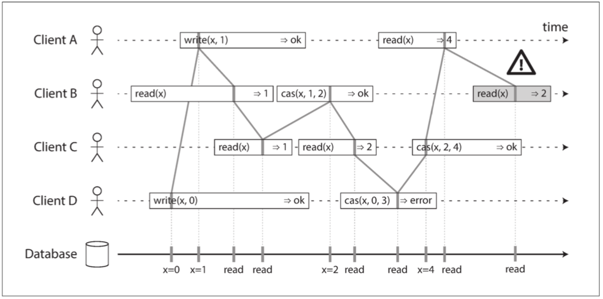

第九章
主要讲了：线性一致性，因果一致性，以及与它们相关的全序和偏序的定义。
还讲了：全序广播，主要使用在复制备份上。
然后讲了线性一致性和全序广播之间的关系，如何使用一个实现另一个。

先讲了而线性一致性，因为线性一致性有很强的保证，像 leader 选举、原子 CAS 操作、唯一性保证等很多地方都依赖于`线性一致性`的保证。

然后讲了因果一致性。因为很多地方不线性一致性那么强的保证，因果一致性有时候也是一个选择。因为因果一致性不是全序的，所以要想办法识别**两个操作的因果顺序**。Lamport timestamps 就是用来解决识别操作因果顺序的方法。

虽然 Lamport timestamps 定义了一个与因果一致的全序，但它还不足以解决分布式系统中的许多常见问题，例如：解决`唯一性`问题。所以又讲了`全序广播`。讲`全序广播`解决`唯一性`的例子时，是使用`全序广播`实现了`线性一致性`。比 Lamport timestamps 实现的`因果一致`的全序要强。（但`全序广播`主要还是用来做**复制 replication**的）

分布式事务与共识（Distributed Transactions and Consensus）
先说了共识非常重要的两个场景：领导选举 和 原子提交。

然后讲了`单节点的原子提交`是如何做的，很容易。但`多节点的原子提交`，就不能像`单节点`那样发一个命令就完了，因为有很多意外会发生。`多节点的原子提交`为了保证`原子性`，需要保证都完成，或都不完成，所以有了`2PC`和`3PC`协议。

2PC 的`协调者`的 Commit Phase，是`单节点的原子提交`的实现关键点：因为一旦到了这个 Phase，谁都不能 rollback，必须执行到底，直到 commit。

后来有了 3PC，3PC 的出现是为了解决 2PC 的问题：就是`协调者`和`参与者`都可能会卡死，而且无法为其它请求提供服务。但 3PC 也会有问题，就是无法保证`原子提交`了。

分布式事务的实践

一些分布式`数据库集群`（即在其标准配置中使用 Replication 和 Partition 的数据库），支持数据库节点之间的内部事务。但还有一些系统使用了多种数据库，为了异构系统支持`原子提交`，很多数据库都提供了 XA API，来实现类似 2PC 的`原子提交`。

但 XA 协议缺点问题也很大（很多都是 2PC 的问题）：
- 协调者单点问题
- 从`无状态服务`变成`有状态服务`。协调者需要把 log 保存到本地。
- 协调者或参与者其中一个 crash 后，其它的角色可能无法提供服务。
- 事务需要`所有参与者`都响应，很难创建`容错系统`

> 把上面的问题总结一下，可以总结成：
> - `协调者`单点问题。
> - `协调者`和`所有参与者`当中，有一个出问题，都进行不下去。

容错共识
因为 2PC 算法和 XA 协议的`需要所有参与者都响应`，所以比较难创建`容错系统`。然后就出现了`共识`。`共识`除了有 safety 属性外，还增加了 liveness 属性（在`共识`中被称为`终止`属性）：由所有未崩溃的节点来最终决定值。**`终止`属性正式形成了`容错`的思想**。这也是和`原子提交`和`全序广播`不同的地方。

其实共识算法和全序广播的属性，有很多类似的地方，所以可以互相转化。因为性能问题，很多系统都是用全序广播来实现的共识算法。

但全序广播和共识相比，有单点和脑裂问题。对于单点问题，可以使用`主备切换`，还可以使用`Leader 选举`。对于脑裂问题，为了解决两个 Leader 造成写不一致问题，使用`时代编号`和`法定人数`来解决这个问题。这些问题都解决后，就完成了`共识算法`（实现上其实是一个`容错的全序广播`）。

> 共识算法好像没有说“数据是否丢失”的问题。

fault-tolerant total order broadcast, 就是加入了共识机制的全序广播

| 特点 | 2PC | 共识 |
| --- | --- | --- |
| Leader 产生方式 | 指定 或 发出事务的人成为 Leader | 选举产生 |
| 参与者响应方式 | 所有参与都要响应 | 多数参与者响应 |
| 恢复 | 无恢复机制 | 在新 Leader 产生后，所有节点会进入一致状态 |

2PC、全序广播、共识的区别。

`共识`意味着以这样一种方式决定某件事：1，所有节点一致同意所做决定，2，且这一决定不可撤销。通过深入挖掘，结果我们发现很广泛的一系列问题实际上都可以归结为共识问题，并且彼此等价。
回顾看看那些可以用共识解决的问题，是不是都符合这两条。

看 ZAB 原子广播，再联系一下上面的讲的`共识`和`原子广播`

正在看`线性一致性`，看看共识算法是如何实现线性一致性的。
https://zhuanlan.zhihu.com/p/42239873
https://juejin.im/post/5bcd790a518825779c21a059
顺序说一下，先了解什么是一致性问题，一致性问题是：在分布式系统中指的是副本（Replication）问题中对于同一个数据的多个副本，其对外表现的数据一致性，如线性一致性、因果一致性、最终一致性等，都是用来描述副本问题中的一致性的。
所以，各种一致性都是针对**不同复本**的。第九章中的两个图，显示是一个DB，有点让初学者误解。 

什么是 FLP？
什么是 两阶段锁定（2PL）？
viewstamped replication 是什么？

****** 记录各种一致性 ************
3，看看线性一致性的实现：可以采用 Active Replication 或 Chain-replication 的系统模型。

1，什么是 Version Vector？
2，Lamport timestamps 为什么需要把对用户名的修改操作，都收集到后才能进行判断？因为它是一个节点一个节点修改的原因？
3，Lamport timestamps 和 Version Vector 有什么区别？
4，为什么其它的机制无法在`分布式`上实现`全序`或`因果`，Lamport timestamps 可以？
5，为什么 Lamport timestamps 解决不了的问题，Total Order Broadcast 就可以解决？Lamport timestamps 的问题，在做唯一性决定时，需要去是`多个 Node`询问，是不是有这种操作。Total Order Broadcast 为什么能解决这个问题，他不需要去`多个 Node`询问吗？
6，Lamport timestamps 是全序的。因为是全用 counter 比较，counter 相同时用进程号进行比较。

# 第八章
主要讲了分布式系统中会产生的问题。

1，首先讲单机系统当发生问题时，是如何处理的（出现问题就停止处理）。但这种方式放到分布式系统上，可能就不太好用了，分布式系统经常出现`部分失效（partial failure）`。原因是分布式系统不确定性太多。不确定性如下：
- 不可靠的网络
- 不可靠的时钟
- 分布式系统中如何定义`真`，并且会发生`假`的问题。

2，然后对每个不确定性都进行详细的说明：

- 网络不可靠
  - 现实中的网络错误
  - 超时与无穷的延迟：
  - 网络拥塞和排队：网络上经常会发生这种情况。
  - 同步和异步网络：现中的同步和异步网络都用在哪些地方。为什么同步网络是实现起来非常困难的。

- 不可靠的时钟
  - 单调时钟（Monotonic Versus）和普通时钟的区别。
  - 时钟同步与准确性：计算机中的石英钟不够精确，它会漂移（drifts）（运行速度快于或慢于预期）
  - 依赖同步时针产生的问题：Last Writing Win
  - 暂停进程会造成`租约（lease）过期`问题：持有`租约`的机器因为 GC 等原因，没有及时更新`租约`，造成多主问题。

- 分布式系统中的`真和假`
  - 由多数定义的`真`：当多数：分布式系统不能完全依赖单个节点，因为节点可能随时失效，可能会使系统卡死，无法恢复。相反，许多分布式算法都依赖于法定人数，即在节点之间进行投票：决策需要来自多个节点的最小投票数，以减少对于某个特定节点的依赖。
  - 拜占庭故障（Byzantine Faults）：什么是拜占庭故障，什么情况下分产生这种问题，在什么情况下不需要关心这个问题。
  - 系统模型（System Model）和实际情况：说明了关于上面的`不可靠的网络`和`不可靠时钟`对应的几种`系统模型`和`算法`，还有`算法正确性`问题。最说明了`系统模型`、`算法`和实现情况之间的差距，和他们的必要性。

# 第九章
这章主要是讲`一致性（Consistency）`和`共识（consensus）`问题。一致性（Consistency）问题是从因为什么问题引申出来的呢？
是由`复本（Replication）`问题引申出来的。为了保持高可用，所以使用了`多复本`机制。但是否需要保证`复本`数据一致，或者如何保证`复本`数据一致呢？这就引出了`一致性（Consistency）`问题。

但本章的更深层次，是在讲"如何在实现`一些保证机制`基本上，找到`分布式的一些抽象`"。也就是说，我们的`抽象`要满足这些`保证机制`（例如，`一致性`就是一个基础的，需要被实现`保证机制`）。有了这些后，我们就知道在哪些情况下，什么可以做到，什么做不到（例如：如果想保证`线性一致性`的话，`网络分区`后就会失去`可用性`；如果想保证`可用性`，那就无法保证`线性一致性`）。我们就有了做出判断的理论基础了。

**为什么要找`分布式的一些抽象`呢？**
因为就像数据库的 ACID 一样，ACID 就是对数据库的一个抽象。有了这个抽象后，只要我们按这个抽象规定的去实现，就可以做一个`可靠的`数据库。同样，在分布式领域里，我们也需要这样一个抽象，来指导我们如何去一个分布式系统。例如：共识（consensus）就是一个非常重要的抽象。

**在找`分布式的一些抽象`之前，我们要了解一些`保证机制`。为什么我们先了解`保证机制`呢？**
因为这些`保证机制`是分布式的基础问题。不管抽象出来的是模型如何，我们也要面对这些基础问题。很多`抽象`，就是为了解决这些问题而产生的。例如：分布式系统到底满足`哪种一致性`，就是我们必须面对的基础问题。

## 线性一致性（Linearizability）
线性一致性（linearizability）（也称为原子一致性（atomic consistency）【7】，强一致性（strong consistency），立即一致性（immediate consistency）或外部一致性（external consistency ））是`一致性`其中的一种。意思是，只要一个客户端成功完成写操作，所有客户端从数据库中读取数据必须能够看到刚刚写入的值。换句话说，线性一致性是一个新鲜度保证（recency guarantee）。
> 注意：数据库事务隔离级别中的`读已提交`和这个没有关系。也就是说，线性一致性（linearizability）只是说单个数据，不管隔离级别的事。

> 很多数据库都是`最终一致性`。因为只要你在同一时刻去看 2 个节点，你可能会看到不同的结果，因为`写请求`到达每个节点的时间都不一样。不论使用什么`复制方式`（single-leader, multi-leader, or leaderless replication），都会产生这个问题。
> 而`线性一致性`是一个`强一致`模型。它不是免费的：具有`较强保证的系统`可能会比`保证较差的系统`，具有更差的性能或更少的容错性。尽管如此，更强的保证可以吸引人，因为它们更容易用对。只有见过不同的一致性模型后，才能更好地决定哪一个最适合自己的需求。

例子：
1，任何一个读取返回新值后，所有后续读取（在相同或其他客户端上）也必须返回新值。在 Client A 读到新值（x=1）后，其它 Client 也一定要读到新值，这是符合`线性一致性（linearizability）`的。

2，下面的这个就不符合`线性一致性（linearizability）`。因为 ClientA 在读到 x=4 之后，ClientB 在读 x 时，也应该读到 4，才符合这个定义，但它读到的是 x=2。

### 线性一致性（Linearizability）与可序列化（Serializability）的区别
线性一致性容易和可序列化相混淆，因为两个词似乎都是类似“可以按顺序排列”的东西。但它们是两种完全不同的保证，区分两者非常重要：

**可序列化：**
可序列化（Serializability）是事务的隔离属性，每个事务可以读写多个对象（行，文档，记录）——参阅“单对象和多对象操作”。它确保事务的行为，与它们按照某种顺序依次执行的结果相同（每个事务在下一个事务开始之前运行完成）。这种执行顺序可以与事务实际执行的顺序不同。

**线性一致性**
线性一致性（Linearizability）是读取和写入寄存器（单个对象）的新鲜度保证。它不会将操作组合为事务，因此它也不会阻止写偏差等问题（参阅“写偏差和幻读”），除非采取其他措施（例如物化冲突）。

一个数据库可以提供`可串行性`和`线性一致性`，这种组合被称为严格的可串行性或强的单副本强可串行性（strong-1SR）。基于两阶段锁定的可串行化实现（参见“两阶段锁定（2PL）”一节）或实际串行执行（参见第“实际串行执行”）通常是线性一致性的。但是，`可序列化`的`快照隔离（参见“可序列化的快照隔离（SSI）”）`不是`线性一致性`的：按照设计，它可以从一致的快照中进行读取，以避免锁定读者和写者之间的争用。一致性快照的要点就在于它不会包括比快照更新的写入，因此从快照读取不是线性一致性的。

## 对`线性一致性（linearizability）`的依赖
**1,锁定和领导选举**
一个使用单主复制的系统，需要确保领导真的只有一个，而不是几个（脑裂）。一种选择领导者的方法是使用锁：每个节点在启动时尝试获取锁，成功者成为领导者。不管这个锁是如何实现的，它必须是线性一致的：所有节点必须就哪个节点拥有锁达成一致，否则就没用了。 

**2,约束和唯一性保证**
- 用户名或电子邮件地址必须唯一标识一个用户
- 银行账户余额永远不会为负数，或者不会出售比仓库里的库存更多的物品，或者两个人不会都预定了航班或剧院里同一时间的同一个位置。
- 一个硬性的唯一性约束（关系型数据库中常见的那种）需要线性一致性。其他类型的约束，如外键或属性约束，可以在不需要线性一致性的情况下实现。

## 实现`线性一致性（linearizability）`
### 1，单主复制（Single-leader replication）：可能是线性一致 (potentially linearizable)
线性一致的单主复制：
- 从`主库`或`同步更新的从库`读取数据，会是线性一致的。
- 如果`主库` crash 后，不会自动切换主库，会是线性一致的。

非线性一致的单主复制：
- 因为设计原因（快照隔离机制）或一些 Bug 原因，有可能不是线性一致的。
- 如果`主库` crash 后，自动切换主库，有可能不是线性一致的。因为，有的客户端还在连接旧的`主库`。
- 使用异步复制，故障切换时甚至可能会丢失已提交的写入，这同时违反了持久性和线性一致性。
 
### 2，共识算法（Consensus algorithms）：线性一致性（linearizability）
与`单主复制`类似。然而，共识协议包含防止脑裂和陈旧副本的措施。由于这些细节，共识算法可以安全地实现线性一致性存储。

### 3，多主复制（Multi-leader replication）：不是线性一致性(not linearizable)
具有多主程序复制的系统通常不是线性一致的，因为多主的目的是，在尽量在各自区域上的 Leader 上进行读写。它们同时在多个 Leader 上处理写入，并将其`异步复制`到其他节点。

### 4，无主复制（Leaderless replication ）：可能不是线性一致 (probably not linearizable)
有时候人们会声称通过要求法定人数读写（ $w + r> n$ ）可以获得“强一致性”。这取决于法定人数的具体配置，以及强一致性如何定义（通常不完全正确）。

## `线性一致性（linearizable）`和`法定人数（quorums）`
​直觉上在Dynamo风格的模型中，严格的法定人数读写应该是`线性一致性`的，但也不一定。
​

上图中，quorum condition 是满足的（ $w(3) + r(2)> n(3)$ ），但是这个执行是非线性一致的：B的请求在A的请求完成后开始，但是B返回旧值，而A返回新值。 

有趣的是，通过牺牲性能，可以使 Dynamo 风格的法定人数线性化：读取者必须在将结果返回给应用之前，同步执行读修复，并且写入者必须在发送写入之前，读取法定数量节点的最新状态。然而，由于性能损失，Riak不执行同步读修复。 Cassandra在进行法定人数读取时，确实在等待读修复完成；但是由于使用了最后写入为准的冲突解决方案，当同一个键有多个并发写入时，将不能保证线性一致性。

而且，这种方式只能实现线性一致的读写；不能实现线性一致的比较和设置操作，因为它需要一个共识算法。总而言之，最安全的做法是：假设采用 Dynamo 风格无主复制的系统不能提供线性一致性。

## 线性一致性的代价
​一些复制方法可以提供线性一致性，另一些复制方法则不能，因此深入地探讨线性一致性的优缺点是很有趣的。
- 对于`多主数据库（Multi-Leader Database）`：每个数据中心都可以继续正常运行：由于在一个数据中心写入的数据，是异步复制到另一个数据中心的，所以在恢复网络连接时，写入操作只是简单地排队并交换。
- 对于`单主复本（single-leader replication）`：则主库必须位于其中一个数据中心。任何写入和任何线性一致的读取请求，都必须发送给该主库。因此对于连接到从库的客户端，读取和写入请求必须通过网络同步发送到主库所在的数据中心。

如果`单主复本（single-leader replication）`配置的数据中心之间的网络断开的话：
- 如果保证`线性一致性（linearizable）`：那些连只能连到`从库`的客户端就不能工作。
- 如果不保证`线性一致性（linearizable）`：那些连只能连到`从库`的客户端，就可以从`从库`中读取数据。

>`多主数据库（Multi-Leader Database）`在网络分区时，两边的网络都有一个 leader，都可以正常工作，所以对没有`可用性`影响。上面已经说了，`多主数据库`不是`线性一致`的。

### CAP
上面说的“`单主复本（single-leader replication）`配置的数据中心之间的网络断开”的问题，不仅仅是对`单主复本（single-leader replication）`的，或者是`多主复本（multi-leader replication）`的，任何`线性一致性（linearizable）`的数据库都有这个问题（注意：重点如果想实现`线性一致性（linearizable）`的，就会有这个问题）。

上面的性质，就是 CAP 理论的属性。CAP 理论是指`一致性（Consistency）`、`可用性（Avaliability）`和`分区容忍性（Partition tolerance）`这三个属性中，只能选择两个。
- CP：保证`一致性`，那些连只能连到`从库`的客户端就不能工作。这里的`一致性`就是`线性一致性（linearizable）`。
- AP：那些连只能连到`从库`的客户端，就可以从`从库`中读取数据。
- CA：认为网络不会存在问题（但实际上网络一定会出现问题）。

#### CAP 的局限性
1，`分区容忍性（Partition tolerance）`实际上不是一`可选的`属性，它是一个必然会发生的事情。所以能选择的只有 C 和 A，所以应该只存在 CP 或 AP。

2，CAP 定理的正式定义仅限于很狭隘的范围，它只考虑了一个一致性模型（即线性一致性）和一种故障（网络分区，或活跃但彼此断开的节点）。它没有讨论任何关于网络延迟，死亡节点或其他权衡的事。 因此，尽管CAP在历史上有一些影响力，但对于设计系统而言并没有实际价值。

CAP 最初是作为一个经验法则提出的，没有准确的定义，目的是开始讨论**数据库**的权衡。那时候许多**分布式数据库**侧重于，在共享存储的集群上提供`线性一致性`的语义。所以，为什么 CAP 会有这些局限性。

## 线性一致性和网络延迟
虽然线性一致是一个很有用的保证，但实际上，`线性一致性`的系统惊人的少。（例如，现代多核CPU上的内存甚至都不是线性一致的）

**为什么会那么多系统不实现`线性一致性`？**
主要原因是为了`提高性能`，而不是为了`提高容错能力（AP）`。线性一致的速度很慢，而不仅仅是网络故障期间。能找到一个更高效的线性一致存储实现吗？看起来答案是否定的...

## 顺序保证（Ordering Guarantees）
`顺序（Ordering）`，`线性一致性（linearizable）`和`共识（Consensus）`之间有着深刻的联系。尽管这个概念比本书其他部分更加理论化和抽象，但对于明确系统的能力范围（可以做什么和不可以做什么）而言是非常有帮助的。我们将在接下来的几节中探讨这个话题。

### 顺序与因果（Ordering and Causality）
顺序反复出现有几个原因，其中一个原因是，它有助于保持因果关系（causality）。下面是几个因果的例子：
- 一个对话的观察者首先看到问题的答案，然后才看到被回答的问题。
- 如果有两个操作A和B，则存在三种可能性：A发生在B之前，或B发生在A之前，或者A和B并发。这种此前发生（happened before）关系是因果关系的另一种表述：如果A在B前发生，那么意味着B可能已经知道了A，或者建立在A的基础上，或者依赖于A。

#### 因果顺序不是全序的（The causal order is not a total order）
下面要先说一下，`全序`和`偏序`。为什么要说`全序`和`偏序`呢？
因为`全序`与`偏序`和`线性一致性`与`因果一致性`有关系。下面进行一步步说明。

**全序（total order）**：允许任意两个元素进行比较，所以如果有两个元素，你总是可以说出哪个更大，哪个更小。例如，自然数集是全序的：给定两个自然数，比如说5和13，那么你可以告诉我，13大于5。

**偏序（partially order）**：然而数学集合并不完全是全序的：{a, b} 比 {b, c} 更大吗？好吧，你没法真正比较它们，因为二者都不是对方的子集。我们说它们是**无法比较（incomparable）的，因此数学集合是偏序（partially order）**的：在某些情况下，可以说一个集合大于另一个（如果一个集合包含另一个集合的所有元素），但在其他情况下它们是无法比较的。

**全序和偏序之间的差异反映在不同的数据库一致性模型中：**
- 线性一致性
在线性一致的系统中，操作是全序的：如果系统表现的就好像只有一个数据副本，并且所有操作都是原子性的，这意味着对任何两个操作，我们总是能判定哪个操作先发生。

- 因果一致性
我们说过，如果两个操作都没有在彼此之前发生，那么这两个操作是并发的（参阅“此前发生”的关系和并发）。换句话说，如果两个事件是因果相关的（一个发生在另一个事件之前），则它们之间是有序的，但如果它们是并发的，则它们之间的顺序是无法比较的。这意味着因果关系定义了一个偏序，而不是一个全序：一些操作相互之间是有顺序的，但有些则是无法比较的。

​因此，根据这个定义，在线性一致的数据存储中是不存在并发操作的：必须有且仅有一条时间线，所有的操作都在这条时间线上，构成一个全序关系。可能有几个请求在等待处理，但是数据存储确保了每个请求都是在唯一时间线上的某个时间点自动处理的，不存在任何并发。
​	
​如果你熟悉像Git这样的分布式版本控制系统，那么其版本历史与因果关系图极其相似。通常，一个**提交（Commit）**发生在另一个提交之后，在一条直线上。但是有时你会遇到分支（当多个人同时在一个项目上工作时），**合并（Merge）**会在这些并发创建的提交相融合时创建。

> 感觉这部分主要想说，`线性一致性`是`全序`的；而`因果一致性`是`偏序`的，并且`偏序`在并发的情况下是`无法进行比较的`。

#### 线性一致性强于因果一致性（Linearizability is stronger than causal consistency）
那么因果顺序和线性一致性之间的关系是什么？
答案是线性一致性**隐含着（implies）**因果关系：任何线性一致的系统都能正确保持因果性。

- 线性一致性确保因果性的事实使线性一致系统变得简单易懂，更有吸引力。然而，正如“线性一致性的代价”中所讨论的，使系统线性一致可能会损害其性能和可用性，尤其是在系统具有严重的网络延迟的情况下（例如，如果系统在地理上散布）
- 线性一致性并不是保持因果性的唯一途径还有其他方法。一个系统可以是因果一致的，而无需承担线性一致带来的性能折损（尤其对于CAP定理不适用的情况）。
- 实际上在所有的不会被网络延迟拖慢的一致性模型中，因果一致性是可行的最强的一致性模型。而且在网络故障时仍能保持可用。
- 在许多情况下，看上去需要线性一致性的系统，实际上需要的只是因果一致性，因果一致性可以更高效地实现。

#### 捕获因果关系（Capturing causal dependencies）
为了确定因果顺序，数据库需要知道：应用读取了哪个版本的数据，来自先前操作的版本号在写入时被传回到数据库。

用于确定哪些操作发生在其他操作之前，与我们在“检测并发写入”中所讨论的内容类似。那一节讨论了无领导者数据存储中的因果性：为了防止丢失更新，我们需要检测到对同一个键的并发写入。因果一致性则更进一步：它需要跟踪整个数据库中的因果依赖，而不仅仅是一个键。可以推广`版本向量（Version Vector）`以解决此类问题。

### 序列号顺序（Sequence Number Ordering）
虽然因果是一个重要的理论概念，但实际上跟踪所有的因果关系是不切实际的。在许多应用中，客户端在写入内容之前会先读取大量数据，我们无法弄清写入因果依赖于先前全部的读取内容，还是仅包括其中一部分。显式跟踪所有已读数据意味着巨大的额外开销。

但还有一个更好的方法：我们可以使用序列号（sequence nunber）或时间戳（timestamp）来排序事件。时间戳不一定来自时钟（或物理时钟，存在许多问题）。它可以来自一个逻辑时钟（logical clock），这是一个用来生成标识操作的数字序列的算法，典型实现是使用一个每次操作自增的计数器。

这样的`序列号`提供了一个全序关系：也就是说每操作都有一个唯一的序列号，而且总是可以比较两个序列号，确定哪一个更大（即哪些操作后发生。特别是，我们可以使用**与因果一致（consistent with causality）**的全序来生成序列号：我们保证，如果操作 A 因果后继于操作 B，那么在这个全序中 A 在 B 前（ A 具有比 B 更小的序列号）。并行操作之间可以任意排序。这样一个全序关系捕获了所有关于因果的信息，但也施加了一个比因果性要求更为严格的顺序。

在`单主复制（single-leader replication）`的数据库中，复制日志定义了与因果一致的写操作。主库可以简单地为每个操作自增一个计数器，从而为复制日志中的每个操作分配一个单调递增的序列号。如果一个从库按照它们在复制日志中出现的顺序来应用写操作，那么从库的状态始终是因果一致的（即使它落后于领导者）。
> 上面说的`因果一致（consistent with causality）`的序列号，是针对`单主复制（single-leader replication）`的，在`多主`或`无主`的数据中，这种序列号好像生成不了。	 

#### 非因果序列号生成器
如果主库（single leader）不存在（可能因为使用了多主（multi-leader）数据库或无主（leader-less）数据库，或者因为使用了分区的数据库），如何为操作生成序列号就没有那么明显了。在实践中有各种各样的方法：
- 每个节点都可以生成自己独立的一组序列号。例如有两个节点，一个节点只能生成奇数，而另一个节点只能生成偶数。
- 可以将时钟（物理时钟）时间戳附加到每个操作上。这种时间戳并不连续，但是如果它具有足够高的分辨率，那也许足以提供一个操作的全序关系。这一事实应用于`最后写入为准`的冲突解决方法中。
- 可以预先分配序列号区块。例如，节点 A 可能要求从序列号1到1,000区块的所有权，而节点 B 可能要求序列号1,001到2,000区块的所有权。然后每个节点可以独立分配所属区块中的序列号，并在序列号告急时请求分配一个新的区块。

这三个选项都比单一主库的自增计数器表现要好，并且更具可扩展性。它们为每个操作生成一个唯一的，近似自增的序列号。然而它们都有同一个问题：生成的序列号与因果不一致。
- 每个节点每秒可以处理不同数量的操作。因此，如果一个节点产生偶数序列号而另一个产生奇数序列号，则偶数计数器可能落后于奇数计数器，反之亦然。你无法准确地说出哪一个操作在因果上先发生。
- 来自物理时钟的时间戳会受到时钟偏移的影响，这可能会使其与因果不一致。
- 在分配区块的情况下，某个操作可能会被赋予一个范围在1,001到2,000内的序列号，然而一个因果上更晚的操作可能被赋予一个范围在1到1,000之间的数字。这里序列号与因果关系也是不一致的。

#### 兰伯特时间戳（Lamport timestamps）
刚才描述的三个序列号生成器与因果不一致，但实际上有一个简单的方法来产生与因果关系一致的序列号。它被称为`兰伯特时间戳（Lamport timestamps）`。

什么是`兰伯特时间戳（Lamport timestamps）`呢？
每个节点都有一个唯一标识符，和一个保存自己执行操作数量的计数器。 兰伯特时间戳就是两者的简单组合：（计数器，节点ID）$(counter, node ID)$。两个节点有时可能具有相同的计数器值，但通过在时间戳中包含节点ID，每个时间戳都是唯一的。

它提供了一个全序：如果你有两个时间戳，则计数器值大者是更大的时间戳。如果计数器值相同，则节点ID越大的，时间戳越大。这如图所示，其中客户端 A 从节点2 接收计数器值 5 ，然后将最大值 5 发送到节点1 。此时，节点1 的计数器仅为 1 ，但是它立即前移至 5 ，所以下一个操作的计数器的值为 6 。

#### 光有时间戳排序还不够（兰伯特时间戳的不足）
> 下面说的不太明白。Lamport timestamps 为什么需要把对用户名的修改操作，都收集到后才能进行判断？因为它是一个节点一个节点修改的原因？

虽然兰伯特时间戳定义了一个与因果一致的全序，但它还不足以解决分布式系统中的许多常见问题。
> 注意：下面的例子是针对分布式的，即有多个 Node 进行存储。

例如，考虑一个需要确保用户名能唯一标识用户帐户的系统。如果两个用户同时尝试使用相同的用户名创建帐户，则其中一个应该成功，另一个应该失败。

乍看之下，似乎操作的全序关系足以解决这一问题（例如使用兰伯特时间戳）：如果创建了两个具有相同用户名的帐户，选择时间戳较小的那个作为胜者（第一个抓到用户名的人），并让带有更大时间戳者失败。但这种方法适用于事后确定胜利者：一旦你收集了系统中的`所有`用户名创建操作，就可以比较它们的时间戳。

这里的问题是，只有在所有的操作都被收集之后，操作的全序才会出现。如果另一个节点已经产生了一些操作，但你还不知道那些操作是什么，那就无法构造所有操作最终的全序关系：来自另一个节点的未知操作可能需要被插入到全序中的不同位置。
> 上面两段写的应该是 Lamport timestamps 的使用例子中（锁）例子。即每个 Node 都有一个 queue，当一个 Node 想要做某种操作时，需要给其它 Node 发送消息。其它 Node 接收到消息后，先放到 queue 里，再进行判断（Counter 和 PID）是否可以进行操作。
> 而且下面“全序广播”章节的第一部分就说了，Lamport timestamps 无法容忍节点失败的事。
 
总结：为了实诸如如用户名上的唯一约束这种东西，仅有操作的全序是不够的，你还需要知道这个全序何时会`被确定下来`并且`不能改变了`。如果你有一个创建用户名的操作，并且确定在全序中，没有任何其他节点可以在你的操作之前插入对同一用户名的声称，那么你就可以安全地宣告操作执行成功。

如何知道你的全序关系已经`被确定下来`并且`不能改变了`，这个想法将在`全序广播`一节中详细说明。

## 全序广播（Total Order Broadcast）
> 上两章讲的是`一致性`问题，这章主要讲`数据复制`的方法：全序广播。

`single-leader replication` 通过选择一个节点作为主库来确定`全序操作`，并在主库的单个 CPU 核上对所有操作进行排序。接下来的**挑战**是：
- 如果吞吐量**超出单个主库的处理能力**，这种情况下**如何扩展系统**；
- 以及，如果**主库失效**（“处理节点宕机”），如何**处理故障切换**。

在分布式系统文献中，这个问题被称为全序广播（total order broadcast）或原子广播（atomic broadcast）。

`全序广播`通常被描述为，在节点间交换消息的协议。 非正式地讲，它要满足两个安全属性：
- 可靠交付（reliable delivery）：没有消息丢失：如果消息被传递到一个节点，它将被传递到所有节点。
- 全序交付（totally ordered delivery：消息以相同的顺序传递给每个节点。

正确的全序广播算法必须始终保证可靠性和有序性，即使节点或网络出现故障。当然在网络中断的时候，消息是传不出去的，但是算法可以不断重试，以便在网络最终修复时，消息能及时通过并送达（当然它们必须仍然按照正确的顺序传递）。

### 使用全序广播
1，全序广播正是`数据库复制`非常需要的。
如果每个消息都代表一次数据库的写入，且每个副本都按相同的顺序处理相同的写入，那么副本间将相互保持一致（除了临时的复制延迟）。这个原理被称为状态机复制（state machine replication）。

2，全序广播来实现可序列化的事务：如“真的串行执行”中所述，如果每个消息都表示一个确定性事务，以存储过程的形式来执行，且每个节点都以相同的顺序处理这些消息，那么数据库的分区和副本就可以相互保持一致。

3，全序广播也是一种创建日志的方式（如在 replication log, transaction log 或 write-ahead log 中）：传递消息就像附加写入日志。由于所有节点必须以相同的顺序传递相同的消息，因此所有节点都可以读取日志，并看到相同的消息序列。

4，全序广播对于实现`防护令牌的锁服务`也很有用。每个获取锁的请求都作为一条消息追加到日志末尾，并且所有的消息都按它们在日志中出现的顺序进行编号。序列号可以当成防护令牌用，因为它是单调递增的。在ZooKeeper中，这个序列号被称为zxid。

### 使用全序广播实现线性一致的存储（Implementing linearizable storage using total order broadcast）
在线性一致的系统中，存在操作的全序。这是否意味着线性一致与全序广播一样？
- 全序广播：不能保证“新鲜性”。全序广播是异步的，消息被保证以固定的顺序可靠地传送，但是不能保证消息何时被送达（所以一个接收者可能落后于其他接收者）。
- 线性一致性：需要保证“新鲜性”，读取一定能看见最新的写入值。

#### 如何构建“线性一致的CAS操作”
但如果有了全序广播，你就可以在此基础上构建线性一致的存储。例如，你可以确保用户名能唯一标识用户。下面就看看如何构建一个**线性一致的CAS操作**。

设想对于每一个可能的用户名，你都可以有一个带有CAS原子操作的线性一致寄存器。每个寄存器最初的值为空值（表示不使用用户名）。当用户想要创建一个用户名时，对该用户名的寄存器执行CAS操作，在先前寄存器值为空的条件，将其值设置为用户的账号ID。如果多个用户试图同时获取相同的用户名，则只有一个CAS操作会成功，因为其他用户会看到非空的值（由于线性一致性）。

你可以通过将全序广播当成仅追加日志的方式来实现这种线性一致的CAS操作：
1. 在日志中追加一条消息，试探性地指明你要声明的用户名。
2. 读日志，并等待你所附加的信息被回送。
3. 检查是否有任何消息声称目标用户名的所有权。如果这些消息中的第一条就你自己的消息，那么你就成功了：你可以提交声称的用户名（也许是通过向日志追加另一条消息）并向客户端确认。如果所需用户名的第一条消息来自其他用户，则中止操作。

> 在 2 中，如果不等待你所附加的信息被回送，而是在消息入队之后立即确认写入，则会得到类似于多核x86处理器内存的一致性模型。 该模型既不是线性一致的也不是顺序一致的。

由于日志项是以相同顺序送达至所有节点，因此如果有多个并发写入，则所有节点会对最先到达者达成一致。选择冲突写入中的第一个作为胜利者，并中止后来者，以此确定所有节点对某个写入是提交还是中止达成一致。类似的方法可以在一个日志的基础上实现可序列化的多对象事务。

**下面再把 Lamport timestamps 的做法和上面的做法具体说明和比较一下**
`全序广播`和 Lamport timestamps 解决唯一问题的不同点是：
- Lamport timestamps 是依靠不同结点之间互相通信，来解决唯一性问题。当一个结点要设置一个有唯一性的用户名时（系统中用户名不能重名），需要结点把消息传给其它结点，其它点收到后，还需要返回 ACK，而不能有节点 crash。整个过程有些繁琐，具体例子请看 Lamport timestamps 的唯一性实现：[分布式系统：Lamport 逻辑时钟 - 知乎](https://zhuanlan.zhihu.com/p/56146800)

- `全序广播`的特点是，`可靠交付`并且`全序交付`。有这种属性的话，我们只要把所有结点的请求，都发到一个 leader 节点。leader 节点收到其它节点的请求后，使用`全序广播`把消息按接收的顺序，再发回给各个结点。对于`唯一的用户名`这样的需求，假如：节点 A 和 B 都想设置 john 这个名字，他们都会发一个**设置用户为 john**的消息，他们也都会接到这两条消息。如果 节点 B 的消息先被返回，节点 B 一看是自己的消息，并且是**设置用户为 john**的消息，节点 B 就进执行设置命令。而 节点 A 也会收到同样消息，节点 A 一看这是 节点 B 的消息，而且也是**设置用户为 john**，就会放弃自己**设置用户为 john**的命令。

#### 如何保证`读操作`的`线性一致性`
尽管这一过程保证写入是线性一致的，但它并不保证`读取`也是线性一致的（如果你从与日志异步更新的存储中读取数据，结果可能是陈旧的。

精确地说，这里描述的过程提供了`顺序一致性（sequential consistency）`，比线性一致性稍微弱一些的保证。为了使读取也线性一致，有几个选项：
- 你可以把`读操作`也加入到 log 中。比如：向 log 发送一个`读取操作`的消息，然后读取 log，当读取到`读取操作`这个消息后，再进行`实际的读取`。所以这些`读取操作`的消息的位置，决定哪个`读取操作`先执行。（etcd 的 Quorum reads 和这个方式有点像。）
- 如果日志允许以线性一致的方式获取最新日志消息的位置，则可以查询该位置，等待直到该位置前的所有消息都传达到你，然后执行读取。 （这是Zookeeper sync() 操作背后的思想【15】：异步的实现当前进程与leader之间的指定path的数据同步）。
- 你可以从同步更新的副本中进行读取，因此可以确保结果是最新的。 （这种技术用于链式复制【63】；参阅“复制研究”。）

### 使用线性一致性存储实现全序广播（Implementing total order broadcast using linearizable storage）

最简单的方法是，假设你有一个`线性一致`的寄存器，来存储一个整数。并且有一个`原子的` increment-and-get 操作（或者原子CAS操作也可以完成这项工作）。

该算法很简单：
1. 每个要通过全序广播发送的消息，首先对线性一致寄存器执行 increment-and-get 操作。
2. 然后将从寄存器获得的`值`，作为序列号附加到消息中。然后你可以将消息发送到所有节点（重新发送任何丢失的消息），而收件人将按序列号连续发送消息。

> 请注意，与兰伯特时间戳不同：通过自增线性一致性寄存器获得的数字，形式上是一个没有间隙的序列。因此，如果一个节点已经发送了消息 4 并且接收到序列号为 6 的传入消息，则它知道它在传递消息 6 之前必须等待消息 5 。这是全序广播和时间戳排序间的`关键区别`。
> （如果是兰伯特时间戳的话，假设 Process A 内部是 Counter 是 2，而 Process B 内部的 Counter 是 6。如果 Process B 向 A 发送消息后，A 的 Counter 就从 2 变成 7，发生了 gap。）

#### “使用线性一致性存储实现全序广播”所存在的问题
实现一个带有`原子性` increment-and-get 操作的`线性一致寄存器`有多困难？如果事情从来不出现问题，那很容易：你可以简单地把它保存在单个节点内的变量中。问题在于，**处理当该节点的网络连接中断时的情况，并在该节点失效时能恢复这个值**。一般来说，如果你对线性一致性的序列号生成器进行深入过足够深入的思考，你不可避免地会得出一个`共识算法`。

这并非巧合：可以证明，`线性一致`的 increment-and-get 寄存器与`全序广播`都等价于共识问题。也就是说，如果你能解决其中的一个问题，你可以把它转化成为其他问题的解决方案。

## 分布式事务与共识（Distributed Transactions and Consensus）
`共识（Consensus）`是分布式计算中`最重要也是最基本的问题`之一。从表面上看似乎很简单：非正式地讲，目标只是让几个节点达成一致（get serveral nodes to agree on something）。不幸的是，许多出故障的系统都是因为错误地轻信这个问题很容易解决。

节点能达成一致，在很多场景下都非常重要，例如：
- 领导选举（Leader election）：
在单主复制的数据库中，所有节点需要就`哪个节点是领导者`达成一致。如果一些节点由于网络故障而无法与其他节点通信，则可能会对领导权的归属引起争议。在这种情况下，共识对于避免错误的故障切换非常重要。错误的故障切换会导致两个节点都认为自己是领导者（脑裂，参阅“处理节点宕机”）。如果有两个领导者，它们都会接受写入，它们的数据会发生分歧，从而导致不一致和数据丢失。

- 原子提交（Atomic commit）：
在支持跨 `多 Node` 或`跨多 Partition`事务的数据库中，一个事务可能在某些节点上失败，但在其他节点上成功。如果我们想要维护事务的原子性（就ACID而言，请参“原子性”），我们必须让所有节点对事务的结果达成一致：要么全部中止/回滚（如果出现任何错误），要么它们全部提交（如果没有出错）。这个共识的例子被称为**原子提交（atomic commit）**问题。

> 原子提交与共识稍有不同：
> - 原子事务只有在所有参与者投票提交的情况下才能提交，如果有任何参与者需要中止，则必须中止。
> - 共识则允许就任意一个被参与者提出的候选值达成一致。
> 然而，原子提交和共识可以相互简化为对方。 非阻塞原子提交则要比共识更为困难 —— 参阅“三阶段提交”。

### 原子提交与二阶段提交（Atomic Commit and Two-Phase Commit (2PC)）

#### 从单节点到分布式原子提交
**在单个节点上**，事务的提交主要取决于数据持久化落盘的顺序：首先是数据，然后是提交记录【72】。事务提交或终止的关键决定时刻是磁盘完成写入提交记录的时刻：在此之前，仍有可能中止（由于崩溃），但在此之后，事务已经提交（即使数据库崩溃）。因此，是单一的设备使得提交具有原子性。

**在多节点上**，仅向所有节点发送提交请求并独立提交每个节点的事务是不够的。这样很容易发生违反原子性的情况：提交在某些节点上成功，而在其他节点上失败：
- 某些节点可能会检测到约束冲突或冲突，因此需要中止，而其他节点则可以成功进行提交。
- 某些提交请求可能在网络中丢失，最终由于超时而中止，而其他提交请求则通过。
- 在提交记录完全写入之前，某些节点可能会崩溃，并在恢复时回滚，而其他节点则成功提交。

如果某些节点**提交（Commit）**了事务，但其他节点却**放弃（Abort）**了这些事务，那么这些节点就会**彼此不一致**。事务提交必须是不可撤销的，因为一旦数据被提交，其结果就对其他事务可见，因此其他客户端可能会开始依赖这些数据。这个原则构成了**读已提交隔离等级的基础**，在“读已提交”一节中讨论了这个问题。如果一个事务在提交后被允许中止，所有那些读取了已提交却又被追溯声明不存在数据的事务也必须回滚。

下面介绍一下**多节点**上的原子提交。

#### 两阶段提交（Introduction to two-phase commit）
`两阶段提交（two-phase commit）`是一种用于实现跨`多个节点`的`原子事务提交`的算法，即确保所有节点提交或所有节点中止。它是分布式数据库中的经典算法。2PC在某些数据库内部使用，也以XA事务的形式对应用可用，或以SOAP Web服务的WS-AtomicTransaction 形式提供给应用。

​2PC使用一个通常不会出现在单节点事务中的新组件：协调者（coordinator）（也称为事务管理器（transaction manager））。协调者通常在**请求事务的相同应用进程**中以库的形式实现（例如，嵌入在Java EE容器中），但也可以是**单独的进程或服务**。
​
​
​正常情况下，2PC事务以应用在多个数据库节点上读写数据开始。我们称这些数据库节点为参与者（participants）。当应用准备提交时，协调者开始阶段 1 ：它发送一个**准备（prepare）**请求到每个节点，询问它们是否能够提交。然后协调者会跟踪参与者的响应：
​- 如果所有参与者都回答“是”，表示它们已经准备好提交，那么协调者在阶段 2 发出**提交（commit）**请求，然后提交真正发生。
- 如果任意一个参与者回复了“否”，则协调者在阶段2 中向所有节点发送**中止（abort）**请求。

下面是 2PC 的一个成功请求：

##### 系统承诺（为什么能保证原子性）
这个简短的描述可能并没有说清楚为什么两阶段提交保证了原子性，而跨多个节点的一阶段提交却没有。在两阶段提交的情况下，准备请求和提交请求当然也可以轻易丢失。 2PC又有什么不同呢？

为了理解它的工作原理，我们必须更详细地分解这个过程：
- 当应用想要启动一个分布式事务时，它向协调者请求一个事务ID。此事务ID是全局唯一的。
- 应用在每个参与者上启动单节点事务，并在单节点事务上捎带上这个全局事务ID。所有的读写都是在这些单节点事务中各自完成的。如果在这个阶段出现任何问题（例如，节点崩溃或请求超时），则协调者或任何参与者都可以中止。
- 当应用准备提交时，协调者向所有参与者发送一个准备请求，并打上全局事务ID的标记。如果任意一个请求失败或超时，则协调者向所有参与者发送针对该事务ID的中止请求。
- 参与者收到准备请求时，需要确保在任意情况下都的确可以提交事务。这包括将所有事务数据写入磁盘（出现故障，电源故障，或硬盘空间不足都不能是稍后拒绝提交的理由）以及检查是否存在任何冲突或违反约束。通过向协调者回答“是”，节点承诺，只要请求，这个事务一定可以不出差错地提交。换句话说，参与者放弃了中止事务的权利，但没有实际提交。
- 当协调者收到所有准备请求的答复时，会就提交或中止事务作出明确的决定（只有在所有参与者投赞成票的情况下才会提交）。协调者必须把这个决定写到磁盘上的事务日志中，如果它随后就崩溃，恢复后也能知道自己所做的决定。这被称为提交点（commit point）。
- 一旦协调者的决定落盘，提交或放弃请求会发送给所有参与者。如果这个请求失败或超时，协调者必须永远保持重试，直到成功为止。没有回头路：如果已经做出决定，不管需要多少次重试它都必须被执行。如果参与者在此期间崩溃，事务将在其恢复后提交——由于参与者投了赞成，因此恢复后它不能拒绝提交。

因此，该协议包含两个关键的“不归路”点：
- 当`参与者`投票“是”时，它承诺它稍后肯定能够提交（尽管协调者可能仍然选择放弃）。
- 一旦协调者做出决定（Commit），这一决定是不可撤销的。

这些承诺保证了2PC的原子性。 （单节点原子提交将这两个事件混为一谈：将提交记录写入事务日志。）

##### 协调者失效（2PC 的问题）
**如果参与者之一或网络发生故障时，协调者会如何处理？**
- 如果任何一个`准备请求（Prepare）`失败或者超时，`协调者`就会中止事务。
- 如果任何提交（Commit）或中止请求（Abort）失败，协调者将无条件重试。但是如果协调者崩溃，会发生什么情况就不太清楚了。

**协调者失效后，参与者如何处理呢？**
- `协调者`在发送`准备请求`之前失败，`参与者`可以安全地中止事务。
- 一旦`参与者`收到了准备请求并投了“是”，就不能再单方面放弃 —— 必须等待`协调者`回答事务是否已经`提交`或`中止`。如果此时`协调者`崩溃或网络出现故障，`参与者`什么也做不了只能等待。参与者的这种事务状态称为**存疑（in doubt）的或不确定（uncertain）**的。

例如，在下图的例子中，`协调者`实际上决定`提交`，数据库2 收到`提交`请求。但是，`协调者`在将`提交请求`发送到数据库1 之前发生崩溃，因此数据库1 不知道是否`提交`或`中止`。超时在这里也没有帮助，因为：
- 如果数据库1 在超时后单方面中止，它将最终与执行提交的数据库2 不一致。
- 同样，单方面提交也是不安全的，因为另一个参与者可能已经中止了。

没有协调者的消息，参与者无法知道是提交还是放弃。原则上参与者可以相互沟通，找出每个参与者是如何投票的，并达成一致，但这不是2PC协议的一部分。

可以完成2PC的唯一方法是：**等待协调者恢复**。这就是为什么，协调者必须在向参与者发送提交或中止请求之前，**将其提交或中止决定写入磁盘上的事务日志**。协调者恢复后，通过读取其事务日志来确定所有存疑事务的状态。任何在协调者日志中没有提交记录的事务都会中止。因此，**2PC的“提交阶段（Commit Point）”是协调者上的“常规单节点原子提交（regular single-node atomic commit）”**。

#### 三阶段提交（3PC）
为什么会出现 3PC 呢？
`两阶段提交（2PC）`被称为**阻塞（blocking）原子提交协议**，因为存在 2PC 可能卡住并等待协调者恢复的情况。理论上，可以使一个原子提交协议变为**非阻塞（nonblocking）**的，以便在**节点失败时不会卡住**。但是让这个协议能在实践中工作并没有那么简单。

作为2PC的替代方案，已经提出了一种称为**三阶段提交（3PC）**的算法。然而，3PC假定网络延迟有界，节点响应时间有限；在大多数具有无限网络延迟和进程暂停的实际系统中，它并不能保证原子性。

通常，非阻塞原子提交需要一个`完美的故障检测器（perfect failure detector）`，即一个可靠的机制来判断**一个节点是否已经崩溃**。在具有无限延迟的网络中，超时并不是一种可靠的故障检测机制，因为即使没有节点崩溃，请求也可能由于网络问题而超时。出于这个原因，**2PC仍然被使用**，尽管大家都清楚可能存在协调者故障的问题。

### 实践中的分布式事务
分布式事务的某些实现会带来严重的性能损失 —— 例如据报告称，MySQL中的分布式事务比单节点事务慢10倍以上，但我们不应该直接忽视分布式事务，因为从中可以汲取重要的经验教训。首先，我们应该精确地说明“分布式事务”的含义。两种截然不同的分布式事务类型经常被混淆：
- 数据库内部的分布式事务（Database-internal distributed transactions）
一些分布式数据库（即在其标准配置中使用复制和分区的数据库）支持数据库节点之间的内部事务。例如，VoltDB和MySQL Cluster的NDB存储引擎就有这样的内部事务支持。在这种情况下，所有参与事务的节点都运行相同的数据库软件。

- 异构分布式事务（Heterogeneous distributed transactions）
在**异构（heterogeneous）**事务中，参与者是两种或以上不同技术：例如来自不同供应商的两个数据库，甚至是非数据库系统（如消息代理）。跨系统的分布式事务必须确保原子提交，尽管系统可能完全不同。

`异构的分布式事务`处理能够以强大的方式集成不同的系统，下面谈一下`异构的分布式事务`。

#### 异构的分布式事务例子
`消息处理`和`数据库事务`形成一个分布式事务。也是说，`消息的发送成功`和`数据库的提交`绑定成一个事务。

只有当所有受事务影响的系统都使用同样的**原子提交协议（atomic commit protocl）**时，这样的分布式事务才是可能的。下面我们看看`异构分布式事务的原子提交协议`。

#### 异构分布式事务的原子提交协议：XA 协议
**什么是 XA 协议**
X/Open XA（**扩展架构（eXtended Architecture）**的缩写）是跨异构技术实现两阶段提交的标准。它于1991年推出并得到了广泛的实现：许多传统关系数据库（包括PostgreSQL，MySQL，DB2，SQL Server和Oracle）和消息代理（包括ActiveMQ，HornetQ，MSMQ和IBM MQ） 都支持XA。

XA不是一个网络协议——它只是一个用来与事务协调者连接的C API。其他语言也有这种API的绑定；例如在 Java EE应用的世界中，XA事务是**使用Java事务API（JTA, Java Transaction API）**实现的，而许多使用`Java数据库连接（JDBC, Java Database Connectivity）`的数据库驱动，以及许多`Java消息服务（JMS）`都支持Java事务API（JTA）。

**XA 协议的具体实现**
`事务协调者`需要实现 XA API。标准没有指明应该如何实现，但实际上`协调者`通常只是一个库，被加载到**发起事务的应用的同一个进程中（而不是单独的服务）**。它在事务中个跟踪所有的参与者，并在要求它们准备之后收集参与者的响应（通过驱动回调），并使用本地磁盘上的日志记录每次事务的决定（提交/中止）。

​如果应用进程崩溃，或者运行应用的机器报销了，协调者也随之消失。然后**任何准备好了，但未提交事务**的`参与者`都会卡在 in dobut 状态，可能会**无法提供服务**。由于`协调程序的日志`位于应用服务器的本地磁盘上，因此必须重启该服务器。且`协调程序库`必须读取日志，以恢复每个事务的`提交/中止`结果。只有这样，`协调者`才能使用数据库驱动的 XA 回调，来要求`参与者`提交或中止。数据库服务器不能直接联系协调者，因为所有通信都必须通过客户端库。

#### 为什么我们关心 in dobut 状态
为什么我们这么`in dobut 状态`的事务？系统的其他部分就不能继续正常工作，无视那些终将被清理的`in dobut 状态`事务吗？

问题在于锁（locking）。正如在“读已提交”中所讨论的那样，数据库事务通常获取待修改的行上的行级排他锁，以防止脏写。此外，如果要使用可序列化的隔离等级，则使用两阶段锁定的数据库也必须为事务所读取的行加上共享锁（参见“两阶段锁定（2PL）”）。

在事务`提交或中止`之前，数据库不能释放这些锁。因此，在使用 2PC 时，事务必须在整个 `in dobut 状态` 期间持有这些锁。如果协调者已经崩溃，需要20分钟才能重启，那么这些锁将会被持有20分钟。如果协调者的日志由于某种原因彻底丢失，这些锁将被永久持有 —— 或至少在管理员手动解决该情况之前。

**为什么持有锁会，会无法提供服务呢？**
当这些锁被持有时，其他事务不能修改这些行。根据数据库的不同，其他事务甚至可能因为读取这些行而被阻塞。因此，其他事务没法儿简单地继续它们的业务了 —— 如果它们要访问同样的数据，就会被阻塞。这可能会导致应用大面积进入不可用状态，直到存疑事务被解决。

#### 从协调者故障中恢复
方法有两个：
1. 重启`协调者`，让他自己恢复
2. 运维手动解除 lock

许多XA的实现都有一个叫**做启发式决策（heuristic decistions）**的策略：允许参与者单方面决定放弃或提交一个存疑事务，而无需协调者做出最终决定。要清楚的是，这里启发式是**可能破坏原子性（probably breaking atomicity）**的委婉说法，因为它违背了两阶段提交的系统承诺。因此，启发式决策**只是为了逃出灾难性的情况而准备的**，而不是为了日常使用的。

#### 分布式事务的问题和限制
XA事务解决了保持多个参与者（数据系统）相互一致的现实的重要问题，它也引入了严重的运维问题。这里的核心认识是：事务协调者本身就是一种数据库（存储了事务的结果），因此需要像其他重要数据库一样小心地打交道：
- **单点问题**
如果协调者没有复制，而是只在单台机器上运行。因为它的失效，会导致其他应用服务器阻塞在存疑事务持有的锁上。

- **从无状态服务，变成有状态服务**
许多服务器端应用都是使用无状态模式开发的（受HTTP的青睐），所有持久状态都存储在数据库中，因此具有应用服务器可随意按需添加删除的优点。但是，当协调者成为应用服务器的一部分时，它会改变部署的性质。突然间，协调者的日志成为持久系统状态的关键部分—— 与数据库本身一样重要，因为协调者日志是为了在崩溃后恢复存疑事务所必需的。这样的应用服务器不再是无状态的了。

- **分布式事务需要所有`参与者`响应，很难创建我们希望的`容错系统（fault-tolerant systems）`，**
对于数据库内部的分布式事务（不是XA），限制没有这么大，例如，分布式版本的SSI 是可能的。然而仍然存在问题：2PC成功提交一个事务需要所有参与者的响应。因此，如果系统的任何部分损坏，事务也会失败。因此，分布式事务又有**扩大失效（amplifying failures）**的趋势，这又与我们构建容错系统的目标背道而驰。

## 容错共识（Fault-Tolerant Consensus）
共识问题通常形式化如下：
> 一个或多个节点可以`提议（propose）`某些值，而共识算法`决定（decides）`采用其中的某个值。在座位预订的例子中，当几个顾客同时试图订购最后一个座位时，处理顾客请求的每个节点可以提议正在服务的顾客的ID，而决定指明了哪个顾客获得了座位。

所以，共识算法必须满足以下性质：
- 一致同意（Uniform agreement）：没有两个节点的决定不同。（也就是说，所有节点的决定都是相同的）
- 完整性（Integrity）：没有节点决定两次。
- 有效性（Validity）：如果一个节点决定（decide）了值 v ，则 v 应该由一些节点所提议（propose）。
- 终止（Termination）：由所有未崩溃的节点来最终决定值。

**下面对这些属性进行一下说明：**
1，`一致同意`和`完整性`属性定义了**共识的核心思想**。
所有人都决定了相同的结果（一致同意性），一旦决定了你就不能改变主意（完整性）。而`有效性`属性主要是为了排除平凡的解决方案：例如，对于`无论提议（propose）了什么值，总是决定（decide）值为 null`的算法，该算法满足`一致同意`和`完整性`属性，但不满足`有效性`属性。
> 对于上面说的`有效性`，进一步说明一下。一般来说，这些节点提议（Propose）一些值，例如：一个提议 A，另一个提议 B。根据算法，应该在 A 和 B 中选一个。但实际上这些都没有选，而是返回了 null，这就不符合`有效性`属性了。

如果你不关心`容错（Fault-Tolerant）`，那么满足前三个属性很容易：你可以将一个节点硬编码为“协调者”，并让该节点做出所有的决定。但如果该节点失效，那么系统就无法再做出任何决定。事实上，这就是我们在两阶段提交的情况中所看到的：如果协调者失效，那么存疑的参与者就无法决定提交还是中止。

2，**`终止`属性正式形成了`容错`的思想**。
它实质上说的是，一个共识算法不能简单地永远闲坐着等死 —— 换句话说，它必须取得进展。即使部分节点出现故障，其他节点也必须达成一项决定（这也是和 2PC 不一样的地方）。 （`终止`是一种`活性（Liveness）`属性，而另外三种是`安全（safety）`属性）

`终止`属性取决于一个假设，`不超过一半`的节点崩溃或不可达。然而即使多数节点出现故障或存在严重的网络问题，绝大多数共识的实现都能始终确保安全属性得到满足—— `一致同意，完整性和有效性`。因此，大规模的中断可能会阻止系统处理请求，但是它不能通过使系统做出无效的决定来破坏共识系统。

### 共识算法和全序广播（Consensus algorithms and total order broadcast）
最著名的容错共识算法是`视图戳复制（VSR, viewstamped replication）`，`Paxos`，`Raft`以及`Zab`。

但大多数这些算法，实际上并不直接使用这里描述的形式化模型：提议（Propose）并且决定（Decide）单个值，并且满足`一致同意`，`完整性`，`有效性`和`终止`这些属性）。取而代之的是，它们决定了值的顺序（sequence），这使它们成为`全序广播`算法，正如本章前面所讨论的那样（参阅“全序广播”）。

注意，`全序广播`要求将消息按照`相同的顺序`，`恰好传递一次`，传送到`所有节点`。如果仔细思考，这相当于进行了几轮共识：在每一轮中，节点提议下一条要发送的消息，然后决定在全序中下一条要发送的消息。

所以，全序广播相当于重复进行多轮共识（每次共识决定与一次消息传递相对应），下面是全序广播和共识的属性对应关系：
- 一致同意属性（所有节点的决定都是相同的）：所有节点决定以`相同的顺序`传递`相同的消息`。
- 完整性属性（没有节点决定两次）：消息不会重复。
- 有效性属性（如果一个节点决定（decide）了值 v ，则 v 应该由一些节点所提议（propose））：消息不会被损坏，也不能凭空编造。
- 终止属性（由所有未崩溃的节点来最终决定值）：消息不会丢失。

视图戳复制，Raft和Zab直接实现了全序广播，因为这样做比重复**一次一值（one value a time）**的共识更高效。在Paxos的情况下，这种优化被称为Multi-Paxos。

### 单领导者复制和共识（Single-leader replication and consensus）
在第5章中，我们讨论了单领导者复制（Single-leader replication），它将所有的写入操作都交给主库，并以相同的顺序将它们应用到从库，从而使副本保持在最新状态。这实际上不就是一个`全序广播`吗？为什么我们在第五章里一点都没担心过共识问题呢？

答案取决于**如何选择领导者**。如果主库是由运维人员手动选择和配置`领导者`的，它无法满足共识的终止属性，因为它需要人为干预才能取得进展。一些数据库会**自动执行领导者选举和故障切换**，如果旧主库失效，会提拔一个从库为新主库（参见“处理节点宕机”）。这使我们向`容错的全序广播`更进一步，从而达成`共识`。

在有了`领导者选举`后，但是还有一个问题：`脑裂问题`。我们之前曾经讨论过脑裂的问题，并且说过所有的节点都需要同意**谁是领导**，否则两个不同的节点都会认为自己是领导者，从而导致数据库进入不一致的状态。如何解决`两个领导者`问题呢？

### 时代编号和法定人数（解决两个领导者问题）
使用两个机制来解决`两个领导者`问题：
- 时代编号（Epoch numbering）
- 法定人数（Quorum）

> 注意：下面讲的`法定人数（Quorum）`算法，好像是 Paxos 的算法。如果不理解的话，可能需要看一下 Paxos。

#### 1，时代编号（Epoch numbering）
迄今为止所讨论的所有`共识协议`，在内部都以某种形式使用一个领导者，但它们**并不能保证领导者是独一无二的**。相反，它们可以做出更弱的保证：协议定义了一个时代编号（epoch number）（在Paxos中称为投票编号（ballot number），视图戳复制中的视图编号（view number），以及Raft中的任期号码（term number）），并**确保在每个时代中，领导者都是唯一的**。

**如何使用时代编号呢？**
时代编号是一个`全序`且`单调递增`的编号。每次当`现任领导`被认为挂掉的时候，节点间就会开始一场投票，以选出一个`新领导`。这次选举被赋予一个递增的时代编号（也就是说，`新领导`的`时间编号`比`之间领导`的大）。如果两个`不同的时代`的领导者之间出现冲突（也许是因为前任领导者实际上并未死亡），那么带有`更大的时代编号`的领导说了算。

在任何领导者被允许决定任何事情之前，必须先检查是否存在其他带有更高时代编号的领导者，它们可能会做出相互冲突的决定。

领导者如何知道**自己没有被另一个节点赶下台**？回想一下在“真理在多数人手中”中提到的：一个节点不一定能相信自己的判，因为节点认为自己是领导者，并不一定意味着其他节点接受它作为它们的领导者。所以需要`法定人数（Quorum）`来解决这个问题。

#### 2，法定人数（Quorum）
它必须从**法定人数（quorum）**的节点中获取选票（参阅“读写的法定人数”）。对领导者想要做出的每一个决定，都必须将提议值发送给其他节点，并等待法定人数的节点响应并赞成提案。法定人数通常（但不总是）由多数节点组成。只有在没有意识到任何带有更高时代编号的领导者的情况下，一个节点才会投票赞成提议。

> 注意，下面的算法可能是 Paxos 的共识算法。其它的共识算法可能不太一样。

因此，我们有两轮投票：第一次是为了选出一位领导者，第二次是对领导者的提议进行表决。关键的洞察在于，这两次投票的法定人群必须相互重叠（overlap）：如果一个提案的表决通过，则至少得有一个参与投票的节点也必须参加过最近的领导者选举。因此，如果在一个提案的表决过程中没有出现更高的时代编号。那么现任领导者就可以得出这样的结论：没有发生过更高时代的领导选举，因此可以确定自己仍然在领导。然后它就可以安全地对提议值做出决定。

| 特点 | 2PC | 共识 |
| --- | --- | --- |
| Leader 产生方式 | 指定 或 发出事务的人成为 Leader | 选举产生 |
| 参与者响应方式 | 所有参与都要响应 | 多数参与者响应 |
| 恢复 | 无恢复机制 | 在新 Leader 产生后，所有节点会进入一致状态 |
 
### 共识的局限性（Limitations of consensus）
`共识算法`对于分布式系统来说是一个巨大的突破：它为其他充满不确定性的系统带来了基础的安全属性（一致同意，完整性和有效性），然而它们还能保持容错（只要多数节点正常工作且可达，就能取得进展）。它们提供了`全序广播`特性，因此也可以它们也可以以一种容错的方式实现线性一致的原子操作（参见“使用全序广播实现线性一致性存储”）。

尽管如此，它们并不是在所有地方都用上了，因为好处总是有代价的：
- 为了更高的性能，人们有时候会选择`可能会丢失数据`做为代价，而不是选择`共识`算法来加强可靠性。
节点在做出决定之前对提议进行投票的过程是一种同步复制。如“同步与异步复制”中所述，通常数据库会配置为异步复制模式。在这种配置中发生故障切换时，一些已经提交的数据可能会丢失 —— 但是为了获得更好的性能，许多人选择接受这种风险。

- 当网络分区时，会有一部分节点无法工作
​共识系统总是需要严格多数来运转。这意味着你至少需要三个节点才能容忍单节点故障（其余两个构成多数），或者至少有五个节点来容忍两个节点发生故障（其余三个构成多数）。如果网络故障切断了某些节点同其他节点的连接，则只有多数节点所在的网络可以继续工作，其余部分将被阻塞（参阅“线性一致性的代价”）。

- 不能简单地在集群中`添加/删除`节点
大多数共识算法假定参与投票的节点是固定的集合，这意味着你不能简单的在集群中添加或删除节点。共识算法的**动态成员扩展（dynamic membership extension）**允许集群中的节点集随时间推移而变化，但是它们比静态成员算法要难理解得多。

- 在网络延迟高度变化的环境中，频繁的领导者选举会导致糟糕的性能表现
共识系统通常依靠超时来检测失效的节点。在网络延迟高度变化的环境中，特别是在地理上散布的系统中，经常发生一个节点由于暂时的网络问题，错误地认为领导者已经失效。虽然这种错误不会损害安全属性，但频繁的领导者选举会导致糟糕的性能表现，因系统最后可能花在权力倾扎上的时间要比花在建设性工作的多得多。

- 有时共识算法对网络问题特别敏感
例如Raft已被证明存在让人不悦的极端情况【106】：如果整个网络工作正常，但只有一条特定的网络连接一直不可靠，Raft可能会进入领导频繁二人转的局面，或者当前领导者不断被迫辞职以致系统实质上毫无进展。其他一致性算法也存在类似的问题，而设计能健壮应对不可靠网络的算法仍然是一个开放的研究问题。

## 成员与协调服务（Membership and Coordination Services）
像ZooKeeper或etcd这样的项目通常被描述为“分布式键值存储”或“协调与配置服务”。

**线性一致性的原子操作**
使用`原子 compare-and-set`操作可以实现锁：如果多个节点同时尝试执行相同的操作，只有一个节点会成功。`共识协议`保证了操作的原子性和线性一致性，即使节点发生故障或网络在任意时刻中断。分布式锁通常以**租约（lease）**的形式实现，租约有一个到期时间，以便在客户端失效的情况下最终能被释放（参阅“进程暂停”）。

**操作的全序排序**
如“领导者与锁定”中所述，当某个资源受到锁或租约的保护时，你需要一个防护令牌来防止客户端在进程暂停的情况下彼此冲突。防护令牌是每次锁被获取时单调增加的数字。 ZooKeeper通过全局排序操作来提供这个功能，它为每个操作提供一个单调递增的事务ID（zxid）和版本号（cversion）。

**失效检测**
客户端在ZooKeeper服务器上维护一个长期会话，客户端和服务器周期性地交换心跳包来检查节点是否还活着。即使连接暂时中断，或者ZooKeeper节点失效，会话仍保持在活跃状态。但如果心跳停止的持续时间超出会话超时，ZooKeeper会宣告该会话已死亡。当会话超时（ZooKeeper调用这些临时节点）时，会话持有的任何锁都可以配置为自动释放（ZooKeeper称之为临时节点（ephemeral nodes））。

**变更通知**
客户端不仅可以读取其他客户端创建的锁和值，还可以监听它们的变更。因此，客户端可以知道另一个客户端何时加入集群（基于新客户端写入ZooKeeper的值），或发生故障（因其会话超时，而其临时节点消失）。通过订阅通知，客户端不用再通过频繁轮询的方式来找出变更。

​在这些功能中，只有`线性一致`的`原子操作`才真的需要共识。但正是这些功能的组合，使得像ZooKeeper这样的系统在分布式协调中非常有用。

### 将工作分配给节点
省略

### 服务发现
ZooKeeper，etcd和Consul也经常用于服务发现——也就是找出你需要连接到哪个IP地址才能到达特定的服务。在云数据中心环境中，虚拟机连续来去常见，你通常不会事先知道服务的IP地址。相反，你可以配置你的服务，使其在启动时注册服务注册表中的网络端点，然后可以由其他服务找到它们。

​但是，服务发现是否需要达成共识还不太清楚。 DNS是查找服务名称的IP地址的传统方式，它使用多层缓存来实现良好的性能和可用性。从DNS读取是绝对不线性一致性的，如果DNS查询的结果有点陈旧，通常不会有问题【109】。 DNS对网络中断的可靠性和可靠性更为重要。

​
### 成员服务
​省略

## 本章小结

## 其它
在理解`一致性（Consistency）`和`共识（consensus）`时，感觉两个有关系，但好像又说不太清，引用[被误用的“一致性” - Kongfy's Blog](http://blog.kongfy.com/2016/08/%E8%A2%AB%E8%AF%AF%E7%94%A8%E7%9A%84%E4%B8%80%E8%87%B4%E6%80%A7/)中的一段说明：
- “一致性（Consistency）”在分布式系统中指的是副本（Replication）问题中对于同一个数据的多个副本，其对外表现的数据一致性，如线性一致性、因果一致性、最终一致性等，都是用来描述副本问题中的一致性的。
- 而共识（Consensus）则不同，个人认为对 Censensus 最合适的翻译是`共识`而非`一致`，关于`共识问题`的定义详见我之前的[文章](http://blog.kongfy.com/2016/05/%e5%88%86%e5%b8%83%e5%bc%8f%e5%85%b1%e8%af%86consensus%ef%bc%9aviewstamped%e3%80%81raft%e5%8f%8apaxos/)，简单来说，共识问题中所有的节点要最终达成共识，由于最终目标是所有节点都要达成一致，所以根本不存在一致性强弱之分。

整个副本系统最终的一致性并不单单取决于共识算法，Client 访问所遵循的规范也会有决定性的作用。比如说：即使副本系统使用multi-paxos在所有副本服务器上同步了日志序号，但如果Client被允许从非Leader节点获取数据，则整个副本系统仍然不是强一致的（思考如果访问了非多数派节点的情况）。

主要分为三个部分：线性一致性（linearizability）、因果一致性和。。todo

为什么 CAP 中的`Consistency（一致性）`是指`线性一致性（Linearizability）`呢？
因为按照 CAP 的理论来说，如果想要保留 CP 属性，那就要牺牲掉 Avaliability。如果是 C 是`最终一致性`的话，那 Avaliability 是可以保留的，所以说 Avaliability 不能保留的话，只能是`线性一致性（Linearizability）`。

todo 
当使用 partial consistency 时，为了保证 causal ordering，可以使用 Version vector。即每次更新都带一个版本号，来判断当前值是不是最新的。 

什么是 atomic broadcast or total order broadcast
an atomic broadcast or total order broadcast is a broadcast where all correct processes in a system of multiple processes receive the same set of messages in the same order; that is, the same sequence of messages

有效性（Validity）：有效性属性主要是为了排除平凡的解决方案：例如，无论提议了什么值，你都可以有一个始终决定值为null的算法。
什么意思？

为什么有 lease 机制，就是为了实现 Consensus 里的 Termination（也就是 Liveness 属性）。

分布式一致性模型和我们之前讨论的事务隔离级别的层次结构有一些相似之处【4,5】（参见“弱隔离级别”）。尽管两者有一部分内容重叠，但它们大多是无关的问题：事务隔离主要是为了，避免由于同时执行事务而导致的竞争状态，而分布式一致性主要关于，面对延迟和故障时，如何协调副本间的状态。

共识算法和法定人数。法定人数只是实现共识算法的一个方式，还有其它方式。

quorums 和 linearizable 还有 consistency 有什么关系？