分布式问题的顺序：
1，当单机不能再扩展后，提出了`分片（partition）`和`复本（replication）`的概念。
- `复本（replication）`被提出的原因是：
  - 错误容忍（Fault Tolerance）：一个存储死后，还想要整个集群可以提供服务的的话，就需要把数据备份多个。
  - 低延迟：当`复本`在不同地区情况下，例如：北京、伦敦，读本地`复本`延迟会低很多。
  - 横向读扩容：如果并发特别高，只从一个节点上读取的话，会有性能问题。通过从多个`复本`上读取，可以分担压力。
2，提出变成分布式后，出现的问题（网络、存储等）。

3，针对问题（网络、存储等），定义 System Model（Timing 的 Model、Failure 的 Model）

4，针对 System Model，做出 Algorithm（lection Algorithms、Concurrency control algorithms）。
- Consistency 是因为 Replication 才提出的问题。
- Leader Election 的出现是因为 Replication 才提出的问题。在只有一个存储的情况下，如果存储死了，就无法提供服务了，所以产生了`单复本`和`多复本`。当`多复本`出现后，为了保证性能的情况下，一般都是异步同步（如果是 quorums 同步，也符合后面的情况）。如果主死了，在其它`复本`中，可能不知道哪一个是`比较新的`，所以需要他们之间进行沟通，看看谁是`比较新的`，然后就由这个`比较新的`来当 Leader。

问题：
- Paritioning 和 Replication 是从哪个阶段提出的？

# System Model And Algorithm
一般来说，我们先有 System Model，例如：关于 Timing 和 关于 Failure 的 System Model。然后会有关于 System Model 的 Algorithm，例如：Election Algorithms、Concurrency control algorithms 等。

# Safety and Liveness
## 算法的正确性
为了定义算法是正确的，我们可以描述它的 properties。例如，Sorting 算法具有如下特性：对于输出列表中的任何两个不同的元素，左边的元素比右边的元素小。这只是定义对列表进行排序含义的一种形式方式。

同样，我们可以写下我们想要的`分布式算法`的 properties 来定义它的正确含义。例如，如果我们正在为一个锁生成屏蔽令牌（参阅“屏蔽令牌”），我们可能要求算法具有以下 properties：
- 唯一性（Uniqueness）
没有两个屏蔽令牌请求返回相同的值。

- 单调序列（Monotonic sequence）
如果请求 $x$ 返回了令牌 $t_x$，并且请求$y$返回了令牌$t_y$，并且 $x$ 在 $y$ 开始之前已经完成，那么$t_x <t_y$。

- 可用性（Availability）
请求防护令牌并且不会崩溃的节点，最终会收到响应。

如果一个 System Model 中的 Algorithm 总是满足，我们假设可能发生的所有情况下的性质，那么这个算法是正确的。

## 对于 Safety and Liveness
为了更一步的抽象`分布式算法`的关于正确性的 properties，我们定义两个 properties：安全（Safety） and 活性（Liveness）。拿上面的例子来说：`唯一性（uniqueness）`和`单调序列（monotonic sequence）`是`安全`属性，但`可用性（Availability）`是`活性（liveness）`属性。
> 如何区分这两种 properties ？一个方法就是，liveness 通常在定义中通常包括“最终（eventually）”一词。 （是的，你猜对了，`最终一致性（eventual consistency）`是一个 liveness 属性。）

Safety 和 Liveness 通常被非正式地定义为：
- Safety：没有坏事发生（nothing bad happens）
- Liveness ：最终好事发生（something good eventually happens）。

但是，最好不要过多地解读那些非正式的定义，因为好与坏的含义是主观的。Safety 和 Liveness 的实际定义是精确的和数学的。

- 如果 Safety 属性被违反，我们可以指出`Safety 属性被破坏`这一点（例如，如果违反了唯一性属性，我们可以确定重复的防护令牌返回的特定操作）。但违反 Safety 属性后，违规行为不能撤销，破坏已经发生。
- Liveness 完全反过来：在某个时间点（例如，一个节点可能发送了一个请求，但还没有收到响应），它可能不成立，但总是希望在未来（即通过接受答复）。

区分 Safety 和 Liveness 的一个优点是，可以帮助我们处理困难的系统模型。对于分布式算法，在系统模型的所有可能情况下，要求始终保持 Safety 属性是常见的。也就是说，即使所有节点崩溃，或者整个网络出现故障，算法仍然必须确保它不会返回错误的结果（即保证安全性得到满足）。

​是，对于 Liveness 属性，我们可以提出一些注意事项：例如，只有在大多数节点没有 crashed，并且网络最终从中断中恢复时，我们才可以说请求需要接收响应。部分同步模型（partial synchronous）的定义，要求系统最终返回到同步状态。即任何网络中断的时间段只会持续一段有限的时间，并且稍后恢复。
​
​
​

# 拜占庭问题(Byzantine)
对于一般的分布式系统，我们都假设 Node 之间通信过程中会有`错误`和`问题`发生。但`错误`和`问题`不是`恶意`的，而由于 Bug 、系统问题、硬件问题等问题产生的。`恶意的`错误和问题是指什么呢？下面两个`恶意`的例子：
- 在航空航天环境中，计算机内存或CPU寄存器中的数据可能被辐射破坏，导致其以任意不可预知的方式响应其他节点。
- 在多个参与组织的系统中，一些参与者可能会试图欺骗或欺骗他人。在这种情况下，节点仅仅信任另一个节点的消息是不安全的，因为它们可能是出于恶意的目的而被发送的。

**拜占庭问题**是指，如何在这种恶意的、不信任的环境中`达成共识`的问题，被称为拜占庭将军问题。
**拜占庭容错（Byzantine fault-tolerant）**是指，当一个系统在部分节点发生故障、不遵守协议、甚至恶意攻击、扰乱网络时仍然能继续正确工作。

在特定场景下，这种担忧在是有意义的：
- 在航空航天环境中，计算机内存或CPU寄存器中的数据可能被辐射破坏，导致其以任意不可预知的方式响应其他节点。由于系统故障将非常昂贵（例如，飞机撞毁和炸死船上所有人员，或火箭与国际空间站相撞），飞行控制系统必须容忍拜占庭故障。
- 在多个参与组织的系统中，一些参与者可能会试图欺骗或欺骗他人。在这种情况下，节点仅仅信任另一个节点的消息是不安全的，因为它们可能是出于恶意的目的而被发送的。例如，像比特币和其他区块链一样的对等网络可以被认为是让互不信任的各方同意交易是否发生的一种方式，而不依赖于中央当局。

我们通常可以安全地假设没有拜占庭式的错误。在你的数据中心里，所有的节点都是由你的组织控制的（所以他们可以信任）。制作拜占庭容错系统的协议相当复杂，而容错嵌入式系统依赖于硬件层面的支持。在大多数服务器端数据系统中，部署拜占庭容错解决方案的成本使其变得不切实际。

## 什么情况下，拜占庭容错无法帮助我们？
1，软件中的一个错误可能被认为是拜占庭式的错误，但是如果您将相同的软件部署到所有节点上，那么拜占庭式的容错算法不能为您节省。大多数拜占庭式容错算法要求超过三分之二的节点能够正常工作（即，如果有四个节点，最多只能有一个故障）。要使用这种方法对付bug，你必须有四个`实现方式独立`的相同软件的实现，并希望一个bug只出现在四个实现之一中。
> 如果四个软件`实现方式`都一样的话，那么在一个上产生的 Bug，在其它上面也会发生。只有`实现方式独立`了，在一个产生的 Bug 在另一个才可能不会发生。

2，同样，如果一个协议可以保护我们免受漏洞，安全妥协和恶意攻击，那么这将是有吸引力的。不幸的是，这也是不现实的：在大多数系统中，如果攻击者可以渗透一个节点，那他们可能会渗透所有这些节点，因为它们可能运行相同的软件。因此传统机制（认证，访问控制，加密，防火墙等）仍然是攻击者的主要保护措施。

# 一致性
由于分布式系统中多个实体或者多个`Replication`的特点，才产生了一致性的概念。从字面意义上来说，『一致性』关注的是分布式系统中`不同实体`之间`数据`或者`状态`的一致程度；而从实际的角度来看，『一致性』其实反映了系统对 client 提供的服务所表现出的特征。

一般而言，分布式系统中的一致性按照从强到若可以分为四种：
1. Linearizability (Strong consistency or Atomic consistency)
2. Sequential consistency
3. Causal consistency
4. Eventual consistency

## 线性一致性 (Linearizability)
线性一致性背后的基本思想很简单：使系统看起来好像只有一个数据副本。线性一致性的要求有两个：
- 任何一次读都能读到某个数据的最近一次写的数据。
- 系统中的所有进程，看到的操作顺序，都和全局时钟下的顺序一致。 

> 有一点需要说明的是，原始论文中线性一致性是基于 single-object (e.g. queue, register) 以及 single-operation (e.g. read, write, enqueue, dequeue) 的模型来定义的。但在`分布式系统`中，就要涉及到`复本`了。所以，分布式系统中的`一致性`问题，就是`多个复本`其对外表现的数据一致性的问题。

### 例子
以典型的分布式数据库为例，我们可以将整个分布式数据库作为 single-object 来看待，如果该数据库支持线性一致性，那么 client 对于该数据库的单个读写操作就需要满足 Linearizability 相应的要求。考虑如下图的线程 P1 读写某个分布式数据库（横向表示时间）：
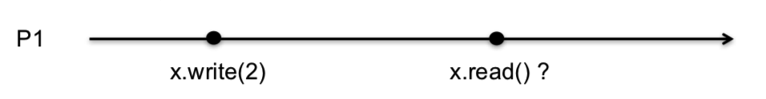

我们期望得到的结果是什么？显然，我们希望 read 操作读取到的 x 值是 write 操作最近写入的那个值 2。因此，Linearizability 实际上刻画了我们对于分布式系统的非常自然的期望：
- 每一个读操作都将返回『最近的写操作』（基于单一的实际时间）的值
- 对任何 client 的表现均一致

注意上面『基于单一的实际时间』这几个字，这表明读写的先后顺序是由一个统一的实际时间（例如某个钟）来决定的，而不由逻辑时间所决定。在此要求下，系统的表现就像按照某个实际的时间顺序来处理所有 client 的读写请求。这个描述看起来不是很好理解，我们通过例子来详细说明。假定 Inv(X) 表示 X 操作的起始， Res(X) 表示 X 操作的结束，横轴表示统一的时间，如下示例图显示了进程 P1 和 P2 的操作时序图：
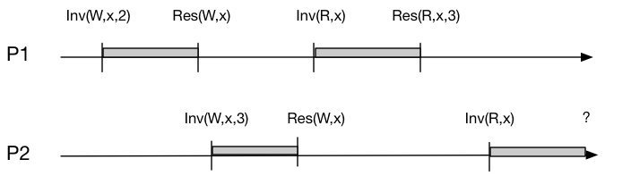

上图中，P1 和 P2 进程均先调用 W 操作写入，再调用 R 操作读取。从单个进程的角度来看，进程自身的读写操作在时间顺序下必定互不重叠；而从整体上看，P1 和 P2 的读写操作在时间上也与彼此互不重叠。因此在上图中，『最近的写操作』应该如何定义一目了然：离 P1 的读操作最近的写操作是 P2 调用 w 写；而离 P2 的读操作最近的写操作仍然是其自身的 w 写。

然而在真实的系统中，不同进程之间的并发读写操作必然会出现时间上的重叠，如下图所示：
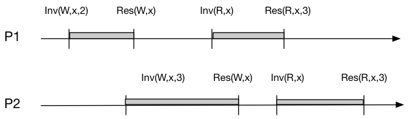

P2 进程的写操作与 P1 进程的读写操作均产生了重叠，针对这种情况下的读操作我们应该如何来定义『最近的写操作』？为了定义『最近』这个概念，我们需要承认一点，任何读操作或者写操作必然在 Inv(X) 和 Res(X) 之间的某一点生效，写操作生效点之后的读操作必定会读到该写操作的值。在此基础上，Linearizability 描述了系统应具备如下两点要求：
- 对于所有的 client 而言，其表现得如同采用了某种顺序来串行地执行所有进程的读写操作；
- 在这种顺序下，所有的读操作均能返回最近的写操作的值；

> 这两个要求，就是最上面说的那两个要求。

因此，我们可以为上图中的 P1 和 P2 找到一个合理的执行顺序：P1 先写 x，然后 P2 再写 x，之后 P1 在 P2 写操作生效点之后读出 x 值为 3，最后 P2 读出 x 的值也为3。这个顺序显然满足上述两点要求，也就满足 Linearizability。

再来看如下图中的场景，如果 P2 进程读出来的值也就是图中的 “?” 的值为 0，仔细想想当前的系统是否满足 Linearizability 的两条要求？

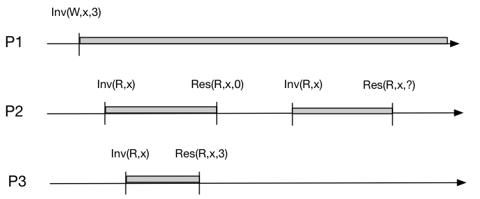

答案显然是不满足的，因为你不可能找到一种序列来顺序的执行 P1，P2 以及 P3 的读写操作，使其得到上图中的结果。更直观点说，既然 P3 的读操作返回了 x 的值为 3，说明了 P3 的读操作是在 P1 的写操作生效点之后执行；而 P2 的第二个读操作在时序上在 P3 的读操作之后（no overlapping），因此 P2 的读操作返回 0 值必然不能满足 Linearizability 的要求。
> 注意：这里`没有`指定 P2 和 P3 的重叠部分中，P2 的读操作一定要`先于` P3 的读操作（虽然是 P2 的读操作先开始的）。

## 顺序一致性 (Sequential consistency)
Lamport 关于顺序一致性的定义是基于 shared-memory multi-processor system 的。我们可以将这种系统理解成一个同步分布式模型，从而扩展该定义到分布式系统领域。 

这个定义实际上对系统提出了两条访问共享对象时的约束：
1. 从单个处理器（线程或者进程）的角度上看，其指令的执行顺序以编程中的顺序为准；
2. 从所有处理器（线程或者进程）的角度上看，指令的执行保持一个单一的顺序；

约束 1 保证了单个进程的所有指令是按照程序中的顺序来执行；而约束 2 保证了所有的内存操作都是`原子`的或者说`实时`的。从编程者的角度，顺序一致性提供了如下图中的抽象。我们可以将共享内存看成一个服务台，而将多个进程看成是接受服务的排队队列：每个进程的内部的读写指令都是按照编程的顺序先来先『服务』，同时服务台在多个队列之间不断切换。

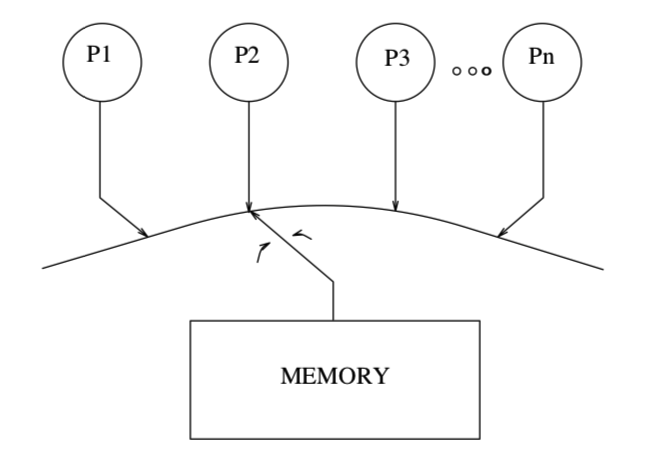

我们仍然用一个例子来更加清楚地展示顺序一致性的概念。下图中横轴表示程序中的顺序（注意不再是时间序），观察如下的两种执行结果是否满足顺序一致性要求：
> 注意：下面的图中上半部分中，P2 的指令所在的位置，不是表示一定在 P1 的 write(3) 和 read()->5 之间执行。P1 与 P2 内部的指令都是按顺序执行。而到底是 P1 先执行，还是 P2 先执行，还是 P1 执行到一半后 P2 才执行，这个都是不确定的。而图下半部分也是一样，不表示 P2 的指令一定在 P1 的 Write(2) 和 Write(3) 之间执行。这个图分成两部分，就想表达执行 P1 和 P2 指令执行先后不一定的这个事。
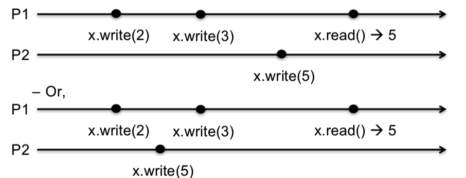

通过简单分析就可以发现，这两种情况我们都可以找到一个满足上述两个约束的执行顺序，即：P1 x.write(2) -> P1 x.write(3) -> P2 x.write(5) -> P1 x.read(5)，这表明其执行结果满足顺序一致性。

继续观察下述的执行结果，你能否找到一种执行顺序使其满足顺序一致性呢？
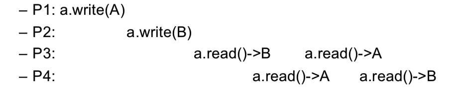

答案是：不能。不管你怎么安排这四个进程的读写操作，要使其既满足各自的编程顺序，又得到相应的执行结果是不可能的。不信你可以把这四个进程对应到上面图 7 中的实例，看看你有没有办法能够找到符合要求的顺序。如果系统的执行得到上图中的结果，我们可以充分的肯定该系统不满足线性一致性。

可以看到，相比于 linearizability，Sequential consistency 放松了一致性的要求。首先，其并不要求操作的执行顺序严格按照真实的时间序；其次，其对不同线程之间的读写操作执行先后没有任何要求，只需保证执行是原子性即可。最后说一点，CPU 体系结构中 Sequential consistency 的概念与我们前文中所介绍的 [Memory Reordering 浅析 - Kaiyuan's Blog | May the force be with me](http://kaiyuan.me/2017/09/22/memory-barrier/) 息息相关，这一部分的以后再找时间另说。

**线性一致性 (Linearizability)和顺序一致性 (Sequential consistency)的区别**

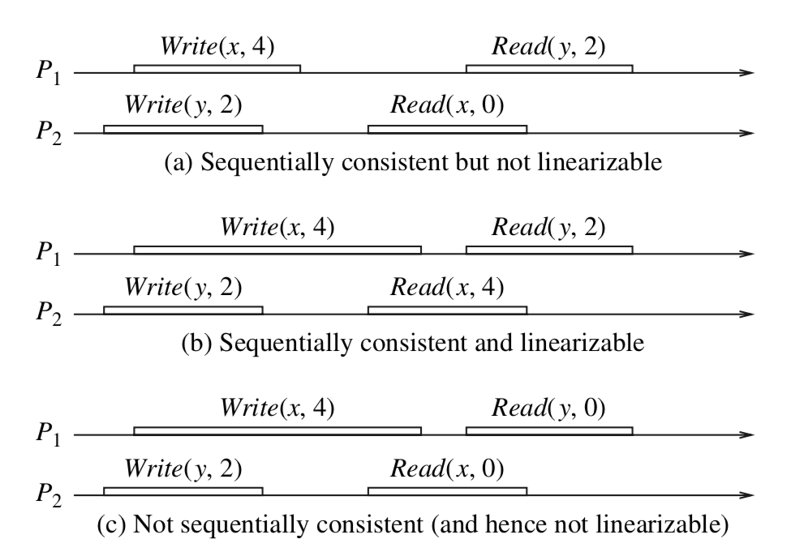

我们看一下上面的例子：
先看第 2 个例子，这个例子中，所有的指令是按照`全局时钟`执行的：Write(y,2) , Write(x,4), Read(x,4) , Read(y,2)。再看第 1 个例子，并不是按`全局时钟`执行的，是先执行完的 P2 的指令，再执行 P1 的指令。

所以这两种一致性的区别是：线性一致性是按`全局时钟`执行的，而顺序一致性则不是。

在实现方面，`线性一致性`可以通过主动备份实现；`顺序一致性`可以通过被动备份实现。

## 因果一致性（Casual Consistency）
什么是因果一致性呢？
简单地说，所有 clients 看到`因果操作的顺序`是一致的，例如，如果 `进程1 的 A 操作` 和 `进程2 的 B 操作`是因果的话，记作 A->B。那么所有 client 看到的结果都**A 操作先执行完，B 操作再执行后的结果** 。

因果一致性（Casual Consistency）在一致性的要求上，又比顺序一致性降低了：它仅要求有因果关系的操作顺序得到保证，非因果关系的操作顺序则无所谓。因果相关的要求是这样的：
- 本地顺序：本进程中，事件执行的顺序即为本地因果顺序。
- 异地顺序：如果读操作返回的是写操作的值，那么该写操作在顺序上一定在读操作之前。
- 闭包传递：和时钟向量里面定义的一样，如果a->b，b->c，那么肯定也有a->c。

以下面的图来看看这两种一致性的对比：
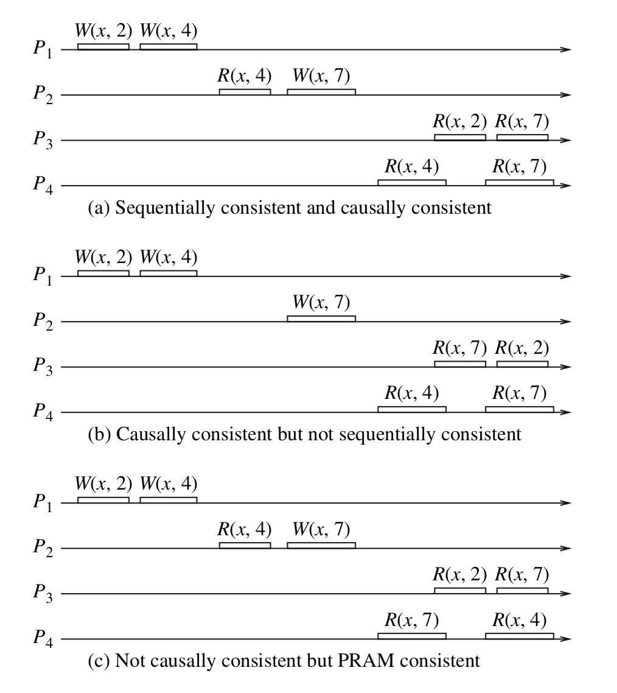

1. 图a满足 Sequential Consistency（顺序一致性），因此也满足Casual Consistency（因果一致性），因为从这个系统中的四个进程的角度看，它们都有相同的顺序也有相同的因果关系。因为，P3 的 R(x,2) 在 P1 的两个指令之间执行，P3 的 R(x,7) 在 P2 的第二个指令后面执行的话，是符合的。P4 的 R(x,4) 在 P1 和 P2 之间执行，P4 的 R(x,7) 在 P2 的第二个指令之后执行，是符合的。

2. 图b满足 Casual Consistency（因果一致性）但是不满足 Sequential Consistency（顺序一致性）。首先P1和P2的写是没有因果关系的，从P3看来，Read(x,7) 表示P2的 Write(x,7)一定在P3的Read(x,7)之前， P3的Read(x,2)表示P1的Write(x,2)一定在P3的Read(x,2)之前，又因为P3中Read(x,7) 在Read(x,2)之前（本地因果顺序），因此，从P3角度看P1和P2的执行顺序应该是：Write(x,7)、Write(x,2)、Write(x,4)。同样的分析方法，可以得出从P4角度看P1和P2的执行顺序应该是：Write(x,2)、Write(x,4)、Write(x,7)。由于P3和P4看到的执行顺序不一致，因此这不满足Sequential Consistency（顺序一致性）要求。

3. 图c展示了比 Casual Consistency（因果一致性）更弱的一种一致性模型： PRAM（Pipelined Random Access Memory）管道式存储器，这个暂时不考虑。

**另一个例子**
我们看一个实际点的例子。有一条微博，并且有两个 user：user1 和 user2。他们在不同的国家，这两个国家都各有一台 datacenter：dc1 和 dc2，这两天 datacenter 异步同步微博和评论等信息。user1 因为和 dc1 近，所以它的数据会先保存到 dc1 上，然后同步到 dc2 上；而 user2 因为和 dc2 近，所以它的数据会先保存到 dc2 上，然后同步到 dc1 上。

当 user2 对 user1 的一个评论进行回复（回复也是一种评论），在保存 user2 的回复时，还需要保存一个`逻辑时钟`。为什么要保存一个`逻辑时钟`呢？

在取得微博所有的评论后，要对评论进行排序。因为 dc1 和 dc 2 在不同的地方，所以物理时钟很可能不一致，一个快一个慢。如果使用物理时钟进行排序的话，如果 dc2 的时钟比 dc 1 快的话，虽然 user2 的回复在 user1 的评论之后，因为 dc2 的物理时间快，会排在 user1 的评论的前面。所以，需要一个逻辑时钟，保证在排序时，`user2 的回复`会排在`user1 的评论`的后面。

这时候就可以使用 Lamport timestamps 来做逻辑时钟。在 user1 读取 user2 的评论时，就取得 user2 数据的逻辑时钟，然后进行加 1，得出回复的逻辑时钟。

### 顺序一致性 (Sequential consistency)和因果一致性（Casual Consistency）的区别
- 从上面图中的第 1 个例子可以看出，如果要保证`顺序一致性`，所有进程看到的其它进程的顺序是一致的。例子中 P3 和 P4 看到的 P1 和 P2 的顺序是一致的。
- 从上面图中的第 2 个例子可以看出，`因果一致性`不要保证，所有进程看到的其它进程的顺序是一致的。例子中 P3 和 P4 看到的 P1 和 P2 的顺序就不是一致的。

> 因果一致性这种`不保证所有进程看到的其它进程的顺序是一致的`性质是可以理解的，因为所有进程接到的消息的`顺序`都不太可能一致。

他们的共同点是，每个进程内的`指令的顺序`是要保证一致的。

### 使用情况
因果一致性在`工业`上不是很流行。

## 参考：
- [几种一致性模型的分析 - Codedump的技术笔记 | 十条](http://www.10tiao.com/html/616/201605/2652227239/1.html)
- [分布式系统一致性 - Kaiyuan's Blog | May the force be with me](http://kaiyuan.me/2018/04/21/consistency-concept/)
- [分布式事务中的一致性和隔离性 - 黑客画家的个人空间 - 开源中国](https://my.oschina.net/fileoptions/blog/2479434)
- [线性一致性和 Raft - NewSQL 数据库 TiDB - SegmentFault 思否](https://segmentfault.com/a/1190000016762033)：这个文章，讲了当两个操作有重叠时，不一定取得什么样的值。也有是说，不是先开始的指令，就一定先执行。

# 逻辑时钟
## 什么是逻辑时钟
逻辑时钟是为了区分现实中的物理时钟提出来的概念，一般情况下我们提到的时间都是指物理时间，但实际上很多应用中，只要所有机器有相同的时间就够了，这个时间不一定要跟实际时间相同。更进一步，如果两个节点之间不进行交互，那么它们的时间甚至都不需要同步。因此问题的关键点在于节点间的交互要在事件的发生顺序上达成一致，而不是对于时间达成一致。

综上，逻辑时钟指的是分布式系统中用于区分事件的发生顺序的时间机制。从某种意义上讲，现实世界中的物理时间其实是逻辑时钟的特例。

## 为什么需要逻辑时钟
时间是在现实生活中是很重要的概念，有了时间我们就能比较事情发生的先后顺序。如果是单个计算机内执行的事务，由于它们共享一个计时器，所以能够很容易通过时间戳来区分先后。同理在分布式系统中也通过时间戳的方式来区分先后行不行？

答案是NO，因为在分布式系统中的不同节点间保持它们的时钟一致是一件不容易的事情。因为每个节点的CPU都有自己的计时器，而不同计时器之间会产生时间偏移，最终导致不同节点上面的时间不一致。也就是说如果A节点的时钟走的比B节点的要快1分钟，那么即使B先发出的消息（附带B的时间戳），A的消息（附带A的时间戳）在后一秒发出，A的消息也会被认为先于B发生。

那么是否可以通过某种方式来同步不同节点的物理时钟呢？答案是有的，NTP就是常用的时间同步算法，但是即使通过算法进行同步，总会有误差，这种误差在某些场景下（金融分布式事务）是不能接受的。

因此，Lamport提出逻辑时钟就是为了解决分布式系统中的时序问题，即如何定义a在b之前发生。值得注意的是，并不是说分布式系统只能用逻辑时钟来解决这个问题，如果以后有某种技术能够让不同节点的时钟完全保持一致，那么使用物理时钟来区分先后是一个更简单有效的方式。

## 如何实现逻辑时钟
通过前面的讨论我们知道通过物理时钟（即绝对参考系）来区分先后顺序的前提是所有节点的时钟完全同步，但目前并不现实。因此，在没有绝对参考系的情况下，在一个分布式系统中，你无法判断事件A是否发生在事件B之前，除非A和B存在某种依赖关系，即分布式系统中的事件仅仅是部分有序的。

上面的结论跟狭义相对论有异曲同工之妙，在狭义相对论中，不同观察者在同一参考系中观察到的事件先后顺序是一致的，但是在不同的观察者在不同的参考系中对两个事件谁先发生可能具有不同的看法. 当且仅当事件A是由事件B引起的时候, 事件A和B之间才存在一个先后关系。两个事件可以建立因果关系的前提是：两个事件之间可以用等于或小于光速的速度传递信息。 值得注意的是这里的因果关系指的是时序关系，即时间的前后，并不是逻辑上的原因和结果。

那么是否我们可以参考狭义相对论来定义分布式系统中两个事件的时序呢？在分布式系统中，网络是不可靠的，所以我们去掉可以和速度的约束，可以得到两个事件可以建立因果（时序）关系的前提是：两个事件之间是否发生过信息传递。在分布式系统中，进程间通信的手段（共享内存、消息发送等）都属于信息传递，如果两个进程间没有任何交互，实际上他们之间内部事件的时序也无关紧要。但是有交互的情况下，特别是多个节点的要保持同一副本的情况下，事件的时序非常重要。

## 参考
- [分布式系统：Lamport 逻辑时钟 - 知乎](https://zhuanlan.zhihu.com/p/56146800)

# Lamport timestamps
Leslie Lamport 在1978年提出逻辑时钟的概念，并描述了一种逻辑时钟的表示方法，这个方法被称为Lamport时间戳(Lamport timestamps)[3]。

分布式系统中按是否存在节点交互可分为三类事件，一类发生于节点内部，二是发送事件，三是接收事件。Lamport时间戳原理如下：
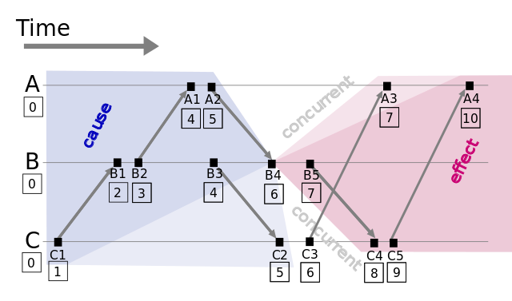
图1: Lamport timestamps space time (图片来源: wikipedia)

1. 每个事件对应一个Lamport时间戳，初始值为0
2. 如果事件在节点内发生，时间戳加1
3. 如果事件属于发送事件，时间戳加1并在消息中带上该时间戳
4. 如果事件属于接收事件，时间戳 = Max(本地时间戳，消息中的时间戳) + 1

> Clock Condition.对于任意事件a, b：如果a -> b（->表示a先于b发生），那么C(a) < C(b), 反之不然, 因为有可能是并发事件 C1.如果a和b都是进程Pi里的事件，并且a在b之前，那么Ci(a) < Ci(b) C2.如果a是进程Pi里关于某消息的发送事件，b是另一进程Pj里关于该消息的接收事件，那么Ci(a) < Cj(b)

假设有事件a、b，C(a)、C(b)分别表示事件a、b对应的Lamport时间戳，如果a->b,则C(a) < C(b)，a发生在b之前(happened before)，例如图1中有 C1 -> B1。通过该定义，事件集中Lamport时间戳不等的事件可进行比较，我们获得事件的偏序关系(partial order)。**注意：如果C(a) < C(b)，并不能说明a -> b，也就是说C(a) < C(b)是a -> b的必要不充分条件**
> 到此为止，讲到的是`偏序关系(partial order)`。下面讲如何把`偏序关系`变成`全序关系`

如果C(a) = C(b)，那a、b事件的顺序又是怎样的？假设a、b分别在节点P、Q上发生，Pi、Qj分别表示我们给P、Q的编号，如果 C(a) = C(b) 并且 Pi < Qj，同样定义为a发生在b之前，记作 a => b。假如我们对图1的A、B、C分别编号Ai = 1、Bj = 2、Ck = 3，因 C(B4) = C(C3) 并且 Bj < Ck，则 B4 => C3。**注意：Lamport逻辑时钟只保证因果关系（偏序）的正确性，不保证绝对时序的正确性。**

一种可行的方式是利用给进程编号，利用进程编号的大小来排序。假设a、b分别在节点P、Q上发生，Pi、Qj分别表示我们给P、Q的编号，如果 C(a) = C(b) 并且 Pi < Qj，同样定义为a发生在b之前，记作 a => b（全序关系）。假如我们对图1的A、B、C分别编号Ai = 1、Bj = 2、Ck = 3，因 C(B4) = C(C3) 并且 Bj < Ck，则 B4 => C3。

通过以上定义，我们可以对所有事件排序，获得事件的全序关系(total order)。上图例子，我们可以进行排序：C1 => B1 => B2 => A1 => B3 => A2 => C2 => B4 => C3 => A3 => B5 => C4 => C5 => A4

观察上面的全序关系你可以发现，从时间轴来看B5是早于A3发生的，但是在全序关系里面我们根据上面的定义给出的却是A3早于B5，可以发现Lamport逻辑时钟是一个正确的算法，即有因果关系的事件时序不会错，但并不是一个公平的算法，即没有因果关系的事件时序不一定符合实际情况。

## 如何使用逻辑时钟解决分布式锁问题
上面的分析过于理论，下面我们来尝试使用逻辑时钟来解决分布式锁问题。

分布式锁问题本质上是对于共享资源的抢占问题，我们先对问题进行定义：
- 已经获得资源授权的进程，必须在资源分配给其他进程之前释放掉它；
- 资源请求必须按照请求发生的顺序进行授权；
- 在获得资源授权的所有进程最终释放资源后，所有的资源请求必须都已经被授权了。

首先我们假设，**对于任意的两个进程Pi和Pj，它们之间传递的消息是按照发送顺序被接收到的, 并且所有的消息最终都会被接收到**。每个进程会维护一个它自己的对其他所有进程都不可见的请求队列。我们假设该请求队列初始时刻只有一个消息（T0:P0）资源请求，P0代表初始时刻获得资源授权的那个进程，T0小于任意时钟初始值

1. 为请求该项资源，进程Pi发送一个（Tm:Pi）资源请求（请求锁）消息给其他所有进程，并将该消息放入自己的请求队列，在这里Tm代表了消息的时间戳
2. 当进程Pj收到（Tm:Pi）资源请求消息后，将它放到自己的请求队列中，并发送一个带时间戳的确认消息给Pi。(注：如果Pj已经发送了一个时间戳大于Tm的消息，那就可以不发送)
3. 释放该项资源（释放锁）时，进程Pi从自己的消息队列中删除所有的（Tm:Pi）资源请求，同时给其他所有进程发送一个带有时间戳的Pi资源释放消息
4. 当进程Pj收到Pi资源释放消息后，它就从自己的消息队列中删除所有的（Tm:Pi）资源请求
5. 当同时满足如下两个条件时，就将资源分配（锁占用）给进程Pi：
  - 按照全序关系排序后，（Tm:Pi）资源请求排在它的请求队列的最前面
  - i 已经从所有其他进程都收到了时间戳>Tm的消息

下面我会用图例来说明上面算法运作的过程，假设我们有3个进程，根据算法说明，初始化状态各个进程队列里面都是(0:0)状态，此时锁属于P0。
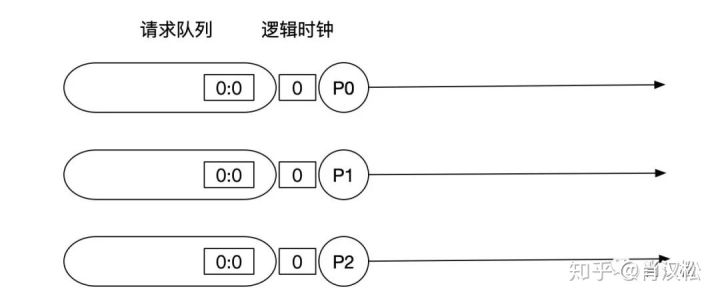

接下来P1会发出请求资源的消息给所有其他进程，并且放到自己的请求队列里面，根据逻辑时钟算法，P1的时钟走到1，而接受消息的P0和P2的时钟为消息时间戳+1。
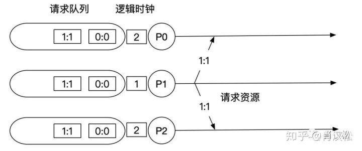

收到P1的请求之后，P0和P2要发送确认消息给P1表示自己收到了。注意，由于目前请求队列里面第一个不是P1发出的请求，所以此时锁仍属于P0。但是由于收到了确认消息，此时P1已经满足了获取资源的第一个条件：**P1已经收到了其他所有进程时间戳大于1的消息**。
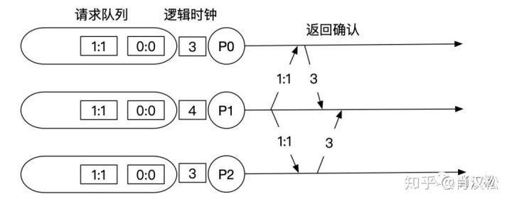

假设P0此时释放了锁（这里为了方便演示做了这个假设，实际上P0什么时候释放资源都可以，算法都是正确的，读者可自行推导），发送释放资源的消息给P1和P2，P1和P2收到消息之后把请求(0:0)从队列里面删除。
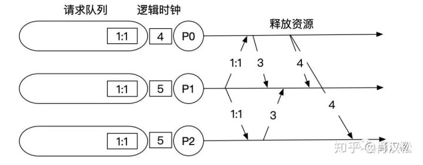

当P0释放了资源之后，我们发现P1满足了获取资源的两个条件：它的请求在队列最前面；P1已经收到了其他所有进程时间戳大于1的消息。也就是说此时P1就获取到了锁。

值得注意的是，**这个算法并不是容错的，有一个进程挂了整个系统就挂了，因为需要等待所有其他进程的响应，同时对网络的要求也很高**。

## 总结
如果你之前看过2PC，Paxos之类的算法，相信你看到最后一定会有一种似曾相识的感觉。实际上，Lamport提出的逻辑时钟可以说是分布式一致性算法的开山鼻祖，后续的所有分布式算法都有它的影子。我们不能想象现实世界中没有时间，而逻辑时钟定义了分布式系统里面的时间概念，解决了分布式系统中区分事件发生的时序问题。

## 参考：
- [分布式系统：Lamport 逻辑时钟 - 知乎](https://zhuanlan.zhihu.com/p/56146800)
- [译《Time, Clocks, and the Ordering of Events in a Distributed System》 - 杭州.Mark - 博客园](https://www.cnblogs.com/hzmark/p/Time_Clocks_Ordering.html)：论文的中文翻译
- [分布式系统理论基础 - 时间、时钟和事件顺序 - 知乎](https://zhuanlan.zhihu.com/p/23278509)：讲 Lamport timestamps，Vector clock 和 Version vector 的不同。
- [全序, 分布式一致性的本质 - fxjwind - 博客园](https://www.cnblogs.com/fxjwind/archive/2013/04/13/3017892.html)：对论文的一个小总结，说到了全序和偏序。

## Vector clock
Lamport时间戳帮助我们得到事件顺序关系，但还有一种顺序关系不能用Lamport时间戳很好地表示出来，那就是同时发生关系(concurrent)[4]。例如图1中事件B4和事件C3没有因果关系，属于同时发生事件，但Lamport时间戳定义两者有先后顺序。

Vector clock是在Lamport时间戳基础上演进的另一种逻辑时钟方法，它通过vector结构不但记录本节点的Lamport时间戳，同时也记录了其他节点的Lamport时间戳[5][6]。Vector clock的原理与Lamport时间戳类似，使用图例如下：

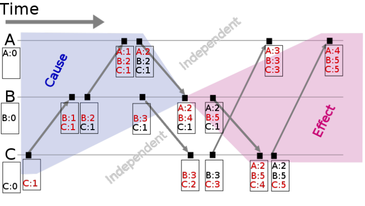
图2: Vector clock space time (图片来源: wikipedia)

假设有事件a、b分别在节点P、Q上发生，Vector clock分别为Ta、Tb，如果 Tb[Q] > Ta[Q] 并且 Tb[P] >= Ta[P]，则a发生于b之前，记作 a -> b。到目前为止还和Lamport时间戳差别不大，那Vector clock怎么判别同时发生关系呢？

如果 Tb[Q] > Ta[Q] 并且 Tb[P] < Ta[P]，则认为a、b同时发生，记作 a <-> b。例如图2中节点B上的第4个事件 (A:2，B:4，C:1) 与节点C上的第2个事件 (B:3，C:2) 没有因果关系、属于同时发生事件。

## 参考：
- [将物理与计算机结合可以做些什么？ - 知乎](https://www.zhihu.com/question/30084741/answer/71115362)：最高的回答讲了一个 Vector Clock 的例子
- [分布式系统理论基础 - 时间、时钟和事件顺序 - 知乎](https://zhuanlan.zhihu.com/p/23278509)：讲 Lamport timestamps，Vector clock 和 Version vector 的不同。

# Version vector

基于Vector clock我们可以获得任意两个事件的顺序关系，结果或为先后顺序或为同时发生，识别事件顺序在工程实践中有很重要的引申应用，最常见的应用是发现数据冲突(detect conflict)。

分布式系统中数据一般存在多个副本(replication)，多个副本可能被同时更新，这会引起副本间数据不一致[7]，Version vector的实现与Vector clock非常类似[8]，目的用于发现数据冲突[9]。下面通过一个例子说明Version vector的用法[10]：

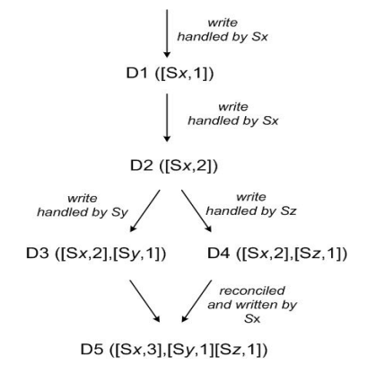
图3: Version vector

client端写入数据，该请求被Sx处理并创建相应的vector ([Sx, 1])，记为数据D1
第2次请求也被Sx处理，数据修改为D2，vector修改为([Sx, 2])
第3、第4次请求分别被Sy、Sz处理，client端先读取到D2，然后D3、D4被写入Sy、Sz
第5次更新时client端读取到D2、D3和D4 3个数据版本，通过类似Vector clock判断同时发生关系的方法可判断D3、D4存在数据冲突，最终通过一定方法解决数据冲突并写入D5
Vector clock只用于发现数据冲突，不能解决数据冲突。如何解决数据冲突因场景而异，具体方法有以最后更新为准(last write win)，或将冲突的数据交给client由client端决定如何处理，或通过quorum决议事先避免数据冲突的情况发生[11]。

由于记录了所有数据在所有节点上的逻辑时钟信息，Vector clock和Version vector在实际应用中可能面临的一个问题是vector过大，用于数据管理的元数据(meta data)甚至大于数据本[12]。

解决该问题的方法是使用server id取代client id创建vector (因为server的数量相对client稳定)，或设定最大的size、如果超过该size值则淘汰最旧的vector信息[10][13]。

## Version vectors算法不足

### 1，仅对单个文件的并发修改有效，对于多个对象的修改无法识别。
对于单一文件系统，当一个文件被编辑时，如果对其目录进行重命名、删除等操作，是不允许的。必须在文件保存后，才能对目录进行重命名或删除操作。但对于分布式系统，用户可以在两个节点上分别进行目录重命名和文件编辑操作。利用Version vectors算法是无法识别这样的并发修改。

因为Version Vectors是针对每个文件进行信息的保存。上面的情况，目录重命名会影响到多个文件，但修改的仅是该目录的Version Vector向量。当两个节点交换更新时就无法识别冲突。当然我们可以修改对Version Vector向量的更新过程，比如当对目录进行操作时，递归的更新其所含文件、子目录的Version Vectors。这意味着需要将不同应用的语义信息移入答Version Vectors算法的更新过程中。

Version Vectors对于单个文件，简单并发更新可以识别。对于多个对象，且对象间存在一定语义约束的情况，Version Vectors算法无法适用。

### 2，持有文件副本的节点不能灵活扩展
Version vectors从一开始就规定了该文件持有的副本数。当需要有更多的节点持有该副本时，需要辅助的算法进行。在Dynamo系统中也采用了Version Vectors算法。假设Dynamo中对于每个文件默认提供三个副本，那么就会有三台电脑同时持有该文件。如果对文件的请求增多，需要增加该文件的副本来满足更多的请求。这时就需要扩展已持有该文件副本节点的Version vector向量，让向量支持更多的元素，从而支持新的节点加入。在节点频繁伸缩情况下，Version vector的开销就很大。

## 参考：
- [分布式系统理论基础 - 时间、时钟和事件顺序 - 知乎](https://zhuanlan.zhihu.com/p/23278509)
- [Version vectors算法介绍和不足 - xiaoqiangXX的专栏 - CSDN博客](https://blog.csdn.net/xiaoqiangxx/article/details/7824681)

======================== 各种比较 ================
# 全序（Total Order）和偏序（Partial Order）
## 定义
全序：对集合中任意两个元素都有关系集合内任何一对元素在在这个关系下都是相互可比较的。 比如：有限长度的序列按字典序是全序的。最常见的是单词在字典中是全序的。

偏序：只对部分要元素成立关系（部分可比）集合内只有部分元素之间在这个关系下是可以比较的。 比如：比如复数集中并不是所有的数都可以比较大小，那么“大小”就是复数集的一个偏序关系。
而且，在偏序关系中，如果它们是并发的，则它们之间的顺序是无法比较的。

## Lamport timestamps 中的`全序`和`偏序`
`偏序`定义满足如下三个条件的最小关系： 
(1)如果a和b是同一个进程中的事件，并且a在b前面发生，那么 a->b 
(2)如果a代表了某个进程的消息发送事件，b代表另一进程中针对这同一个消息的接收事件，那么a->b 
(3)如果 a->b且b->c，那么a->c (传递性)

全序定义如下：
假设a是进程Pi中事件，b是进程Pj中的事件，那么当且仅当满足如下条件之一时: 
(1)Ci(a)<Cj(b); 
(2)Ci(a)=Cj(b) 且 Pi<Pj， 
那么我们就认为“a=>b”

## 全序的意义
涉及到分布式系统的状态机问题,全序问题可以被用于解决分布式系统的一致性问题。

### 线性一致性
`线性一致性`就是`全序`的，但`线性一致性`的定义要大于`全序`。也就是`全序`只是定义`线性一致性`的一部分，或说是一个属性。

`全序`只定义了，所有指令是可比较的。而`线性一致性`还定义了：任何一个读取返回新值后，所有后续读取（在相同或其他客户端上）也必须返回新值。

注意：`线性一致性`的全序 和 Lamport timestamps 中的`全序`还不太一样。`线性一致性`的全序是有一个`全局时钟`，`全局时钟`更像一个物理时钟，即横轴代表指令发生的时间顺序（但对于并发指令，并没有要求哪个一定先执行）。而 Lamport timestamps 中的`全序`，是指逻辑时钟的全序，即从横轴来看，虽然一个指定在另一个指定前面，也不代表`前面指定`一定会比`后面指令`先执行。

线性一致性可以用来做`分布式锁`。

[分布式存储--关于线性一致性的实现的事件顺序问题 - 知乎](https://zhuanlan.zhihu.com/p/57062155)

### 因果一致性
而因果一致性是`偏序`的。

# `一致性（Consistency）`和`共识（consensus）`
在理解`一致性（Consistency）`和`共识（consensus）`时，感觉两个有关系，但好像又说不太清，引用[被误用的“一致性” - Kongfy's Blog](http://blog.kongfy.com/2016/08/%E8%A2%AB%E8%AF%AF%E7%94%A8%E7%9A%84%E4%B8%80%E8%87%B4%E6%80%A7/)中的一段说明：
- “一致性（Consistency）”在分布式系统中指的是副本（Replication）问题中对于同一个数据的多个副本，其对外表现的数据一致性，如线性一致性、因果一致性、最终一致性等，都是用来描述副本问题中的一致性的。
- 而共识（Consensus）则不同，个人认为对 Censensus 最合适的翻译是`共识`而非`一致`，关于`共识问题`的定义详见我之前的[文章](http://blog.kongfy.com/2016/05/%e5%88%86%e5%b8%83%e5%bc%8f%e5%85%b1%e8%af%86consensus%ef%bc%9aviewstamped%e3%80%81raft%e5%8f%8apaxos/)，简单来说，共识问题中所有的节点要最终达成共识，由于最终目标是所有节点都要达成一致，所以根本不存在一致性强弱之分。

整个副本系统最终的一致性并不单单取决于`共识算法`，Client 访问所遵循的规范也会有决定性的作用。比如说：即使副本系统使用multi-paxos在所有副本服务器上同步了日志序号，但如果Client被允许从非Leader节点获取数据，则整个副本系统仍然不是强一致的（思考如果访问了非多数派节点的情况）。

做个总结：
- Paxos是共识（Consensus）算法而不是强一致性（Consistency）协议
- 一致性（Consistency）是副本（Replication）问题中的概念，共识（Consensus）算法没有一致性级别的区分。

# 线性一致性（Linearizability）与可序列化（Serializability）
线性一致性容易和可序列化相混淆，因为两个词似乎都是类似“可以按顺序排列”的东西。但它们是两种完全不同的保证，区分两者非常重要：

**可序列化：**
可序列化（Serializability）是事务的隔离属性，每个事务可以读写多个对象（行，文档，记录）——参阅“单对象和多对象操作”。它确保事务的行为，与它们按照某种顺序依次执行的结果相同（每个事务在下一个事务开始之前运行完成）。这种执行顺序可以与事务实际执行的顺序不同。

**线性一致性**
线性一致性（Linearizability）是读取和写入寄存器（单个对象）的新鲜度保证。它不会将操作组合为事务，因此它也不会阻止写偏差等问题（参阅“写偏差和幻读”），除非采取其他措施（例如物化冲突）。

一个数据库可以提供可串行性和线性一致性，这种组合被称为严格的可串行性或强的单副本强可串行性（strong-1SR）。基于两阶段锁定的可串行化实现（参见“两阶段锁定（2PL）”一节）或实际串行执行（参见第“实际串行执行”）通常是线性一致性的。但是，可序列化的快照隔离（参见“可序列化的快照隔离（SSI）”）不是线性一致性的：按照设计，它可以从一致的快照中进行读取，以避免锁定读者和写者之间的争用。一致性快照的要点就在于它不会包括比快照更新的写入，因此从快照读取不是线性一致性的。

# CAP和ACID
CAP 中的 C 是指 Consistency，表示 Replication 的一致性（CAP 的 C 表示的是“线性一致性”）。

而 ACID 中的 C 是指数据库状态的一致性，在事务执行前后，数据库的一致性约束没有被破坏。ACID中的一致性包含实体完整性约束不被破坏，完整性包含实体完整性（主属性不为空）、参照完整性（外键必须存在原表中）、用户自定义的完整性。比如列值非空（not null）、列值唯一（unique）、列值是否满足一个bool表达式（check语句，如性别只能有两个值、岁数是一定范围内的整数等），例如age smallint CHECK (age >=0 AND age <= 120).数据库保证age的值在[0, 120]的范围，如果不在这个范文，那么更新操作失败，事务也会失败。

# 其它
## 1，解决锁“领导者与锁定”问题

通常情况下，一些东西在一个系统中只能有一个。例如：
- 数据库分区的领导者只能有一个节点，以避免脑裂（split brain）（参阅“处理节点宕机”）。
- 特定资源的锁或对象只允许一个事务/客户端持有，以防同时写入和损坏。
- 一个特定的用户名只能被一个用户所注册，因为用户名必须唯一标识一个用户。

在分布式系统中实现这一点需要注意：即使一个节点认为它是“天选者（the choosen one）”（分区的负责人，锁的持有者，成功获取用户名的用户的请求处理程序），但这并不一定意味着有法定人数的节点同意！一个节点可能以前是领导者，但是如果其他节点在此期间宣布它死亡（例如，由于网络中断或GC暂停），则它可能已被降级，且另一个领导者可能已经当选。

​	如果一个节点继续表现为天选者，即使大多数节点已经声明它已经死了，则在考虑不周的系统中可能会导致问题。这样的节点能以自己赋予的权能向其他节点发送消息，如果其他节点相信，整个系统可能会做一些不正确的事情。

​	例如，图8-4显示了由于不正确的锁实现导致的数据损坏错误。 （这个错误不仅仅是理论上的：HBase曾经有这个问题【74,75】）假设你要确保一个存储服务中的文件一次只能被一个客户访问，因为如果多个客户试图写对此，该文件将被损坏。您尝试通过在访问文件之前要求客户端从锁定服务获取租约来实现此目的。

图8-4 分布式锁的实现不正确：客户端1认为它仍然具有有效的租约，即使它已经过期，从而破坏了存储中的文件

​	这个问题就是我们先前在“进程暂停”中讨论过的一个例子：如果持有租约的客户端暂停太久，它的租约将到期。另一个客户端可以获得同一文件的租约，并开始写入文件。当暂停的客户端回来时，它认为（不正确）它仍然有一个有效的租约，并继续写入文件。结果，客户的写入冲突和损坏的文件。

防护令牌
​	当使用锁或租约来保护对某些资源（如图8-4中的文件存储）的访问时，需要确保一个被误认为自己是“天选者”的节点不能中断系统的其它部分。实现这一目标的一个相当简单的技术就是防护（fencing），如图8-5所示

图8-5 只允许以增加屏蔽令牌的顺序进行写操作，从而保证存储安全

​	我们假设每次锁定服务器授予锁或租约时，它还会返回一个防护令牌（fencing token），这个数字在每次授予锁定时都会增加（例如，由锁定服务增加）。然后，我们可以要求客户端每次向存储服务发送写入请求时，都必须包含当前的屏蔽令牌。

​	在图8-5中，客户端1以33的令牌获得租约，但随后进入一个长时间的停顿并且租约到期。客户端2以34的令牌（该数字总是增加）获取租约，然后将其写入请求发送到存储服务，包括34的令牌。稍后，客户端1恢复生机并将其写入存储服务，包括其令牌值33.但是，存储服务器会记住它已经处理了一个具有更高令牌编号（34）的写入，因此它会拒绝带有令牌33的请求。

​	如果将ZooKeeper用作锁定服务，则可将事务标识zxid或节点版本cversion用作屏蔽令牌。由于它们保证单调递增，因此它们具有所需的属性【74】。

​	请注意，这种机制要求资源本身在检查令牌方面发挥积极作用，通过拒绝使用旧的令牌，而不是已经被处理的令牌来进行写操作——仅仅依靠客户端检查自己的锁状态是不够的。对于不明确支持屏蔽令牌的资源，可能仍然可以解决此限制（例如，在文件存储服务的情况下，可以将防护令牌包含在文件名中）。但是，为了避免在锁的保护之外处理请求，需要进行某种检查。

​	在服务器端检查一个令牌可能看起来像是一个缺点，但这可以说是一件好事：一个服务假定它的客户总是守规矩并不明智，因为使用客户端的人与运行服务的人优先级非常不一样【76】。因此，任何服务保护自己免受意外客户的滥用是一个好主意。
​	
​	
​	
## System Model
**关于 Timing 的 Model：**
- 	同步模型（synchronous model）
假设`网络延迟`，`进程暂停`和`时钟误差`的发生，都是有一定限度（bounded）的。但这并不是暗示着`完全同步的时钟`或`零网络延迟`，这只意味着`网络延迟`、`暂停`和`时钟漂移`将永远不会超过某个固定的上限。同步模型并不是大多数实际系统的现实模型，因为无限延迟和暂停确实会发生。

- 部分同步（partial synchronous）
意味着一个系统在大多数情况下，像一个同步系统一样运行，但有时候会超出网络延迟，进程暂停和时钟漂移的界限。这是很多系统在现实中使用的模型：大多数情况下，网络和进程表现良好，否则我们永远无法完成任何事情，但是我们必须承认，在任何关于时间的假设都可能偶尔地被破坏。发生这种情况时，网络延迟，暂停和时钟错误可能会变得相当大。

- 异步模型（Asynchronous model）
在这个模型中，一个算法不允许对 timing 做任何假设（假设多长时间会返回等）。事实上它甚至没有时钟（所以它不能使用超时）。一些算法被设计为可用于异步模型，但非常受限。

**关于 Failure 的 Model：**
- 崩溃停止故障（Crash-stop faults）
模型中，算法可能会假设节点只能以一种方式失效，即通过 crashing。这意味着节点可能在任意时刻突然停止响应，并且它永远不会恢复。

- 崩溃-恢复故障（Crash-recovery faults）
我们假设节点可能会在任何时候 crash，但也许会在未知的时间之后，再次开始响应。在本型中，假设节点具有稳定的存储（即，非易失性磁盘存储）且会在崩溃中保存，而内存中的状态会丢失。

- 拜占庭（任意）故障（Byzantine (arbitrary) faults）
​节点可以做（绝对意义上的）任何事情，包括试图戏弄和欺骗其他节点，如上一节所述。
​
**​总结：**
​对于真实系统的建模，具有**崩溃-恢复故障（crash-recovery）的部分同步模型（partial synchronous）**通常是最有用的模型。分布式算法如何应对这种模型？

# 线性一致性 和 2PC（原子提交）
感觉`线性一致性`和`2PC`好像有一些关系，例如：
> 对于`single-leader replication`系统来说，如果 leader 和 replication 是同步的，就可以实现线性一致性。2PC 看起来解决了`同步`问题，2PC 协议使**使两个节点都更新**或**都不更新**。

他们之间正好是有了一些相同点，看起来会有些关系。但 2PC 和 3PC 是分布式事务领域的概念，是用来实现分布式事务，而事务的存在主要是保证**数据库本身的内部一致性**。数据库本身的内部一致性，可以包括：实体完整性约束不被破坏，完整性包含实体完整性（主属性不为空）、参照完整性（外键必须存在原表中）、用户自定义的完整性等等。

线性一致性只是保证可以读到`最新的内容`，并且操作是`全序`的。关于如何实现 Linearizability，可以采用 Active Replication 或 Chain-replication 的系统模型。

# 线性一致性 和 全序广播
共识点：
- 都是全序

不同点：
- 全序广播：不能保证“新鲜性”。全序广播是异步的，消息被保证以固定的顺序可靠地传送，但是不能保证消息何时被送达（所以一个接收者可能落后于其他接收者）。
- 线性一致性：需要保证“新鲜性”，读取一定能看见最新的写入值。

### 相互实现
**使用全序广播实现线性一致的存储**
可以使用全序广播实现线性一致的存储。但全序广播是异步的，不能保证“新鲜性”。如何才能保证“新鲜性”呢？

答案就是在`读操作`时候做手脚：
- 你可以把`读操作`也加入到 log 中。比如：向 log 发送一个`读取操作`的消息，然后读取 log，当读取到`读取操作`这个消息后，再进行`实际的读取`。所以这些`读取操作`的消息的位置，决定哪个`读取操作`先执行。（etcd 的 Quorum reads 和这个方式有点像。）
- 如果日志允许以线性一致的方式获取最新日志消息的位置，则可以查询该位置，等待直到该位置前的所有消息都传达到你，然后执行读取。 （这是Zookeeper sync() 操作背后的思想：异步的实现当前进程与leader之间的指定path的数据同步）。
- 你可以从同步更新的副本中进行读取，因此可以确保结果是最新的。

**使用线性一致性存储实现全序广播**
因为`全序广播`要求`全序`，所以在每个一个消息时，都要给消息一个序号。使用`线性一致性 CAS`操作，来取得`全序广播`中的很个消息的`序号`。每次发消息前，都使用`线性一致性 CAS`取得一个序号，赋给消息。

# 原子提交（Atomic Commit）与共识（Consensus）
- 原子事务只有在所有参与者投票提交的情况下才能提交，如果有任何参与者需要中止，则必须中止。
- 共识则允许就任意一个被参与者提出的候选值达成一致。

然而，原子提交和共识可以相互简化为对方。感觉个原子提交也是共识的一种，因为共识的目的是**让一些节点达成一致**，原子提交也是让节点达成一致。

其它
# 关于共识
一般共识：2PC
容错共识：容错的全序广播
上面的想法对吗？原子事务和共识有什么关系？再看一回`分布式事务和共识`那一章。

为什么会出现`共识`？
因为很多算法都没有`容错`和`恢复`机制。共识定义了这些机制或属性。好好说一下，哪些有算法没有容错和恢复：线性一致的 CAS、全序广播中的序列号、2PC，还有没有其它？

# 共识和全序广播
看起来，很多问题都可以用`共识`算法解决，但实际上很多地方都使用`全序广播（可能是带容错功能的）`来解决。原因只有一个，性能问题。
使用共识也可以实现全序广播，但因为性能问题，所以不这么实现？

# 关于`timestamp`方式和`single-leader replication`
这两种方式都可以解决一些问题（看一下都有什么问题），但在解决`唯一性`问题时，timestamp 方式，没有 single-leader replication 方式好用。为什么？

# 全序广播如果要变成`容错-全序广播`，是不是需要使用`共识`解决 leader 选举问题。这样就变成了`容错-全序广播`？

# 关于线性一致性、因果一致性、Lamport timestamps 和 全序广播
在看《Designing.Data-Intensive.Applications》时，对 线性一致性、因果一致性、Lamport timestamps 这些保证和抽象出来的原因不是很清楚。看了一些资料，可能是因为对他们的初始背景不清楚所导致的。下面具体说一下背景：

针对分布式系统`一致性`概念，我们现在一提起这个词，可能就会想到`复本`的一致性。但其实在这个概念初期，没有指定说是存储的一致性，只是说分布式系统的一致性。这些一致性感觉为是指`进程`间交互的`一致性`。而在`线性一致性`的论文中，也是说`线性一致性`是基于 single-object (e.g. queue, register) 以及 single-operation (e.g. read, write, enqueue, dequeue) 的模型来定义的，也没有直接说成存储。

因果一致性是，所有 clients 看到`因果操作的顺序`是一致的，例如，如果 `进程1 的 A 操作` 和 `进程2 的 B 操作`是因果的话，记作 A->B。那么所有 client 看到的结果都**A 操作先执行完，B 操作再执行后的结果** 。

todo 看一下哪些情况需要`因果一致性`？
看一下什么是最终一致性？
[Causal Consistency - MariaDB.org](https://mariadb.org/causal-consistency/)
微信不同datacenter是不是一个例子？
有两个 user：user1 和 user2。他们在不同的国家，这两个国家都有一台 datacenter。当 user1 对 user2 的一个评论进行回复（回复也是一种评论）后，在取得这两个评论后，因为时钟问题，不能使用物理时间进行排序。这时候就要使用`逻辑时钟`进行排序了。user2 的评论的逻辑时钟，一定在 user1 的回复之前。这时候就可以使用 Lamport timestamps 来做逻辑时钟。在 user1 读取 user2 的评论时，就取得 user2 数据的逻辑时钟，然后进行加 1，得出回复的逻辑时钟。

