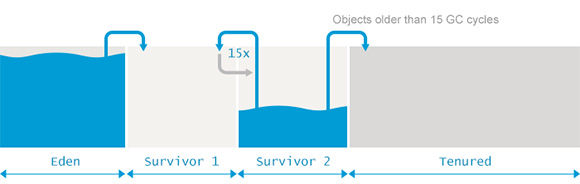

# 文章
- [jvm系列(三):java GC算法 垃圾收集器 - 纯洁的微笑 - 博客园](http://www.cnblogs.com/ityouknow/p/5614961.html)：介绍 JVM 的各种回收算法，和回收器。并介绍了新生代和老生代的回收器的组合，非常好。
- [Minor GC vs Major GC vs Full GC | Java Code Geeks - 2019](https://www.javacodegeeks.com/2015/03/minor-gc-vs-major-gc-vs-full-gc.html)：讲了三者的区别，非常好。这个是中文翻译，但有很多翻译不准确的地方：[Minor GC、Major GC和Full GC之间的区别 - ImportNew](http://www.importnew.com/15820.html)。
- [JVM参数配置详解（包含JDK1.8） - yjl33的专栏 - CSDN博客](https://blog.csdn.net/yjl33/article/details/78890363)：JVM 参数配置的一些方案。
- [大型跨境电商JVM调优经历 - 掘金](https://juejin.im/post/5b091ee35188253892389683)：JVM 参数配置的经验，和各种场景下的配置方法。
- [一次堆外OOM问题的排查 - 后端 - 掘金](https://juejin.im/entry/5976b6c8f265da6c306564e6)：堆外内存发生 OOM 的解决方法。
- [【转】深入理解Major GC, Full GC, CMS - hongxi.org - ITeye博客](https://wely.iteye.com/blog/2339052)：讲了 full gc 和 minor gc 的区别。

一个系列，从原理到调优，还有工具的使用：
- [jvm优化—— 图解垃圾回收 - 掘金](https://juejin.im/post/59dd7ce8f265da43052d9680)
- [jvm优化必知系列——监控工具 - 掘金](https://juejin.im/post/59e6c1f26fb9a0451c397a8c)
- [如何合理的规划一次jvm性能调优 - 掘金](https://juejin.im/post/59f02f406fb9a0451869f01c)

另一个系列：
- [JVM系列一：JVM内存组成及分配 - redcreen - 博客园](https://www.cnblogs.com/redcreen/archive/2011/05/04/2036387.html)
- [JVM系列二:GC策略&内存申请、对象衰老 - redcreen - 博客园](http://www.cnblogs.com/redcreen/archive/2011/05/04/2037056.html)
- [JVM系列三:JVM参数设置、分析 - redcreen - 博客园](https://www.cnblogs.com/redcreen/archive/2011/05/04/2037057.html)
- [JVM系列四:生产环境参数实例及分析【生产环境实例增加中】 - redcreen - 博客园](https://www.cnblogs.com/redcreen/archive/2011/05/05/2038331.html)
- [JVM系列五:JVM监测&工具[整理中] - redcreen - 博客园](https://www.cnblogs.com/redcreen/archive/2011/05/09/2040977.html)
- [HotSpot VM GC 的种类 - redcreen - 博客园](http://www.cnblogs.com/redcreen/archive/2011/05/04/2037029.html)

关于 CMS：
- [GC之详解CMS收集过程和日志分析 - 凌渡冰 - 博客园](https://www.cnblogs.com/zhangxiaoguang/p/5792468.html)
- [一次CMS GC问题排查过程（理解原理+读懂GC日志） | IT瘾](http://itindex.net/detail/47030-cms-gc-%E9%97%AE%E9%A2%98)
- [为啥heap小于3g不建议使用CMS GC这种方式 – hellojavacases微信公众号网站](http://hellojava.info/?p=142)
- [图解CMS垃圾回收机制，你值得拥有 - 简书](https://www.jianshu.com/p/2a1b2f17d3e4)

关于 JVM 参数：
- [JVM系列三:JVM参数设置、分析 - redcreen - 博客园](https://www.cnblogs.com/redcreen/archive/2011/05/04/2037057.html)

关于 JVM 日志打印：
- [jvm的GC日志分析 - - ITeye博客](https://swcdxd.iteye.com/blog/1859858)

自己的感想：
- 关于堆外内存：在配置堆外内存参数时，大家一般都配置`XX:MaxDirectMemorySize`这个参数。为什么配置这个参数呢？
一般情况下，在 Full GC 时候，会回收堆外内存。但如果 Full GC 很少的情况下，堆外内存有可能把剩余内存占满。当配置了`XX:MaxDirectMemorySize`这个参数后，达到这个参数的阈值后，就会引发 Full GC 进行回收堆外内存。

- 是不是 Old 区配置越小越好呢？不太知道。因为如果 old 区小，发生的频率高，但回的也快。如果大，发生的频率低，但每次回收的慢。

# 总结
## 1，JVM 内存区域的划分

- Young space: 包括 Eden、Survior1 和 Survior2 等 3 个部分。
- Old/Tenured space：只包括 Old/Tenured 一个部分。

## 2，Minor GC、Major GC 和 Full GC 的区别。
### 分类
Minor GC：是指 Young space（包括 Eden、Survior1 和 Survior2）因为空间不足，无法创建新的对象时会进行 GC，这时候的 GC 被称为`Minor GC`。

Major GC：是指 Old space 空间到达了指定比率后，或因为内存碎片问题无法存放对象时，会进行一次 GC，这时候的 GC 被称为`Major GC`。

Full GC：这个名称没有一个统一的定义。有的说是 Major GC 就是 Full GC，有的说 Full GC 就是 Minor GC + Major GC。从发生顺序上来说，每次 Major GC 可能都会有一次 Minor GC，因为 Major GC 是因为 Young space 的对象上升到 Old Space 上产生的。但实际上，从 JVM 的输出来看，Full GC 是指 Major GC 时，产生的 Stop The World 的次数。

比如，如果使用 CMS 收集器的话，进行一次 Major GC 会产生两个 Full GC（使用 jstat 查看 full gc 次数为 2），因为 CMS 会产生两次的 Stop The World。这么看来，JVM 把 Stop The World 算成了一次 Full GC。
> 为什么 Young GC 也会产生 Stop The World，但不算是 Full GC 呢？可以参考：[【转】深入理解Major GC, Full GC, CMS - hongxi.org - ITeye博客](https://wely.iteye.com/blog/2339052)

### 关于 Stop The World
在 Minor GC 和 Major GC 时，都会产生 Stop The World（后面简称 STW）。产生 STW 后，应用线程就会停止工作，无法提供服务。如果停止时间过长的话，就会影响服务的可用性。

#### Minor GC 的 STW 
对于 Minor GC 来说，所有的 Minor GC 都会触发 STW。在 Minor GC 时如果对象是无效的，可以立刻被回收的话，STW 的导致的停顿是非常短的，可以忽略不计；但如果对象不符合 GC 条件（即，需要复制到 Survivor 或 Old 空间），Minor GC 执行时应用线程停顿（无法服）务的时间将会长很多。

另外，对象从 Young 晋升到 Old 时，对于`寻找哪里能放下`的这个步骤，CMS 比ParallelOld GC是慢一些的，因此就导致了YGC速度会有一定程度的下降。所以，根据 Old Space 的 GC Collector 类型，YGC 慢多少也不一样。

#### Major GC 的 STW 
Major GC 的话也会产生 STW，但具体会有多长时间的 STW，是要根据的`GC 收集器(Collector)`来看。下面说说每种收集器造成的停顿时长。
- Serial 收集器：串行收集器是最古老，最稳定以及效率高的收集器。Old Space 是使用`标记-压缩`算法，垃圾收集的整个过程中会造成 STW，也就是说整个过程中`服务都不可用`。

- ParNew 收集器：ParNew收集器其实就是Serial收集器的多线程版本。Old Space 是串行的，使用的是`标记-压缩`算法，垃圾收集的整个过程中也是 STW。

- Parallel Scavenge 收集器：类似ParNew收集器，更关注系统的吞吐量。和 ParNew 收集器一样，Old Space 也是串行的，使用的是`标记-压缩`算法，垃圾收集的整个过程中也是 STW。

- Parallel Old 收集器：是Parallel Scavenge 收集器的 Old Space版本（这里没有介绍 Young Space 的情况，这两个收集器区别是在 Old Space）。Old Space 是`并行`的，使用的是`标记-压缩`算法，垃圾收集的整个过程中也是 STW。

- CMS 收集器：是一种以获取最短回收停顿时间为目标的收集器，尤其重视服务的响应速度，希望系统停顿时间最短。它包括 4 个阶段：初始标记（CMS initial mark）、并发标记（CMS concurrent mark）、重新标记（CMS remark）和 并发清除（CMS concurrent sweep）。只有 初始标记（CMS initial mark）和 重新标记（CMS remark）阶段是 STW 的，其它的阶段都是和应用线程并行进行的。

- G1 收集器：是用来代替 CMS 收集器的。它也有几个阶段，其中 初始标记(Initial-Mark)、再标记(Remark)、清除失活对象(Copy/Clean up) 阶段会有 STW。其它阶段也是并行的。

上面对每个收集器并没有进行详细的介绍。总结一下，CMS 和 G1 以外的收集器，进行中都是 STW的，只不过是有`串行`和`并行`之分。而 CMS 和 G1 目的是减少停顿，它把 GC 分成了几个阶段，其中有几个阶段是 STW 的，但其它阶段可以和应用线程并行工作的。

## 3，Minor GC 和 Major GC 触发条件是什么？GC 发生后，都做了什么？
`触发条件`和`GC 具体动作`都是和特定的 GC Collector 相关的。有不同点，也有相同点。

### Minor GC 触发条件
`串行`、`并行`和 CMS Collector 触发条件都是一样的，具体如下：
- Eden 空间不足
- ScavengeBeforeFullGC 被设置。这个参数是指每次 Major GC 前，都会调用一次 Minor GC。

### Major GC 触发条件
根据 GC Collector 不同，触发条件也不同。

`串行`和`并行` Collector 触发条件如下：
- old 空间不足
- perm空间不足
- System.gc()的调用，包括RMI等的定时触发
- YGC时的悲观策略--YGC前&YGC后
- dump live的内存信息时(jmap –dump:live)

CMS 触发条件：
- old Gen的使用率大的一定的比率 默认为92%
- 配置了CMSClassUnloadingEnabled,且Perm Gen的使用达到一定的比率 默认为92%
- Hotspot自己根据估计决定是否要触法
- 在配置了ExplictGCInvokesConcurrent的情况下显示调用了System.gc()
- Full GC(Serial MSC)
- promotion failed 或 concurrent Mode Failure时;

### 具体动作
参考参看：[HotSpot VM GC 的种类 - redcreen - 博客园](http://www.cnblogs.com/redcreen/archive/2011/05/04/2037029.html)

## 4，内存申请和对象衰老过程
### 内存申请过程

- JVM会试图为相关Java对象在Eden中初始化一块内存区域；
- 当Eden空间足够时，内存申请结束。否则到下一步；
- JVM试图释放在Eden中所有不活跃的对象（minor collection），释放后若Eden空间仍然不足以放入新对象，则试图将部分Eden中活跃对象放入Survivor区；
- Survivor区被用来作为Eden及old的中间交换区域，当OLD区空间足够时，Survivor区的对象会被移到Old区，否则会被保留在Survivor区；
- 当old区空间不够时，JVM会在old区进行major collection；
- 完全垃圾收集后，若Survivor及old区仍然无法存放从Eden复制过来的部分对象，导致JVM无法在Eden区为新对象创建内存区域，则出现"Out of memory错误"；

### 对象衰老过程
- 新创建的对象的内存都分配自eden。Minor collection的过程就是将eden和在用survivor space中的活对象copy到空闲survivor space中。对象在young generation里经历了一定次数(可以通过参数配置)的minor collection后，就会被移到old generation中，称为tenuring。

具体参考：
- [JVM系列二:GC策略&内存申请、对象衰老 - redcreen - 博客园](http://www.cnblogs.com/redcreen/archive/2011/05/04/2037056.html)
- [java 图解JVM在内存中申请对象及垃圾回收流程 - Code-lover's Learning Notes - CSDN博客](https://blog.csdn.net/coslay/article/details/37726745)

# 问题
OK 1，Major GC 发生的原因，只有参数一个原因吗？

2，如果需要 new 一个对象，但 eden 和 survivor 区域都放不下的话，会如何？
会直接放到 old space。

3，Survivor Space 是如何使用的？总是空一个吗？一个满了后，Minor GC 时把存活的对象放到另一个中吗？
其中一个 survivor 区域一直是空的，是 eden 区域和另一个 survivor 区域在下一次copy collection 后，活着的 object 的目的地。object 在 survivo 区域被复制直到转移到old 区。

4，每个 space 都是如何回收和晋升的？

5，对于 Promotion 失败，是不是如果都在 Minor GC 回收了，就不再需要修改 Survivor 和 old 大小了。

OK 6，什么时候会发生 Major GC？
对于每个 GC Collector 都不一样，CMS 达到那个参数了就会发生 或 满了 或 System.gc()，其它的呢？

所谓的悲观策略（ http://tmalltesting.com/archives/663 我们性能测试团队一个同学分析的案例），就是JVM不按照JVM指定的参数来进行CMS GC，而是根据内存情况以及之前回收的方式动态调整，自行进行GC。旧生代剩余的空间（available）大于新生代中使用的空间（max_promotion_in_bytes），或者大于之前平均晋升的old的大小（av_promo），返回false。cms gc是每隔一个周期（默认2s）就会做一次这个检查，如果为false，则不执行YGC，而触发cms gc。
[一次CMS GC问题排查过程（理解原理+读懂GC日志） | IT瘾](http://itindex.net/detail/47030-cms-gc-%E9%97%AE%E9%A2%98)

7，GC Collector 中的 并行和并发的区别
区别1：
`并行`对应的是`串行`，`串行`是由一个线程行进行 GC，而`并行`是由多个线程一起进行 GC。不管`串行`还是`并行`，在 GC 的过程中，`应用线程`是暂停工作的。

`并发`和`并行`的区别是，不仅使用多线程进行 GC，并且 GC 过程中，可以和`应用线程`同时进行工作（这是和`并发`的最大区别）。

区别2：
`并行` Collector 主要是以达到`一定吞吐量`为目标；`并发` Collector 主要是以达到`快速响应`为目标。为什么这么说呢？

因为在`并发 GC` 时（CMS），为了减少 STW 时间，和`并发 GC` 相比，有一些复杂的工作要做，例如：Remark 等。而在`并行 GC` 时，因为`应用线程`是暂停的，所以就少了很多步骤，GC 总时间上就比`并发 GC`要少，但 STW 时间上比`并发 GC`要多。