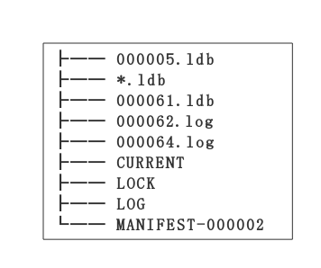

# 日志
## 为什么需要日志（WAL or journal）
- 日志是`单机本地存储系统`的不可缺少的。
- `单机本地存储系统`就是日志的具体实现（standalone local storage system is substantialization of WAL）。
- 日志保证数据完整性，在断电或线程崩溃等情况发生时。
- 日志是处理`事务的ACID`的关键。
- 顺序访问比随机访问快得多。

下面是一段 Stonebraker 说的，关于数据库设计的话:
1. 每个数据库的修改都应该产生一条日志，并且日志应该在数据库被修改之前，保存到磁盘上。

2. 数据库记录日志时，必须按用户操作的`先后顺序`进行记录。

3. 对于一个`提交事务`请求，日志记录必须在`请求返回之前`记录到磁盘上。

## LevelDB 的日志

为了防止写入内存的数据库因为进程异常、系统掉电等情况发生丢失，leveldb在写内存之前会将本次写操作的内容写入日志文件中。

在leveldb中，有两个memory db，以及对应的两份日志文件。其中一个memory db是可读写的，当这个db的数据量超过预定的上限时，便会转换成一个不可读的memory db，与此同时，与之对应的日志文件也变成一份frozen log。

而新生成的immutable memory db则会由后台的minor compaction进程将其转换成一个sstable文件进行持久化，持久化完成，与之对应的frozen log被删除。

在本文中主要分析日志的结构、写入读取操作。

# 日志文件
日志文件有两个：一个是对应 memtable，一个是对应 immutable memtable。

从上图可以看出，`000062.log`和`000064.log`对应两个 memtable。

# 日志结构
每个 memtable 对应一个 log 文件，那 log 文件内部是什么样的呢？log 文件内部主要是按以下逻辑划分的。

- Block：首先是 block，每 32KB 数据是一个 block。一个 log 文件里有多个 block。
- Record：每个 block 里面有多个 record。Record 的作用是当具体数据过大时，给数据做分片用；或者数据很小时，让 block 能够存储多个数据。每个 record 有 header 部分，还有具体数据（payload）部分。
- Payload：每个 payload 是装载用户的具体操作内容，而这些内容放到一个 payload 里，来表示一个原子操作。
- Op：op 是每个用户操作的具体内容，put 或 delete，数据格式不太一样。

## Block

为了增加读取效率，日志文件中按照block进行划分，每个block的大小为32KB。每个block中包含了若干个完整的record。

一条日志记录包含一个或多个record。每个record包含了一个7字节大小的header，前4字节是该record的校验码，紧接的2字节是该record数据的长度，以及最后一个字节是该record的类型。其中checksum校验的范围包括record的类型以及随后的data数据。

record共有四种类型：full，first，middle，last。一条日志记录若只包含一个record，则该record的类型为full。若一条日志记录包含多个record，则这些record的第一个类型为first, 最后一个类型为last，中间包含大于等于0个middle类型的record。

由于一个block的大小为32KB，因此当一条日志文件过大时，会将第一部分数据写在第一个block中，且类型为first，若剩余的数据仍然超过一个block的大小，则第二部分数据写在第二个block中，类型为middle，最后剩余的数据写在最后一个block中，类型为last。

## Record
日志的内容为写入的batch编码后的信息。

具体的格式为：

一条日志记录的内容包含：
- Header
- Data（就是上面的图中的 payload）

其中 header 中有：
1. 当前 db 的 sequence number
2. 本次日志记录中所包含的 put/del 操作的个数。

紧接着写入所有 batch 编码后的内容。有关 batch 的编码规则，可以见 读写操作.

# 日志写

日志写入流程较为简单，在leveldb内部，实现了一个journal的writer。首先调用Next函数获取一个singleWriter，这个singleWriter的作用就是写入一条journal记录。

singleWriter开始写入时，标志着第一个record开始写入。在写入的过程中，不断判断writer中buffer的大小，若超过32KB，将record开始到现在做为一个完整的record，为其计算header之后将整个block写入文件。与此同时reset buffer，开始新的record的写入。

若一条journal记录较大，则可能会分成几个record存储在若干个block中。

# 日志读

同样，日志读取也较为简单。为了避免频繁的IO读取，每次从文件中读取数据时，按block（32KB）进行块读取。

每次读取一条日志记录，reader调用Next函数返回一个singleReader。singleReader每次调用Read函数就返回一个record的数据。每次读取一个record，都会检查这批数据的校验码、数据类型、数据长度等信息是否正确，若不正确，且用户要求严格的正确性，则返回错误，否则丢弃整个record的数据。

循环调用singleReader的read函数，直至读取到一个类型为Last的record，表示整条日志记录都读取完毕，返回。

# 个人总结
## 1，关于 memtable 和 immutable memtable
两个 memtable 这种模式，主要是为了能够不阻塞写操作。这种模式在 RocketMQ 中也有体现，在 CommitLog 接收消息写入处理时，接收到一定时间的消息后，就要处理这些消息。处理消息之前，准备另一个 queue 来接收`新的消息`。这样在处理`已经接收到的消息`时，不影响新的消息的接收。

## 2，写操作的原子性
通过把每次 put/del 数据个数记到一条记录中，来保证处理的原子性。那如果一次 put 3 条数据，恢复时读到最后一条数据出错了，那是不是就保证不了原子性了？有没有这种可能性？

没有读代码，推断可能是这么做的：`在读到第 3 条数据出错的话，整个 Record 的数据都放弃掉，这样可以保证原子性`。但一般来说，在读取 block 时候，如果文件中内容写的不正确（因为停机一部分数据没有写到磁盘上），CRC 校验就会出错，会把这个 block 给放弃掉。

## 3，当 block 无法容下 record 时
当 block 无法容下 record 时，LevelDB 会把数据分成几份来保存。如果 block 的空间连一份数据中的 Header 部分都写不下的话，会以 0 进行填充。

RocketMQ 当写不下全部数据的时候，不会分成 first、middle、last，而是把剩余的空间设置成`空白消息`。因为 RocketMQ 每个日志文件都很大，可能这样做浪费的空间，小于为每个消息都加一个字段所占用的空间，所以设置成`空白`。

如果 header 都写不下，RocketMQ 是 header 部分能写多少就写多少，就是为了把文件填满。然后会把数据保存到一个新文件上。但在启动后，数据恢复时可能会发生问题，在遇到上面那种`Header 都没有写完整`的文件后，因为在读取 header 时无法读取完整，会报异常，后面的文件都不会被恢复了。（不知道理解的对不对）

## 4，日志文件的保存和删除
在保存文件到磁盘时，是以每个 block 为单位保存的。如果不把 block 填满，就不会保存到磁盘上。从 block 的数据结构就可以看出，block 的第一个字段是保存`数据部分 CRC 校验值`。（这么做的话，可能存储在数据丢失的风险）

immutable memtable 则会由后台的minor compaction进程将其转换成一个sstable文件进行持久化，持久化完成，与之对应的日志被删除。

# 参考：
- [LevelDB的操作日志](https://codingstory.com/2012/07/11/leveldb-commit-log/)
- [Leveldb_RTFSC](http://www.grakra.com/2017/06/17/Leveldb-RTFSC/)
- [LevelDB：写操作](https://www.jianshu.com/p/8639b21cb802)
 