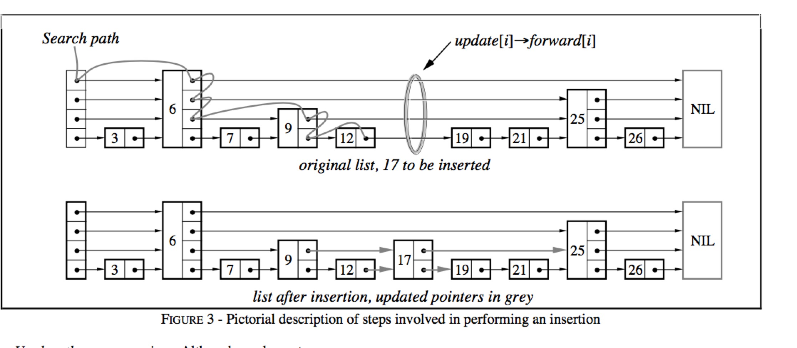
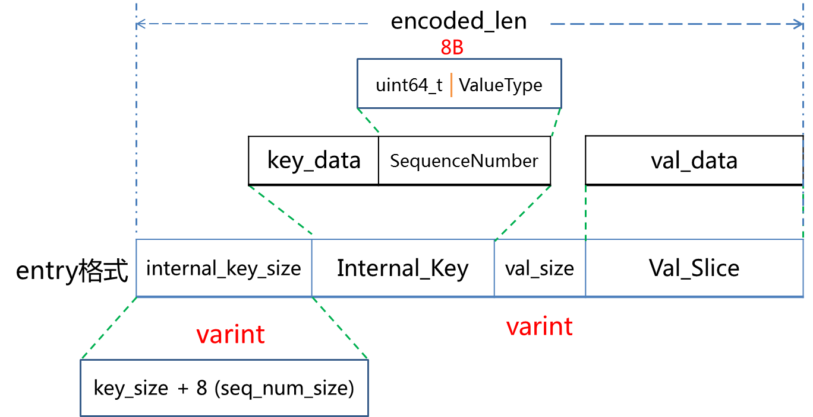
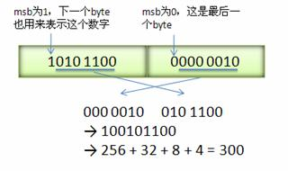
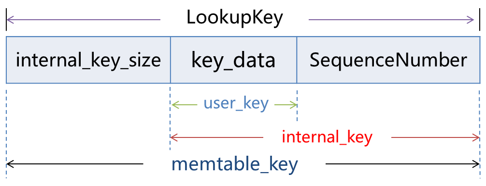

# 前言
下面的关于 skiplist 的说明，如果看的不太明白的话，可以看下面的文章来加深理解。
- [深夜学算法之SkipList：让链表飞](https://www.jianshu.com/p/fcd18946994e)：有图有说明，很好理解。但 RandomLevel 的计算方法不是很好理解。
- [JAVA SkipList 跳表 的原理和使用例子](https://blog.csdn.net/bigtree_3721/article/details/51291974)：里面说了时间复杂度的计算 和 RandomLevel 的计算方法。
- [【算法导论33】跳跃表（Skip list）原理与java实现](https://blog.csdn.net/BrilliantEagle/article/details/52206261)：有一些例子说明，好理解。还有 Java 实现。


# 内存数据库
leveldb中内存数据库用来维护有序的key-value对，其底层是利用跳表实现，绝大多数操作（读／写）的时间复杂度均为O(log n)，有着与平衡树相媲美的操作效率，但是从实现的角度来说简单许多，因此在本文中将介绍一下内存数据库的实现细节。

## 跳表
### 概述
跳表（SkipList）是由William Pugh提出的。他在论文《Skip lists: a probabilistic alternative to balanced trees》中详细地介绍了有关跳表结构、插入删除操作的细节。

这种数据结构是利用概率均衡技术，加快简化插入、删除操作，且保证绝大大多操作均拥有O(log n)的良好效率。

作者在他的论文中这样介绍跳表：
> 
Skip lists are a data structure that can be used in place of balanced trees. Skip lists use probabilistic balancing rather than strictly enforced balancing and as a result the algorithms for insertion and deletion in skip lists are much simpler and significantly faster than equivalent algorithms for balanced trees.

平衡树（以红黑树为代表）是一种非常复杂的数据结构，为了维持树结构的平衡，获取稳定的查询效率，平衡树每次插入可能会涉及到较为复杂的节点旋转等操作。作者设计跳表的目的就是借助概率平衡，来构建一个快速且简单的数据结构，取代平衡树。


作者从链表讲起，一步步引出了跳表这种结构的由来。

- 图a中，所有元素按序排列，被存储在一个链表中，则一次查询之多需要比较N个链表节点；

- 图b中，每隔2个链表节点，新增一个额外的指针，该指针指向间距为2的下一个节点，如此以来，借助这些额外的指针，一次查询至多只需要⌈n/2⌉ + 1次比较；

- 图c中，在图b的基础上，每隔4个链表节点，新增一个额外的指针，指向间距为4的下一个节点，一次查询至多需要⌈n/4⌉ + 2次比较；

作者推论，若每隔2^ i个节点，新增一个辅助指针，最终一次节点的查询效率为O(log n)。但是这样不断地新增指针，使得一次插入、删除操作将会变得非常复杂。

一个拥有k个指针的结点称为一个k层结点（level k node）。按照上面的逻辑，50%的结点为1层节点，25%的结点为2层节点，12.5%的结点为3层节点。若保证每层节点的分布如上述概率所示，则仍然能够相同的查询效率。图e便是一个示例。

维护这些辅助指针将会带来较大的复杂度，因此作者将每一层中，每个节点的辅助指针指向该层中下一个节点。故在插入删除操作时，只需跟操作链表一样，修改相关的前后两个节点的内容即可完成，作者将这种数据结构称为跳表。

### 结构


一个跳表的结构示意图如上所示。

跳跃列表是按层建造的。底层是一个普通的有序链表。每个更高层都充当下面链表的”快速通道”，这里在层 i 中的元素按某个固定的概率 p (通常为0.5或0.25)出现在层 i+1 中。平均起来，每个元素都在 1/(1-p) 个列表中出现，而最高层的元素（通常是在跳跃列表前端的一个特殊的头元素）在 O(log1/p n) 个列表中出现。

### 查找


在介绍插入和删除操作之前，我们首先介绍查找操作，该操作是上述两个操作的基础。

例如图中，需要查找一个值为17的链表节点，查找的过程为：

- 首先根据跳表的高度选取最高层的头节点；
- 若跳表中的节点内容小于查找节点的内容，则取该层的下一个节点继续比较；
- 若跳表中的节点内容等于查找节点的内容，则直接返回；
- 若跳表中的节点内容大于查找节点的内容，且层高不为0，则降低层高，且从前一个节点开始，重新查找低一层中的节点信息；若层高为0，则返回当前节点，该节点的key大于所查找节点的key。
综合来说，就是利用稀疏的高层节点，快速定位到所需要查找节点的大致位置，再利用密集的底层节点，具体比较节点的内容。

### 插入
插入操作借助于查找操作实现。


- 在查找的过程中，不断记录每一层的前任节点，如图中红色圆圈所表示的；
- 为新插入的节点随机产生层高（随机产生层高的算法较为简单，依赖最高层数和概率值p，可见下文中的代码实现）；
- 在合适的位置插入新节点（例如图中节点12与节点19之间），并依据查找时记录的前任节点信息，在每一层中，以链表插入的方式，将该节点插入到每一层的链接中。

链表插入指：将当前节点的Next值置为前任节点的Next值，将前任节点的Next值替换为当前节点。
```
func (p *DB) randHeight() (h int) {
    const branching = 4
    h = 1
    for h < tMaxHeight && p.rnd.Int()%branching == 0 {
        h++
    }
    return
}
```
### 删除
跳表的删除操作较为简单，依赖查找过程找到该节点在整个跳表中的位置后，以链表删除的方式，在每一层中，删除该节点的信息。

链表删除指：将前任节点的Next值替换为当前节点的Next值，并将当前节点所占的资源释放。

### 迭代
#### 1，向后遍历

- 若迭代器刚被创建，则根据用户指定的查找范围[Start, Limit)找到一个符合条件的跳表节点；
- 若迭代器处于中部，则取出上一次访问的跳表节点的后继节点，作为本次访问的跳表节点（后继节点为最底层的后继节点）；
- 利用跳表节点信息（keyvalue数据偏移量，key，value值长度等），获取keyvalue数据；
#### 2，向前遍历

- 若迭代器刚被创建，则根据用户指定的查找范围[Start, Limit）在跳表中找到最后一个符合条件的跳表节点；
- 若迭代器处于中部，则利用上一次访问的节点的key值，查找比该key值更小的跳表节点；
利用跳表节点信息（keyvalue数据偏移量，key，value值长度等），获取keyvalue数据；

## 内存数据库
在介绍完跳表这种数据结构的组织原理以后，我们介绍leveldb如何利用跳表来构建一个高效的内存数据库。

### 键值编码
在介绍内存数据库之前，首先介绍一下内存数据库的键值编码规则。由于内存数据库本质是一个kv集合，且所有的数据项都是依据key值排序的，因此键值的编码规则尤为关键。

内存数据库中，key称为internalKey，其由三部分组成：
- 用户定义的key：这个key值也就是原生的key值；
- 序列号：leveldb中，每一次写操作都有一个sequence number，标志着写入操作的先后顺序。由于在leveldb中，可能会有多条相同key的数据项同时存储在数据库中，因此需要有一个序列号来标识这些数据项的新旧情况。序列号最大的数据项为最新值；
- 类型：标志本条数据项的类型，为更新还是删除；


### 键值比较
内存数据库中所有的数据项都是按照键值比较规则进行排序的。这个比较规则可以由用户自己定制，也可以使用系统默认的。在这里介绍一下系统默认的比较规则。

默认的比较规则：
- 首先按照字典序比较用户定义的key（ukey），若用户定义key值大，整个internalKey就大；
- 若用户定义的key相同，则序列号大的internalKey值就小；

通过这样的比较规则，则所有的数据项首先按照用户key进行升序排列；当用户key一致时，按照序列号进行降序排列，这样可以保证首先读到序列号大的数据项。

### 插入数据时的结构
上面是介绍了 key 的数据结构，在保存到 memtable 中时，是把 key 和 value 包装成一个 entry 数据结构来保存的。结构说明如下：
- internal_key_size：用来保存 internal key 的大小
- internal_key：就是上面说明的 key。
- val_size：value 部分的大小。
- val_slice：value 数据




#### 细节 1
注意，internal_key_size 和 val_size 的存储方式都是使用 varint 编码方式进行存储的。什么是 varint 编码呢？

> Varint 是一种紧凑的表示数字的方法。它用一个或多个字节来表示一个数字，值越小的数字使用越少的字节数。这能减少用来表示数字的字节数。比如对于 int32 类型的数字，一般需要 4 个 byte 来表示。但是采用 Varint，对于很小的 int32 类型的数字，则可以用 1 个 byte 来表示。当然凡事都有好的也有不好的一面，采用 Varint 表示法，大的数字则需要 5 个 byte 来表示。从统计的角度来说，一般不会所有的消息中的数字都是大数，因此大多数情况下，采用 Varint 后，可以用更少的字节数来表示数字信息。例子如下：

参考：[数值压缩存储方法Varint](https://www.cnblogs.com/smark/archive/2012/05/03/2480034.html)

#### 细节 2
memtable 接收到的数据格式和`日志`接收到的数据格式是一样的。即：
- header(sequence + count)
- OP_1
- OP_2
- ......
- OP_N

因为在使用 api 输入指令时，例如：`leveldb.Put("foo", "v1"); Put("foo", "v2")`，就把 key/value 保存成了上面的`header + op_n`的格式了。

当要把数据保存到 memtable，memtable 会把 header 部分去掉，然后对 OP_N 部分进行循环处理，取得每一条数据，做成上 entry 的格式，然后插入到 skiplist 中。


### 查询数据时的结构
在查询时，项目的数据结构如下。只要有 user key，就可以组成查询 key。



### 数据组织
以goleveldb为示例，内存数据库的定义如下：
```
type DB struct {
    cmp comparer.BasicComparer
    rnd *rand.Rand

    mu     sync.RWMutex
    kvData []byte
    // Node data:
    // [0]         : KV offset
    // [1]         : Key length
    // [2]         : Value length
    // [3]         : Height
    // [3..height] : Next nodes
    nodeData  []int
    prevNode  [tMaxHeight]int
    maxHeight int
    n         int
    kvSize    int
}
```
其中kvData用来存储每一条数据项的key-value数据，nodeData用来存储每个跳表节点的链接信息。

nodeData中，每个跳表节点占用一段连续的存储空间，每一个字节分别用来存储特定的跳表节点信息。

- 第一个字节用来存储本节点key-value数据在kvData中对应的偏移量；
- 第二个字节用来存储本节点key值长度；
- 第三个字节用来存储本节点value值长度；
- 第四个字节用来存储本节点的层高；
- 第五个字节开始，用来存储每一层对应的下一个节点的索引值；

### 基本操作
Put、Get、Delete、Iterator等操作均依赖于底层的跳表的基本操作实现，不再赘述。

# 个人总结
## 1，关于内存数据库
在内存数据库中，最重要的就是 skiplist 的实现了，因为它是 memtable 的核心逻辑。

除此之外，还有一点就是 internal_key 了。在 skiplist 进行比较 key 时，是拿 internal_key 进行比较。sequence number 起到了版本控制作用。

## 2，关于 varint 编码
在保存 key 和 value 的 size 字段时，对 size 使用了 varint 编码，当 key 和 value 都不大时，可以节省一些空间。

## 3，写 memtable 代码
1，
文件：db_impl.cc
方法：`Status DBImpl::Write(const WriteOptions& options, WriteBatch* my_batch) `
```
if (status.ok()) {
status = WriteBatchInternal::InsertInto(updates, mem_); // 向 memtable 写
}
```

2，
文件：write_batch.cc
方法：`Status WriteBatchInternal::InsertInto(const WriteBatch* b,
                                      MemTable* memtable)`
```
Status WriteBatchInternal::InsertInto(const WriteBatch* b,
                                      MemTable* memtable) {
  MemTableInserter inserter;
  inserter.sequence_ = WriteBatchInternal::Sequence(b);
  inserter.mem_ = memtable;
  return b->Iterate(&inserter); // 调用 inserter 进行写 memtable
}
```

3，
文件：write_batch.cc
```
Status WriteBatch::Iterate(Handler* handler) const {
  Slice input(rep_);
  if (input.size() < kHeader) {
    return Status::Corruption("malformed WriteBatch (too small)");
  }

  input.remove_prefix(kHeader);
  Slice key, value;
  int found = 0;
  while (!input.empty()) {
    found++;
    char tag = input[0];
    input.remove_prefix(1);
    switch (tag) {
      case kTypeValue:
        if (GetLengthPrefixedSlice(&input, &key) &&
            GetLengthPrefixedSlice(&input, &value)) {
          handler->Put(key, value); // 向 memtable 加一条 put 数据
        } else {
          return Status::Corruption("bad WriteBatch Put");
        }
        break;
      case kTypeDeletion:
        if (GetLengthPrefixedSlice(&input, &key)) {
          handler->Delete(key); // 向 memtable 加一条 delete 数据
        } else {
          return Status::Corruption("bad WriteBatch Delete");
        }
        break;
      default:
        return Status::Corruption("unknown WriteBatch tag");
    }
  }
  if (found != WriteBatchInternal::Count(this)) {
    return Status::Corruption("WriteBatch has wrong count");
  } else {
    return Status::OK();
  }
}
```

4，
文件：write_batch.cc
```
class MemTableInserter : public WriteBatch::Handler {
 public:
  SequenceNumber sequence_;
  MemTable* mem_;

  virtual void Put(const Slice& key, const Slice& value) {
    mem_->Add(sequence_, kTypeValue, key, value);
    sequence_++;
  }
  virtual void Delete(const Slice& key) {
    mem_->Add(sequence_, kTypeDeletion, key, Slice());
    sequence_++;
  }
};
```

5，
文件：memtable.cc
```
// 在这里进行 internal_key 的创建和保存。
void MemTable::Add(SequenceNumber s, ValueType type,
                   const Slice& key,
                   const Slice& value) {
  // Format of an entry is concatenation of:
  //  key_size     : varint32 of internal_key.size()
  //  key bytes    : char[internal_key.size()]
  //  value_size   : varint32 of value.size()
  //  value bytes  : char[value.size()]
  size_t key_size = key.size();
  size_t val_size = value.size();
  size_t internal_key_size = key_size + 8;
  const size_t encoded_len =
      VarintLength(internal_key_size) + internal_key_size +
      VarintLength(val_size) + val_size;
  char* buf = arena_.Allocate(encoded_len);
  char* p = EncodeVarint32(buf, internal_key_size);
  memcpy(p, key.data(), key_size);
  p += key_size;
  EncodeFixed64(p, (s << 8) | type);
  p += 8;
  p = EncodeVarint32(p, val_size);
  memcpy(p, value.data(), val_size);
  assert(p + val_size == buf + encoded_len);
  table_.Insert(buf);
}
```

# 问题：
1，sequence number 是如何使用的？在插入和查询时，都是如何取得这个值的？


# 参考
- [MemTable与SkipList-leveldb源码剖析(3)](http://www.pandademo.com/2016/03/memtable-and-skiplist-leveldb-source-dissect-3/)：源码解析的文章，这篇文章有的图是从这里找的，有不明白可以去找找。
- [Leveldb源码笔记之读操作](http://blog.1feng.me/2016/09/10/leveldb-read/)：源码解析的文章，这篇文章有的图是从这里找的，有不明白可以去找找。
- [leveldb中的memtable](http://bean-li.github.io/leveldb-memtable/)：源码解析的文章，引用了上两篇文章中的图。
- [LevelDB：写操作](https://www.jianshu.com/p/8639b21cb802)：简单介绍写的主要流程，并指明是哪行代码，方便理解。
