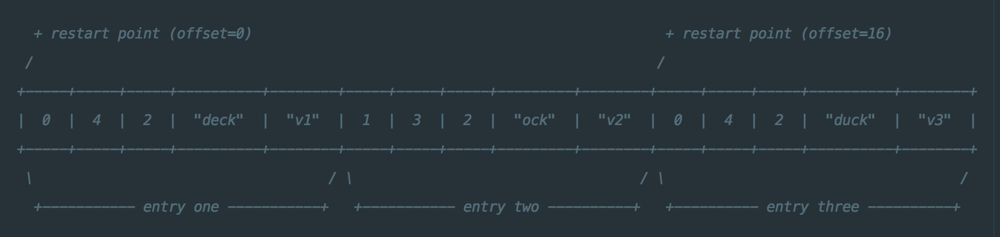
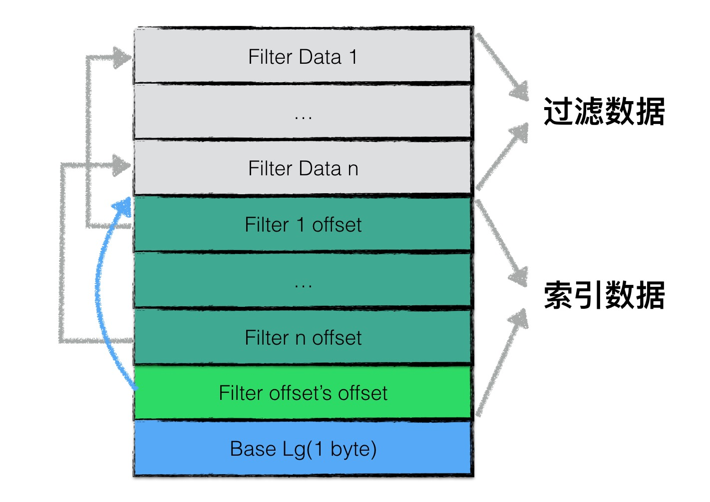
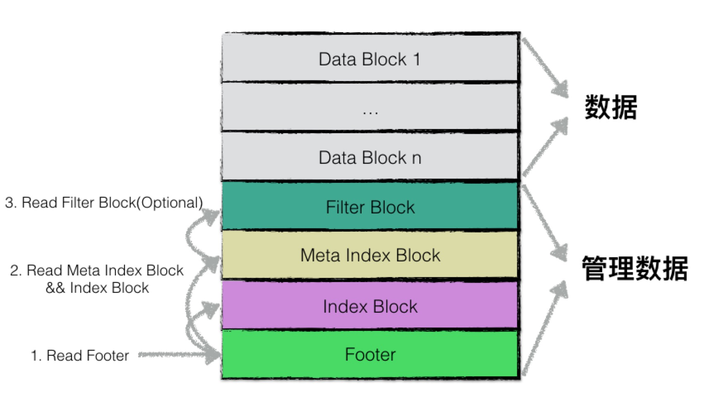

# 概述
如我们之前提到的，leveldb是典型的LSM树(Log Structured-Merge Tree)实现，即一次leveldb的写入过程并不是直接将数据持久化到磁盘文件中，而是将写操作首先写入日志文件中，其次将写操作应用在memtable上。

当leveldb达到checkpoint点（memtable中的数据量超过了预设的阈值），会将当前memtable冻结成一个不可更改的内存数据库（immutable memory db），并且创建一个新的memtable供系统继续使用。

immutable memory db会在后台进行一次minor compaction，即将内存数据库中的数据持久化到磁盘文件中。

>
在这里我们暂时不展开讨论minor compaction相关的内容，读者可以简单地理解为将内存中的数据持久化到文件

leveldb（或者说LSM树）设计Minor Compaction的目的是为了：
- 有效地降低内存的使用率；
- 避免日志文件过大，系统恢复时间过长；
当memory db的数据被持久化到文件中时，leveldb将以一定规则进行文件组织，这种文件格式成为sstable。在本文中将详细地介绍sstable的文件格式以及相关读写操作。

# SStable文件格式
## 整体结构
sstable 文件的整体结构如下：
- data_block 0 ~ N-1
- filter_block
- meta_index_block
- index_block
- footer


（上图左下部分，metaindex_handle 箭头指向错了，应该指向 index_block 上面的 meta_index_block。）

每个 data_block 保存的是具体的数据。除了具体数据外，还有一些为了查找数据用的结构，整体结构如下：
- restart_interval 0 ~ M-1：这里保存的是具体的数据，每个 interval 里保存多条数据，这些数据都是 key 之间有联系的，例如：key:abc, key:abcd, key:abx，具体在下下面详细介绍时进行解释。除了数据外，还保存了一些关于 key 的共享信息和长度，还有 value 的一些信息。这些信息都是为了方便查找而存储的。
- offset of restart_interval：记录每个 interval 的 offset，方便直接查找。
- number of restart_interval：interval 一共的数量
- compression_type：是否进行压缩
- crc32：前面所有字段（包括 compression_type ）压缩后的数据的 crc 值。


## 物理结构
为了提高整体的读写效率，一个sstable文件按照固定大小进行块划分，默认每个块的大小为4KiB。`每个 Block(data_block、filter_block、meta_index_block等)`中，除了存储数据以外，还会存储两个额外的辅助字段：
- 压缩类型
- CRC校验码

压缩类型说明了Block中存储的数据是否进行了数据压缩，若是，采用了哪种算法进行压缩。leveldb中默认采用Snappy算法进行压缩。CRC校验码是循环冗余校验校验码，校验范围包括`数据`以及`压缩类型（compression_type）`。


## 逻辑结构
在逻辑上，根据功能不同，leveldb在逻辑上又将sstable分为：
- data block: 用来存储key value数据对；
- filter block: 用来存储一些过滤器相关的数据（布隆过滤器），但是若用户不指定leveldb使用过滤器，leveldb在该block中不会存储任何内容；
- meta Index block: 用来存储filter block的索引信息（索引信息指在该sstable文件中的偏移量以及数据长度）；
- index block：index block中用来存储每个data block的索引信息；
- footer: 用来存储meta index block及index block的索引信息；


注意，1-4类型的区块，其物理结构都是如1.1节所示，每个区块都会有自己的压缩信息以及CRC校验码信息。

## data block 结构
data block 中存储的数据是leveldb中的key/value键值对。其中一个data block中的数据部分（不包括压缩类型、CRC校验码）按逻辑又以下图进行划分：
> 下面介绍各种 block 时，都不包括`压缩类型（Compression_type）`和`CRC校验码`。


这个图和上面的结构图中每部分的叫法不太一样，对应如下：
- restart_interval 1~N：entry 1~N
- offset of restart_interval 1~N：restart point 1~N
- number of restart_interval：restart point lenth

### entry
第一部分用来存储key/value数据。由于sstable中所有的key/value对都是严格按序存储的，用了节省存储空间，leveldb并不会为每一对key/value对都存储完整的key值，而是存储与上一个key非共享的部分，避免了key重复内容的存储。

每间隔若干个key/value对，将为该条记录重新存储一个完整的key。重复该过程（默认间隔值为16），每个重新存储完整key的点称之为 Restart point。

>
leveldb设计Restart point的目的是在读取sstable内容时，加速查找的过程。
>
由于每个Restart point存储的都是完整的key值，因此在sstable中进行数据查找时，可以首先利用restart point点的数据进行键值比较，以便于快速定位目标数据所在的区域；当确定目标数据所在区域时，再依次对区间内所有数据项逐项比较key值，进行细粒度地查找；
>
该思想有点类似于跳表中利用高层数据迅速定位，底层数据详细查找的理念，降低查找的复杂度。

每个数据项的格式如下图所示：


一个entry分为5部分内容：
- 与前一条记录key共享部分的长度；
- 与前一条记录key不共享部分的长度；
- value长度；
- 与前一条记录key非共享的内容；
- value内容；

例如：
```
restart_interval=2
entry one  : key=deck,value=v1
entry two  : key=dock,value=v2
entry three: key=duck,value=v3
```


三组entry按上图的格式进行存储。值得注意的是restart_interval为2，因此每隔两个entry都会有一条数据作为restart point点的数据项，存储完整key值。因此entry3存储了完整的key。

### restart point 和 length
此外，第一个 restart point 为 0（偏移量），第二个 restart point 为 16，restart point 共有两个，因此一个datablock数据段的末尾添加了下图所示的数据：


尾部数据记录了每一个restart point的值，以及所有restart point的个数。


## filter block结构
讲完了data block，在这一章节将展开讲述filter block的结构。

为了加快sstable中数据查询的效率，在直接查询datablock中的内容之前，leveldb首先根据filter block中的过滤数据判断指定的datablock中是否有需要查询的数据，若判断不存在，则无需对这个datablock进行数据查找。

filter block存储的是data block数据的一些过滤信息。这些过滤数据一般指代布隆过滤器的数据，用于加快查询的速度，关于布隆过滤器的详细内容，可以见《Leveldb源码分析 - 布隆过滤器》。




filter block存储的数据主要可以分为两部分：（1）过滤数据（2）索引数据。

其中索引数据中，filter i offset表示第i个filter data在整个 filter block 中的起始偏移量。filter offset's offset 表示 filter block offset 在filter block中的偏移量，也就是上图中 filter 1 offset 的位置。

在读取filter block中的内容时，可以首先读出filter offset's offset的值，然后依次读取filter i offset，根据这些offset分别读出filter data。

Base Lg默认值为11，表示每 `2KB` 的数据，创建一个新的过滤器来存放过滤数据。也就是说，每个 filter_block 大小是 `2KB`。    

一个 sstable 只有一个 filter block，其内存储了所有  block 的 filter 数据. 具体来说，filter_data_k 包含了所有起始位置处于 [base*k, base*(k+1)] 范围内的 block 的 key 的集合的 filter 数据，按数据大小而非 block 切分主要是为了尽量均匀，以应对存在一些 block 的 key 很多，另一些 block 的 key 很少的情况。

>
leveldb中，特殊的sstable文件格式设计简化了许多操作，例如：
索引和BloomFilter等元数据可随文件一起创建和销毁，即直接存在文件里，不用加载时动态计算，不用维护更新


## meta index block结构
meta index block 用来存储 filter block 在整个 sstable 中的索引信息。

meta index block只存储一条记录，记录的 key/value 如下：
- key：”filter.”与过滤器名字组成的常量字符串
- value：filter block在sstable中的索引信息，信息如下（实际保存的是 value 序列化后的内容）：
  * （1）在sstable中的偏移量（也就是第一个 filter block 的位置）
  * （2）数据长度。

## index block结构
与meta index block类似，index block用来存储所有data block的相关索引信息。index block 包含若干条记录，每一条记录代表一个 data block 的索引信息。一条索引包括以下内容：
- data block i 中最大的key值；
- 该data block起始地址在sstable中的偏移量；
- 该data block的大小；


>
其中，data block i最大的key值还是index block中该条记录的key值。如此设计的目的是，依次比较index block中记录信息的key值即可实现快速定位目标数据在哪个data block中。


## footer结构
footer大小固定，为48字节，用来存储 meta index block 与 index block 在 sstable 中的索引信息，另外尾部还会存储一个 magic word，内容为：”http://code.google.com/p/leveldb/“字符串sha1哈希的前8个字节。


# 读写操作
在介绍完sstable文件具体的组织方式之后，我们再来介绍一下相关的读写操作。为了便于读者理解，将首先介绍写操作。

## 写操作
sstable的写操作通常发生在：
- memory db将内容持久化到磁盘文件中时，会创建一个sstable进行写入；
- leveldb后台进行文件compaction时，会将若干个sstable文件的内容重新组织，输出到若干个新的sstable文件中；

对sstable进行写操作的数据结构为tWriter，具体定义如下（以下代码应该是 go 语言实现，并不是 C++ 实现）：

```go
// tWriter wraps the table writer. It keep track of file descriptor
// and added key range.
type tWriter struct {
    t *tOps

    fd storage.FileDesc // 文件描述符
    w  storage.Writer   // 文件系统writer
    tw *table.Writer

    first, last []byte
}
```

主要包括了一个sstable的文件描述符，底层文件系统的writer，该sstable中所有数据项最大最小的key值以及一个内嵌的tableWriter。

一次sstable的写入为一次不断利用迭代器读取需要写入的数据，并不断调用tableWriter的Append函数，直至所有有效数据读取完毕，为该sstable文件附上元数据的过程。

该迭代器可以是一个内存数据库的迭代器，写入情景对应着上述的第一种情况；该迭代器也可以是一个sstable文件的迭代器，写入情景对应着上述的第二种情况；

>
sstable的元数据包括：（1）文件编码（2）大小（3）最大key值（4）最小key值

故，理解tableWriter的Append函数是理解整个写入过程的关键。

### tableWriter

在介绍append函数之前，首先介绍一下tableWriter这个数据结构。主要的定义如下：
```
// Writer is a table writer.
type Writer struct {
    writer io.Writer
    // Options
    blockSize   int // 默认是4KiB

    dataBlock   blockWriter // data块Writer
    indexBlock  blockWriter // indexBlock块Writer
    filterBlock filterWriter // filter块Writer
    pendingBH   blockHandle
    offset      uint64
    nEntries    int // key-value键值对个数
}
```

其中blockWriter与filterWriter表示底层的两种不同的writer，blockWriter负责写入data数据的写入，而filterWriter负责写入过滤数据。

pendingBH记录了上一个dataBlock的索引信息，当下一个dataBlock的数据开始写入时，将该索引信息写入indexBlock中。

### Append

一次append函数的主要逻辑如下：
- 若本次写入为新dataBlock的第一次写入，则将上一个dataBlock的索引信息写入；
- 将keyvalue数据写入datablock;
- 将过滤信息写入filterBlock；
- 若datablock中的数据超过预定上限，则标志着本次datablock写入结束，将内容刷新到磁盘文件中；

```
func (w *Writer) Append(key, value []byte) error {
    w.flushPendingBH(key)
    // Append key/value pair to the data block.
    w.dataBlock.append(key, value)
    // Add key to the filter block.
    w.filterBlock.add(key)

    // Finish the data block if block size target reached.
    if w.dataBlock.bytesLen() >= w.blockSize {
        if err := w.finishBlock(); err != nil {
            w.err = err
            return w.err
        }
    }
    w.nEntries++
    return nil
}
```
下面分别说一下每个部分的逻辑。

### dataBlock.append

该函数将编码后的kv数据写入到dataBlock对应的buffer中，编码的格式如上文中提到的数据项的格式。此外，在写入的过程中，若该数据项为restart点，则会添加相应的restart point信息。

### filterBlock.append

该函数将kv数据项的key值加入到过滤信息中，具体可见《Leveldb源码解析 - 布隆过滤器》

### finishBlock
当一个datablock中的数据超过了固定上限，则需要将相关数据写入到磁盘文件中。
> 上面的操作，只是把数据写到一块内存中，集中起来。写到内存的数据格式，和要保存到磁盘的数据格式可能并不一样。因为写到磁盘上的一部分数据（data_block）是需要进行压缩的。下面介绍写到磁盘时要做的工作。

在写入时，需要做以下工作：
- 封装dataBlock，记录restart point的个数；
- 若dataBlock的数据需要进行压缩（例如snappy压缩算法），则对dataBlock中的数据进行压缩；
- 计算checksum；
- 封装dataBlock索引信息（offset，length）；
- 将datablock的buffer中的数据写入磁盘文件；
- 利用这段时间里维护的过滤信息生成过滤数据，放入filterBlock对用的buffer中；

### Close

当迭代器取出所有数据并完成写入后，调用tableWriter的Close函数完成最后的收尾工作：
- 若buffer中仍有未写入的数据，封装成一个datablock写入；
- 将filterBlock的内容写入磁盘文件；
- 将filterBlock的索引信息写入metaIndexBlock中，写入到磁盘文件；
- 写入indexBlock的数据；
- 写入footer数据；

至此为止，所有的数据已经被写入到一个sstable中了，由于一个sstable是作为一个memory db或者Compaction的结果原子性落地的，因此在sstable写入完成之后，将进行更为复杂的leveldb的版本更新，将在接下来的文章中继续介绍。


## 读操作
读操作作为写操作的逆过程，充分理解了写操作，将会帮助理解读操作。

下图为在一个sstable中查找某个数据项的流程图：


大致流程为：
- 首先判断“文件句柄”cache中是否有指定sstable文件的文件句柄，若存在，则直接使用cache中的句柄；否则打开该sstable文件，按规则读取该文件的元数据，将新打开的句柄存储至cache中；
- 利用sstable中的index block进行快速的数据项位置定位，得到该数据项有可能存在的两个data block；
- 利用index block中的索引信息，首先打开第一个可能的data block；
- 利用filter block中的过滤信息，判断指定的数据项是否存在于该data block中，若存在，则创建一个迭代器对data block中的数据进行迭代遍历，寻找数据项；若不存在，则结束该data block的查找；
- 若在第一个data block中找到了目标数据，则返回结果；若未查找成功，则打开第二个data block，重复步骤4；
- 若在第二个data block中找到了目标数据，则返回结果；若未查找成功，则返回Not Found错误信息；

### 缓存
在leveldb中，使用cache来缓存两类数据：

- sstable文件句柄及其元数据；
- data block中的数据；

因此在打开文件之前，首先判断能够在cache中命中sstable的文件句柄，避免重复读取的开销。

### 元数据读取


由于sstable复杂的文件组织格式，因此在打开文件后，需要读取必要的元数据，才能访问sstable中的数据。

元数据读取的过程可以分为以下几个步骤：
- 读取文件的最后48字节的利用，即Footer数据；
- 读取Footer数据中维护的(1) Meta Index Block(2) Index Block两个部分的索引信息并记录，以提高整体的查询效率；
- 利用meta index block的索引信息读取该部分的内容；
- 遍历meta index block，查看是否存在“有用”的filter block的索引信息，若有，则记录该索引信息；若没有，则表示当前sstable中不存在任何过滤信息来提高查询效率；
- 数据项的快速定位

sstable中存在多个data block，倘若依次进行“遍历”显然是不可取的。但是由于一个sstable中所有的数据项都是按序排列的，因此可以利用有序性已经index block中维护的索引信息快速定位目标数据项可能存在的data block。

一个index block的文件结构示意图如下：


index block是由一系列的键值对组成，每一个键值对表示一个data block的索引信息。
- key：为该data block中数据项key的最大值
- value：为该data block的索引信息（offset, length）。

因此若需要查找目标数据项，仅仅需要依次比较index block中的这些索引信息，倘若目标数据项的key大于某个data block中最大的key值，则该data block中必然不存在目标数据项。故通过这个步骤的优化，可以直接确定目标数据项落在哪个data block的范围区间内。

>
值得注意的是，与data block一样，index block中的索引信息同样也进行了key值截取，即第二个索引信息的key并不是存储完整的key，而是存储与前一个索引信息的key不共享的部分，区别在于data block中这种范围的划分粒度为16，而index block中为2 。
>
也就是说，index block连续两条索引信息会被作为一个最小的“比较单元“，在查找的过程中，若第一个索引信息的key小于目标数据项的key，则紧接着会比较第三条索引信息的key。
>
这就导致最终目标数据项的范围区间为某”两个“data block。


### 过滤data block

若sstable存有每一个data block的过滤数据，则可以利用这些过滤数据对data block中的内容进行判断，“确定”目标数据是否存在于data block中。

过滤的原理为（具体的原理可能参见《布隆过滤器》）：
- 若过滤数据显示目标数据不存在于data block中，则目标数据一定不存在于data block中；
- 若过滤数据显示目标数据存在于data block中，则目标数据可能存在于data block中；

因此利用过滤数据可以过滤掉部分data block，避免发生无谓的查找。

### 查找data block


在data block中查找目标数据项是一个简单的迭代遍历过程。虽然data block中所有数据项都是按序排序的，但是作者并没有采用“二分查找”来提高查找的效率，而是使用了更大的查找单元进行快速定位。

与index block的查找类似，data block中，以16条记录为一个查找单元，若entry 1的key小于目标数据项的key，则下一条比较的是entry 17。

因此查找的过程中，利用更大的查找单元快速定位目标数据项可能存在于哪个区间内，之后依次比较判断其是否存在与data block中。

可以看到，sstable很多文件格式设计（例如restart point， index block，filter block，max key）在查找的过程中，都极大地提升了整体的查找效率。

## 文件特点
### 只读性
sstable文件为compaction的结果原子性的产生，在其余时间是只读的。

### 完整性
一个sstable文件，其辅助数据：
- 索引数据
- 过滤数据

都直接存储于同一个文件中。当读取是需要使用这些辅助数据时，无须额外的磁盘读取；当sstable文件需要删除时，无须额外的数据删除。简要地说，辅助数据随着文件一起创建和销毁。

### 并发访问友好性
由于sstable文件具有只读性，因此不存在同一个文件的读写冲突。

leveldb采用引用计数维护每个文件的引用情况，当一个文件的计数值大于0时，对此文件的删除动作会等到该文件被释放时才进行，因此实现了无锁情况下的并发访问。

### Cache一致性
sstable文件为只读的，因此cache中的数据永远于sstable文件中的数据保持一致。


# 个人总结
## 1，data_block
- data_block 里保证数据是按 key 的顺序存储的
- 使用类似 skiplist 的方式（restart point），实现数据快速定位
- 增加索引信息，加速数据定位（restart point offset 和 length）

## 2，filter_block 
- 使用 bloomfilter 快速判断数据是否存在于 data_block 中。
- filter_block 内部也使用索引加快 filter_block 的数据定位

在 filter_block 中有一个 base_lg（也称为 kFilterBaseLg），这个字段的默认值为 11，它是干什么用的呢？
它是用来定义 filter_block 中每个 filter 的大小的。生成 filter 时，使用的是一个叫 kFilterBase 的变量，这个变量的定义如下：
> static const size_t kFilterBase = 1 << kFilterBaseLg;

就是把 1 向左移动 11 位，就变成了 2048。


## 3，index_block
index_block 和 meta_index_block 一样，都是对前面 block 的 offset 和 length 的索引，但还加了一个 key 信息。这样，通过索引就可以知道数据是否“不在” data_block 中。

## 4，footer
footer 主要是保存`索引`信息的索引。

而放在尾部，就可以先写一部分信息（例如：data_block），写完这些信息后，再信息的索引（index_block）。如果索引信息放在首部，在写完数据信息后，需要再回过头来更新索引信息。

使用 magic number 来做一个数据读取的保证，判断数据是否损坏

## 5，sstable 的 meta 数据
sstable 也是有 meta 数据的。sstable的元数据包括：
1. 文件编码
2. 大小
3. 最大key值
4. 最小key值

这样也可以加快文件的定位。

## 6，sstable 写操作
写操作主要可以分成两部分：
- 位图 sstable 数据。准备 data_block 和 filter_block 数据，直到达到 data_block 数据上限。
- 在写入磁盘前，把 data_block 进行压缩，然后写入磁盘。接着再写入 filter_block 和 各种索引信息（meta_index_block、index_block、footer）。

## 7，读取操作
在读取数据时，要先试着从`缓存`中读取 sstable 的 meta 数据。就像 LSM Tree 那篇文章上说的，一些索引数据都是保存到缓存中的。

在 levelDB 中，缓存的数据有两类:
- sstable 文件句柄及其 meta 数据
- data_block 中的数据

读取数据的过程，和写过程是逆向的。读取时一定是先读取 meta 数据，也就是先读取 footer，再通过 footer 里的信息读取 index_block 和 meta_index_block。最后再根据需要读取 data_block 和 filter_block。

index_block 的存储和 data_block 的存储非常像。因为 index_block 中有 key，所以它也是按 key 顺序存储的。而且，也是用类似 skiplist 的形式存储的，即，不是所有的 key 都存储`完整的 key`。这样的好处也是能快速定位需要的 key。只不过 data_block 中每 16 条数据一个 restart point，index_block 是每 2 个数据。


还可以使用 filter_block 进一步的加速数据定位速度。

data_block 都以类似 skiplist 的结构存储的，所以读取时也可以跃过一些 key 来实现快速读取，和 index_block 一样。

## 8，加快数据读取的存储方案
- restart point: 类似 skiplist 的数据结构。
- 使用各种 offset 索引：快速定位数据
- index_block 中保存`最大 key`：能快速判断是否在某个 data_block 中
- filter_block：在 index_block 快速定位数据有可能在某个 data_block 后，使用 bloomfilter 再进一步确认数据是否在 data_block 中。
- sstable meta 数据：保存`最大 key`和`最小 key`，快速确认数据是否可能在 sstable 中。
- cache：把索引和一部分 data_block 保存在内存中，方便快速读取。
- 数据以 key 顺序存储：在 compaction 时，能快速进行归并排序。

## 9，sstable 文件后缀
最开始是 sst，在 2013 年左右变成了 ldb。

# 参考
- [LevelDB源码解析19. FilterBlockBuilder](https://zhuanlan.zhihu.com/p/45340857)：讲了 filter_block 中的 BaseLg 的作用。

# 问题
3，filter block 中的 base_lg 的作用是什么？data_block 和 filter block 是如何对应的？
[LevelDB Bloom Filter实现](http://duanple.blog.163.com/blog/static/7097176720123227403134/) 中 2.1 讲了 filter，但感觉不太明白。

data_block 和 filter block 是如何对应的？还是不太明白，等看完 bloomfilter 之后再来看。

4，meta_index_block 中的 size 作用是做什么呢？
和 index_block 中的 length 的作用是一样的，用来指明当前所指向的数据块的大小。

5，一个sstable只有一个filter block，其内存储了所有block的filter数据. 具体来说，filter_data_k 包含了所有起始位置处于 [base*k, base*(k+1)]范围内的block的key的集合的filter数据，按数据大小而非block切分主要是为了尽量均匀，以应对存在一些block的key很多，另一些block的key很少的情况。怎么回事？

6，“写操作”那块用的是 go 的代码，如果再看一下 C++ 的实现。

7，sstable 的 meta 数据保存在什么地方？（最大 key 和 最小 key 等信息）
