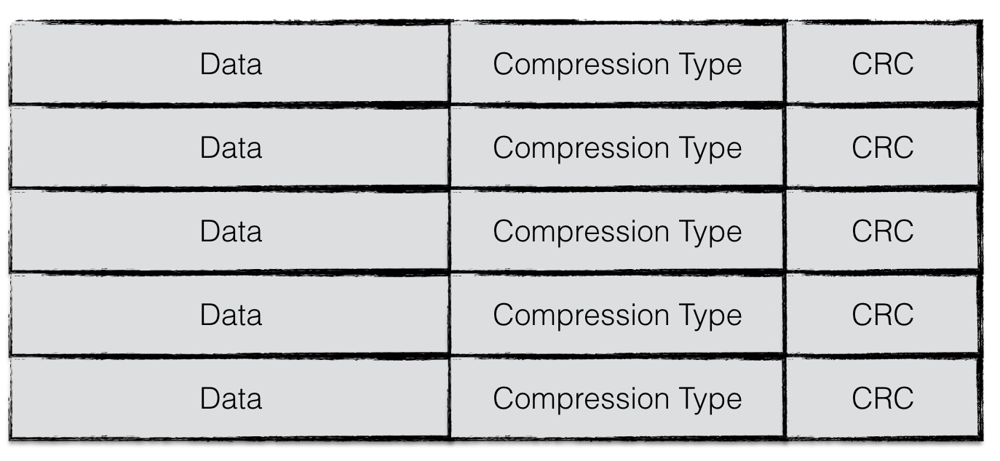
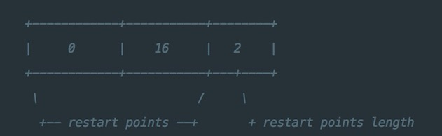

# 概述
如我们之前提到的，leveldb是典型的LSM树(Log Structured-Merge Tree)实现，即一次leveldb的写入过程并不是直接将数据持久化到磁盘文件中，而是将写操作首先写入日志文件中，其次将写操作应用在memtable上。

当leveldb达到checkpoint点（memtable中的数据量超过了预设的阈值），会将当前memtable冻结成一个不可更改的内存数据库（immutable memory db），并且创建一个新的memtable供系统继续使用。

immutable memory db会在后台进行一次minor compaction，即将内存数据库中的数据持久化到磁盘文件中。

>
在这里我们暂时不展开讨论minor compaction相关的内容，读者可以简单地理解为将内存中的数据持久化到文件

leveldb（或者说LSM树）设计Minor Compaction的目的是为了：
- 有效地降低内存的使用率；
- 避免日志文件过大，系统恢复时间过长；
当memory db的数据被持久化到文件中时，leveldb将以一定规则进行文件组织，这种文件格式成为sstable。在本文中将详细地介绍sstable的文件格式以及相关读写操作。

# SStable文件格式
## 整体结构
sstable 文件的整体结构如下：
- data_block 0 ~ N-1
- filter_block
- meta_index_block
- index_block
- footer


每个 data_block 保存的是具体的数据。除了具体数据外，还有一些为了查找数据用的结构，整体结构如下：
- restart_interval 0 ~ M-1：这里保存的是具体的数据，每个 interval 里保存多条数据，这些数据都是 key 之间有联系的，例如：key:abc, key:abcd, key:abx，具体在下下面详细介绍时进行解释。除了数据外，还保存了一些关于 key 的共享信息和长度，还有 value 的一些信息。这些信息都是为了方便查找而存储的。
- offset of restart_interval：记录每个 interval 的 offset，方便直接查找。
- number of restart_interval：interval 一共的数量
- compression_type：是否进行压缩
- crc32：前面所有字段（包括 compression_type ）压缩后的数据的 crc 值。


## 物理结构
为了提高整体的读写效率，一个sstable文件按照固定大小进行块划分，默认每个块的大小为4KiB。`每个 Block(data_block、filter_block、meta_index_block等)`中，除了存储数据以外，还会存储两个额外的辅助字段：
- 压缩类型
- CRC校验码

压缩类型说明了Block中存储的数据是否进行了数据压缩，若是，采用了哪种算法进行压缩。leveldb中默认采用Snappy算法进行压缩。CRC校验码是循环冗余校验校验码，校验范围包括`数据`以及`压缩类型（compression_type）`。



## 逻辑结构
在逻辑上，根据功能不同，leveldb在逻辑上又将sstable分为：
- data block: 用来存储key value数据对；
- filter block: 用来存储一些过滤器相关的数据（布隆过滤器），但是若用户不指定leveldb使用过滤器，leveldb在该block中不会存储任何内容；
- meta Index block: 用来存储filter block的索引信息（索引信息指在该sstable文件中的偏移量以及数据长度）；
- index block：index block中用来存储每个data block的索引信息；
- footer: 用来存储meta index block及index block的索引信息；


注意，1-4类型的区块，其物理结构都是如1.1节所示，每个区块都会有自己的压缩信息以及CRC校验码信息。

## data block 结构
data block 中存储的数据是leveldb中的key/value键值对。其中一个data block中的数据部分（不包括压缩类型、CRC校验码）按逻辑又以下图进行划分：
> 下面介绍各种 block 时，都不包括`压缩类型（Compression_type）`和`CRC校验码`。


这个图和上面的结构图中每部分的叫法不太一样，对应如下：
- restart_interval 1~N：entry 1~N
- offset of restart_interval 1~N：restart point 1~N
- number of restart_interval：restart point lenth

### entry
第一部分用来存储key/value数据。由于sstable中所有的key/value对都是严格按序存储的，用了节省存储空间，leveldb并不会为每一对key/value对都存储完整的key值，而是存储与上一个key非共享的部分，避免了key重复内容的存储。

每间隔若干个key/value对，将为该条记录重新存储一个完整的key。重复该过程（默认间隔值为16），每个重新存储完整key的点称之为 Restart point。

>
leveldb设计Restart point的目的是在读取sstable内容时，加速查找的过程。
>
由于每个Restart point存储的都是完整的key值，因此在sstable中进行数据查找时，可以首先利用restart point点的数据进行键值比较，以便于快速定位目标数据所在的区域；当确定目标数据所在区域时，再依次对区间内所有数据项逐项比较key值，进行细粒度地查找；
>
该思想有点类似于跳表中利用高层数据迅速定位，底层数据详细查找的理念，降低查找的复杂度。

每个数据项的格式如下图所示：


一个entry分为5部分内容：
- 与前一条记录key共享部分的长度；
- 与前一条记录key不共享部分的长度；
- value长度；
- 与前一条记录key非共享的内容；
- value内容；

例如：
```
restart_interval=2
entry one  : key=deck,value=v1
entry two  : key=dock,value=v2
entry three: key=duck,value=v3
```


三组entry按上图的格式进行存储。值得注意的是restart_interval为2，因此每隔两个entry都会有一条数据作为restart point点的数据项，存储完整key值。因此entry3存储了完整的key。

### restart point 和 length
此外，第一个 restart point 为 0（偏移量），第二个 restart point 为 16，restart point 共有两个，因此一个datablock数据段的末尾添加了下图所示的数据：



尾部数据记录了每一个restart point的值，以及所有restart point的个数。


# 个人总结
## 1，使用 Restart Point 来做实现 skiplist 类型的查询。


# 问题
## 1，当在 sstable 进行查找时，是如何使用 restart point 的呢？

## 2，restart point 的 offset 和 count 是存储在哪个地方？有没有一个大图来表示存储结构。