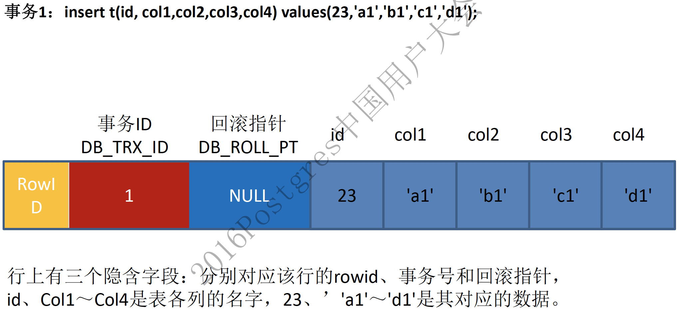
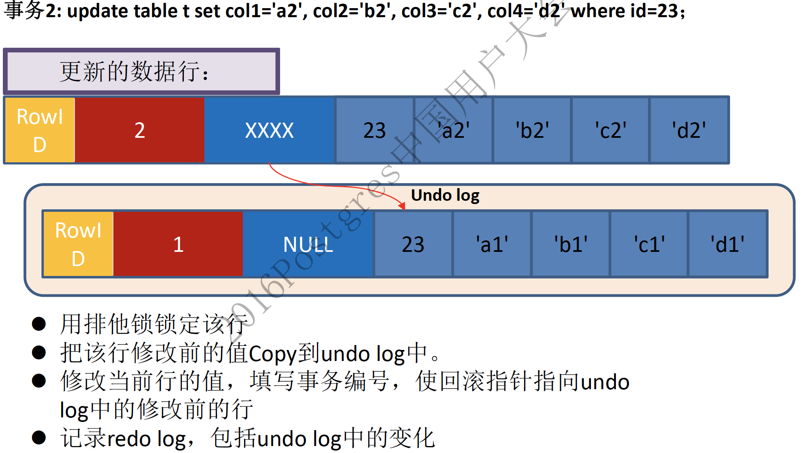

# 前言

# 什么是 Snapshot
Snapshot 翻译过来就是`快照`的意思。作用是，把`某个时间点`的 DB 数据做一个记录，之后时间点对 DB 数据的修改，不影响前上个时间点的 DB 数据。

下面是一个 levelDB 使用的例子，因为说明需要，删除一部分代码。（代码引用自：[leveldb源码分析之快照SnapShots | 罗道文的私房菜](https://luodw.cc/2015/10/31/leveldb-15/)）
```
int main(void)
{
   ....
	std::string key1="fruit";
	std::string value1="apple";
	// 1. 把 key1 = fruit 写入 DB
	status=db->Put(leveldb::WriteOptions(),key1,value1);
	leveldb::ReadOptions readoptions;
   // 2. 在 key1 = fruit 状态下，取得一个 DB 的 snapshot
	//readoptions.snapshot=db->GetSnapshot();
	 std::string value2="orange";
	 // 3. 把 key1 = orange 写入 DB
	 status=db->Put(leveldb::WriteOptions(),key1,value2);
	 // 4. 取得 key1 的 value
	 status=db->Get(leveldb::ReadOptions(),key1,&value);
	 std::cout<<value<<std::endl;
}
```
此段代码逻辑很简单，对于同一个 key，插入两次不同 value 的数据，然后读取 key 的 value。根据注释语句`readoptions.snapshot=db->GetSnapshot()`的打开或关闭，结果不同。

- 注释时：value = orange
- 取消注释时：value = apple 

**为什么打开时，value = apple 呢？**
因为在取得 value 时，会使用一个参数：`leveldb::ReadOptions()`，在读取 value 时，会使用全局变量`ReadOptions()`的`snapshot`属性，即 `ReadOptions().snapshot`。
- 取消注释的话，意思是：将`ReadOptions().snapshot`属性设置为 key = apple 时的 DB 数据状态。
- 注释的话，意思是：不设置`readoptions.snapshot`。当 Get 数据时，`readoptions.snapshot`为空时，就会从 DB 最新状态下取得数据。所以 key = orange。


# 为什么需要 snapshot？
snapshot 解决两个问题：
- 读取一致性问题：实现了一致性只读视图，类似于数据库的`可重复读`的事务隔离级别。
- 读写并发问题：没有使用锁，这样在读数据时，其它线程可以对正在读的数据进行修改。如果使用锁机制，把读取的数据进行锁住的话，其它线程就无法进行修改数据了。

snapshot 其中是一个种 MVCC 机制。


# 实现方式
leveldb 实现快照的原理关键就在于`sequence number`。

什么是`sequence number`呢？
> `sequence number`是一个递增变量。

**关于数据的写**
每插入`一条/一批`数据，都会用`sequence number`变量，设置数据的`sequence number`属性，然后`sequence number`变量再加 1。

**关于数据的读**
读取数据时，都是读取某个 snapshot 之前的数据。例如：当读取数据时，Get 方法会有一个 snapshot 参数。如果 snapshot 参数不为空时，通过参数中的 snapshot 参数，取得`sequence number <= snapshot`的数据；如果 snapshot 为空，则取得当前`sequence number`变量的值，做为 snapshot 取得`sequence number <= snapshot`的数据。

上面的例子中，当去掉注释时，Get 方法中的 snapshot 参数为 key = apple 时的 snapshot，所以取得的 value 为 apple。

# 代码解析
`sequence number` 生成后，包装在 SnapShot 的实现类和工具类中进行使用。所以在看程序时，需要要看的是 SnapShot 的实现类和工具类。

SnapShot 是一个抽象类，在db.h中有声明。和 snapshot 有关的类有两个：
- SnapshotImpl：是 SnapShot 实现类，对应每个`sequence number`。使用双链表来连接每个 snapshot。
- SnapshotList：SnapshotList 是用来创建和管理 snapshot 的类，可以看成是工具类。


## SnapshotImpl 实现
SnapshotImpl 实现如下，主要属性和方法如下：
- SequenceNumber number_：保存当前 snapshot 的`sequence number`。
- SnapshotImpl* prev_：用于插入 SnapshotList 时，更新前后关系。SnapshotList更新时，实现操作的是这个属性。
- SnapshotImpl* next_：用于插入 SnapshotList 时，更新前后关系。SnapshotList更新时，实现操作的是这个属性。
- SnapshotList* list_：这个节点所属的 SnapshotList;

## SnapshotList 实现
SnapshotList 是操作 SnapshotImpl 的工具类，主要方法如下：
- SnapshotImpl* oldest()：取出最旧的快照
- SnapshotImpl* newest()：取出最新的快照
- SnapshotImpl* New(SequenceNumber seq)：生产新的 snapshot
- void Delete(const SnapshotImpl* s)：删除 snapshot
  
## 上层调用实现
在db_impl.cc类里，定义了一个 SnapshotList 成员变量，用来保存以及取出快照，当用户程序调用db->GetSnapshot()时，真实调用的是`SnapshotList.New()`方法:
```
const Snapshot* DBImpl::GetSnapshot() {
  MutexLock l(&mutex_);
  return snapshots_.New(versions_->LastSequence());
}
```

调用 SnapshotList 的 new 方法，用上一个序列号生成一个快照，并且插入快照链表里。当用户调用db->ReleaseSnapshot(readoptions.snapshot)时，真实调用的是`SnapshotList.Delete()`:
```
void DBImpl::ReleaseSnapshot(const Snapshot* s) {
  MutexLock l(&mutex_);
  snapshots_.Delete(reinterpret_cast<const SnapshotImpl*>(s));
}
```
调用SnapshotList的delete方法，将当前使用的快照删除。

因为写入记录时，不涉及快照的问题，只有读取时，才有快照的存在。所以当系统调用db->get和db->NewIterator时，才关系快照问题。当调用get时：
- 首先判断是否定义了readoption.snapshot，如果定义了，那么就按这个快照读取数据;
- 如果没有定义，那么就用上一个序列号作为快照序列号来读取数据。


# 细节
## 1，Mysql 的 MVCC
snapshot 机制，实际上是一种 MVCC 机制，在 Mysql 中也有 MVCC 机制。

在 Mysql 中是使用 Undo log 和 transaction id 进行实现的。例子如下：

### （1）插入例子
1，Session 1 开启 transaction，并创建了以下数据。Session 1 的 transaction id 也是 1。（注意，此时 session 1 的 transaction 并未提交关闭）

id | name | 创建(事务ID) | 删除时间(事务ID)
---|---|---|---
1 | yang | 1 | undefined
2 | long | 1 | undefined
3 | fei | 1 | undefined

2，Session 2 开启 transaction，并创建了以下数据。Session 2 的 transaction id 也是 2。（注意，此时 session 2 的 transaction 并未提交关闭）

id | name | 创建(事务ID) | 删除(事务ID)
---|---|---|---
1 | yang | 1 | undefined
2 | long | 1 | undefined
3 | fei | 1 | undefined
4 | tian | 2 | undefined

3，此时 Session 1 在`select *`时，查找到的都是`创建(事务ID) <= Session 1 transaction id `的数据。实现了`可重复读`。

### （2）更新例子
在更新时，既使用到了`创建/删除（事务ID）`，还使用了`undo log`和`回滚指针`。在这个例子中，重要的是`undo log`和`回滚指针`，所以省略了`创建/删除（事务ID）`变化表示。

1，先插入一条数据，做为原始数据。


2，Session 1 开启事务，更新刚刚插入的数据。更新记录时，原记录将被放入到undo表空间中，并通过DB_ROLL_PT指向该记录。


3，Session 2 查询表里唯一的一条数据。
session 2 查询返回的数据是，未修改的过的那条数据（a1,b1....）。未修改数据就是从这个undo中返回的。MySQL 就是根据记录上的`回滚段指针`及`事务ID`判断记录是否可见，如果不可见继续按照`DB_ROLL_PT`继续回溯查找。

在RR隔离级别下，`创建/删除（事务ID）`
```
INSERT ->  记录的创建（事务ID） = 当前事务ID，删除（事务ID） = NULL

DELETE -> 记录的创建（事务ID）不动，删除（事务ID） = 当前事务ID

UPDATE -> 将记录复制一次

　　　　　　　　老记录的创建（事务ID）不动，删除（事务ID） = 当前事务ID

　　　　　　　　新记录的创建（事务ID） = 当前事务ID，删除（事务ID） = NULL

SELECT -> 返回的记录需要满足两个条件：

　　　　　　　　创建（事务ID） <= 当前事务ID (记录是在当前事务之前或者由当前事务创建的）

　　　　　　　　删除（事务ID） == NULL || 删除（事务ID） > 当前事务ID （记录是在当前事务之后被删除的）
```

参考请参考：（最好按顺序看）
- [mysql中的数据一致性、一致性读、快照读详解](http://www.zsythink.net/archives/1436)
- [MVCC 原理探究及 MySQL 源码实现分析 - 后端 - 掘金](https://juejin.im/entry/58f86815ac502e00638e1c97)
- [MYSQL中的乐观锁实现(MVCC)简析 - 参考消息 - SegmentFault 思否](https://segmentfault.com/a/1190000009374567)
- [MySQL InnoDB MVCC深度分析 - stevenczp - 博客园](https://www.cnblogs.com/stevenczp/p/8018986.html)：最下面的参考可以看一下。


## 2，Mysql MVCC 解决了什么问题
- MVCC使得数据库读不会对数据加锁，select不会加锁，提高了数据库的并发处理能力。
- 借助MVCC，数据库可以实现RC，RR等隔离级别，用户可以查看当前数据的前一个或者前几个历史版本。保证了ACID中的I-隔离性。佛如


## 3，关于`原子更新`时的`sequence number`
在上面说到写操作时，有下面这段话：
> 每插入`一条/一批`数据，都会用`sequence number`变量，设置数据的`sequence number`属性，然后`sequence number`变量再加 1。

为什么会是`一条`或是`一批`呢？
levelDB 有两个写方法，Put 和 Write。区别如下：
- Put：一次只可以写一个 key。这个 key 有个唯一的`sequence number`。
- Write：一次可以写多个 key。写入的多个 key 是原子操作，这些 key 有相同的`sequence number`。

也就是说，每次 Put 的 key 都有一个唯一的`sequence number`，而 Write 写的 key 的`sequence number`是`相同`且`唯一`的。

# 参考
- [leveldb源码分析之快照SnapShots | 罗道文的私房菜](https://luodw.cc/2015/10/31/leveldb-15/)
- [leveldb注释8–snapshot机制 | petermao的技术blog](http://www.petermao.com/leveldb/leveldb-8-snapshot.html)
- [leveldb snapshot详解 - ewouldblock7 - 博客园](https://www.cnblogs.com/ewouldblock7/p/3641692.html)
