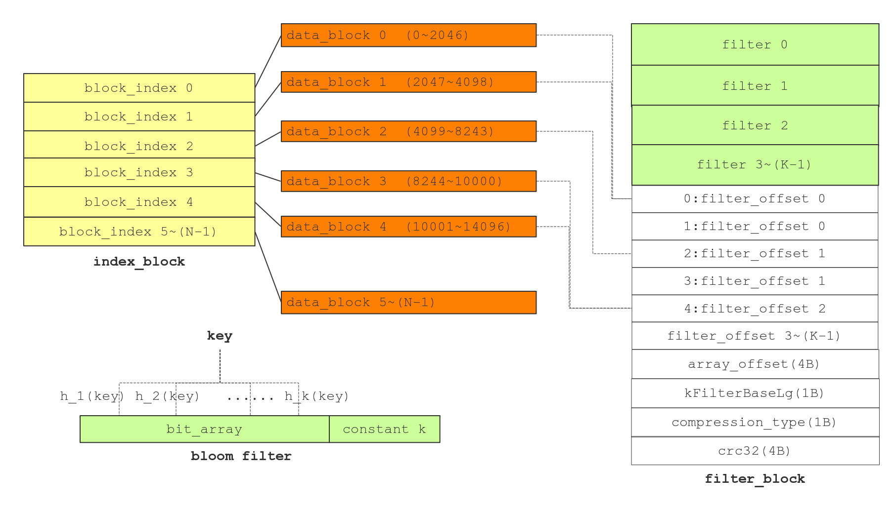

# 前言
sstable 文件的foot， data block 和index block都已经介绍过了，看起来好像已经齐备了，根据footer 能够找到index block，而index记录了data block的索引信息，可以根据index block中的索引，快速定位到某个key（可能）位于which data block。

那么meta block和metaindex block到底是干啥的呢，为什么要有它呢？meta block的左右在于快速的确定，是否存在某个key，如果不存在，就没必要去遍历data block查找该key了。

如何快速判断某个key是否存在？

Bloom Filter这种数据结构就是干这个活的。

> 本文是很大部分 [leveldb中的SSTable (3)](http://bean-li.github.io/leveldb-sstable-bloom-filter/) 的内容，还有一些自己的理解和其它文章的总结。所有参考的文章，会在最下面的参考中标明。

# 一、Bloom Filter
Burton Howard Bloom 在1970年设计的数据结构，用来判断某个key是否属于某个集合。它的原理比较简单，首先定义一个很大的数组，作为位图，初始时，位图中的每个元素都是0。向集合添加某个key的时候，计算一组hash值（多个不同的hash函数），根据结果将位图对应位置的位设为1。如下图所示：

当判断某个key，如上图中的bean是否存在时，将key值通过多个hash函数（如上图中的3个hash函数），判断对应位置是否是1，如果不是1，表示该key并不存在。

如果将key值通过多个hash函数，发现每一个对应位置的bit都是1，说明该key值有很大的概率是存在的。

为什么是很大的概率，而不是绝对？因为Bloom Filter可能会出现虚警，发现每个对应位置都是1，但是去查找确实不存在该key，如下图所示：

上图中lucky并不在集合中，但是hash算出来的三个位置，分别有abc leveldb moon将其设置为1，所以lucky被误判成存在集合中，造成false positive，出现虚警。

即bloom filter 有如下的性质：
- 如果bloom filter判断不在集合中，那么一定不在集合中 （Never false negative）
- 如果bloom filter判断在集合中，那么有很大的概率在集合中，但是也有一定的概率不在集合中，即出现虚警 （false positive）

既然会出现false positive，那么虚警概率就很重要了。考虑极端情况，如果位图数组相对于key的个数，太少，势必造成几乎每一个bit都是1，这样虚警的概率是非常高的，整个bloom filter压根就没有存在的价值，因为无论怎么判断，bloom filter总是回答key在集合中。

因此判断集合的大小，选择合适size的bloom filter位图就成了效率的关键。

如果位图中的bit数位为m，集合中的元素为n，hash函数的个数为k，那么虚警概率

如果m 和n 是确定的，那么最优的k为：
--

m n k 组合下，相关虚警概率的情况如下：

(数据来源于 [Bloom Filters - the math](http://pages.cs.wisc.edu/~cao/papers/summary-cache/node8.html#SECTION00053000000000000000))

很明显，如果hash 函数的个数太多，就会带来更多的运算，这显然是不合理的，因此，要想降低虚警概率，必须要m／n要尽可能的大，

如果m／n等于20的时候，3个hash函数就可以将虚警概率降低到千分之三左右，4个hash 函数就能将虚警概率控制在千分之一左右。

# 二、leveldb 中的 bloom filter
leveldb搞个全局的Bloom Filter是不现实的，因为无法预知客户到底存放多少key，leveldb可能存放百万千万个key－value pair，也可能存放几百 几千个key－value，因为n不能确定范围，因此位图的大小m，也很难事先确定。如果设置的m过大，势必造成内存浪费，如果设置的m过小，就会造成很大的虚警。

leveldb的设计，并不是全局的bloom filter，而是根据局部的bloom filter，每一部分的数据，设计出一个bloom filter，多个bloom filter来完成任务。

leveldb中的bloom filter有第二个层面的改进，即采用了下面论文中的算法思想：

[Less Hashing, Same Performance: Building a Better Bloom Filter](https://www.eecs.harvard.edu/~michaelm/postscripts/rsa2008.pdf)

这个论文有兴趣的同学可以读一下，我简单summary一下论文的思想，为了尽可能的降低虚概率，最优的hash函数个数可能很高，比如需要10个hash函数，这势必带来很多的计算，而且要设计多个不同的hash函数，论文提供了一个思想，用1个hash函数，多次移位和加法，达到多个hash 的结果。

## 1，bloom filter 参数设定
levelDB 是先决定 m/n 的值，通过 m/n 的值反过来定 m 和 k 的大小。我们看看是如何做的：
1，m/n
每个 key 所用的位的个数。levelDB 的实现是使用固定值 10。10 是一个好的取值，会产生大约 %1 的虚警（false positive）。下面是源码上的说明(filter_policy.h)：
> A good value for bits_per_key is 10, which yields a filter with ~ 1% false positive rate.

2，n
levelDB 的 bloom filter 是针对固定大小的。这个 n 就是每次生产 bloom filter 的 key 的数量。

3，k
在 `k=m/n*ln2` 的公式中，m/n 和 ln2(~0.69) 都知道了，所以我们就可以算出 k 的值了，key 为 6.9。

4，m
既然`k=m/n*ln2` 中的 k n 都知道了，这样也可以算出位图大小 m 了。m 为 `k * n * ln2`。

## 2，如何根据 keys 生成位图
每一 key 都进行下面的运算：

1，生成 key 的 hash 值。（类似 murmur hash 的算法）

2，计算出一个增量值`delta`。除了`第一次`通过`原始的 hash`结果算出哪个位应该为 1，其它时候都使用`原始 hash值 + 增量（delta）`来算出哪个位应该为 1。
这个增量计算方法为：`(h >> 17) | (h << 15)`。是利用`原始 hash`进行的二次计算。

3，进行 k 次循环，使用`原始 hash`和`增量（delta）`，对位图上的具体位进行设置 1。具体公式如下：
> bitmap |= 1 << ((hash % m) % 8)
> （这里的 hash 值是增加完`增量`后的 hash 值。当然，第一次循环时，hash 不增加`增量`）

上面的公式的意思是：
- 先用 hash 值对 m(位图大小)进行取模
- 然后用前面取模的值，再对 8 进行取模
- 最后把 1 向左移动`最后取模的值`这么多位，通过`|=`把位图这个位设置成 1。

例如：如果 hash 值为 10，m 为 100，则 ((10 % 100) % 8) = 2，`1 << 2` 为 `00000100`，就是把位图的第 3 位设置为 1。

在 k 循环中，除了第 1 次外，每次 hash 的值都要加上 delta。例如：hash = 10，delta = 3。第 1 次 hash 为 10，第 2 次 hash 为 13，第 3 次 hash 为 16。

**最后，有两个小细节：**
1，最后一个字节保存的是 k（hash 次数）。
在位图的最后一个字节，是用来保存 k（hash 次数）的。这个字节应该不占用 m（位图大小）的空间。

2，在计算 m（位图大小）时使用了`size_t bytes = (bits + 7) / 8`这样的计算。
加这一步的原因是，如果位图大小不是整数个字节的话，就把大小变成整数个字节。例如：如果位图大小为 91 位，占用的空间就是`11字节 + 3位`。这样在使用公式计算后就变成`12字节 + 5位`，然后去掉 5 位，就变成了 12 字节。

## 3，如何从位图上查找数据是否可能存在呢？
在查找时，在位图中查找 key 的过程如下。
1，先取得位图的最一个字节，就是 k（hash 循环次数）。

2，取得 key 的 hash 值，和 delta。

3，像保存一样，循环 k 次，计算每一次的应该取得的位。其中有一次取得的位的值为 0，就证明 key 不存在；如果每次取得的值都为 1，那么 key 可能存在，可以进行遍历。

首先定下来 m/n 的值为 10。然后每个 data_block 的 key 的个数是有限的，levelDB 中每 2K 的 key 数据做一次 filter（可能会超过 2K 数据，因为判断是 > 2K，所以 key 过来时可能已经超过 2K 了）。

# 三、leveldb 中的 filter_block
下图为 filter block 的存储结构：

在图中下部中，有每个 data_block 对应的 bloom filter 的结构。bit_array 部分是一个大的数组，用来保存 key 哪些位被设置成 1。而 k 是 bloom filter 的 hash 次数。

## 1，关于 data_block 和 filter_block 中的 filter、filter offset 的对应关系
对应关系总结起来：
> 每个 data_block 对应`1 个 filter`和`多个 filter offset`。
> （多个 filter offset中，第 1 offset 指向 filter 的起始位置。第 2 个及以后的 offset 指向 filter 尾部的位置。）

比如：block_data 的默认大小为 4K（未压缩），每个 filter 的大小默认是 2K。也就是说 4K 大小的 block_data 中的`所有 key`的对应的位图数据，保存在`1个` filter(2K) 中，但占用 block_data / filter size 个 filter offset（例子中是 4/2=2个）。第 1 个 filter offset 保存 filter 的起始 offset，第 2 个 filter offset 都指向那  filter 结束的位置。
(上图的例子是每个 data_block 为 2K 左右，不知道什么情况会生成这样大小的 data_block。)

有两个疑问：
- 为什么 data_block 超过 4K了，还用一个 filter 来保存呢？因为 2K 的 filter 足够保存 4K 及 4K 以上 data_block 中的所有 keys。
  能够保存 4K 的 data_block 的 keys 应该是作者考虑过的了。为什么也能够保存 4K 以上的 keys 呢？因为 data_block 的默认大小是 4K，如果超过 4K了，说明可能有一个 key/value 大小一下超过了 data_block 的剩余空间，结果整个 data_block 超过了 4K。这样看来，value 总体大小虽然很大，key 的数量基本没变，所以对 filter 的影响不大。（上面如何超过 4K 的说明，是推断，没有看实际代码）
- 为什么 filter offset 要多个呢？个人想法是：
  * filter offset 的目的是帮助 data_block 快速定位 filter，所以 data_block 和 filter offset 是一对一关系。
  * 而且，因为 filter 的创建是根据 data_block 大小所创建的，所以在读取时也是根据 data_block 大小读取相应的 filter offset。例如：如果 data_block 为 4K，读取时使用 data_block(4)/filter size(2) = 2，找到第 2 个 fitler offset，再通过这个 offset 找到`具体的 filter`。这么做的话，不管 data_block 是排在第几个，都可以用大小来快速定位 filter。

## 2，生成 filter 和 filter offset 的流程
具体的生成 filter 和 filter offset 的流程如下：
- 如果`当前 data_block 没有生成完对应的 filter`，就开始进行生成 filter。`当前 data_block 没有生成完对应的 filter` 的判断条件是：`data_block offset / filter 默认大小(2K) > filter_offsets size`。
  * data_block offset：就是 data_block 写到内存后，尾部的 offset。例如：当前内存数据为 10K，写入 4K 的 data_block，传入的 data_block offset 为 14K。
  * filter_offsets size：filter offset 的个数
- 如果`当前 data_block`是第一次生成 filter
  * 把 filter_block 的 size 保存到 filter_offsets 中。size 被当成 offset 使用。
  * 根据 data_block 里的所有 keys，做成位图，然后保存到 filter_block 中。
- 如果`当前 data_block`不是第一次生成 filter，把前一次生成的 filter 的 offset 放到 filter_offsets 中，而不生成任何 filter。

### 生成例子1
**前提：**
- block_data：4K 大小
- data_block offset：4K。（第一次保存数据）
- filter_offsets size：0

**过程：**
- data_block offset(4K) / filter size(2K) > filter_offset size(0)，即 2 > 0，说明还需要生成 filter。
- 是第一次生产 filter，生成 filter，再把 filter 的 offset(值为 0)，放到 filter_offsets 里。
- data_block offset(4K) / filter size(2K) > filter_offset size(1)，即 2 > 1，说明还需要生成 filter。
- 不是第一次生产 filter，不需要生成 filter，把上次生成的 filter 尾部位置(2K)的 offset 放到 filter_offsets 里。
- data_block offset(4K) / filter size(2K) > filter_offset size(2)，即 2 > 2，条件不成立，结束创建。

### 生成例子2
**前提：**
- block_data：7K 大小
- data_block offset：11K。（第二次保存数据，加上前一回的 4K）
- filter_offsets size：2

**过程：**
- data_block offset(11K) / filter size(2K) > filter_offset size(2)，即 5 > 2，说明还需要生成 filter。
- 是第一次生产 filter，生成 filter，再把 filter 的 offset(2K)，放到 filter_offsets 里。
- data_block offset(11K) / filter size(2K) > filter_offset size(3)，即 5 > 3，说明还需要生成 filter。
- 不是第一次生产 filter，不需要生成 filter，把上次生成的 filter 尾部位置的 offset(4K) 放到 filter_offsets 里。
- data_block offset(11K) / filter size(2K) > filter_offset size(4)，即 5 > 4，说明还需要生成 filter。
- 不是第一次生产 filter，不需要生成 filter，把上次生成的 filter 尾部位置的 offset(4K) 放到 filter_offsets 里。
- data_block offset(11K) / filter size(2K) > filter_offset size(5)，即 5 > 5，条件不成立，结束创建。

这次 7K 的 data_block 生成了 3(7/2) 个 offset，这点要注意。

## 3，查找 filter 和 filter offset 的流程
具体的查找流程如下：
- 通过 data_block offset 取得 data_block 对应的 filter offset，这样就找到了 filter 的起始位置。具体实现是：`block_offset >> base lg (11)`。
  > 注意：此 data_block offset 是 data_block 起始的 offset。例如：data_block 长度为 4K，起始 offset 为 10K，尾部 offset 为 14K的话，传进来的是`起始 offset(10K) 这个 offset`

- 然后再取得`对应 filter offset 的下一个 offset`，这样就能通过两个 offset 算出 filter 的 size。

- 通过 key 和 filter，调用 bloom filter 的查找方法，来判断 key 是否可能在 data_block 中。

### 例子（利用的是上面例子保存到的 filter 数据）
**前提：**
- block_data：4K 大小
- data_block offset：0K
- filter_offsets size：5

**过程：**
1. 取得 filter offset。filter offset = block offset(0K) >> 11 = block offset(0K) / filter size(2K) = 0。则取得 filter_offsets[0] 里的数据（是 filter 的起始位置）。

2. 取得`对应 filter offset 的下一个 offset`，filter_offsets[0+1] 的数据，这个数据保存的是 filter 尾部的位置。这样就可以知道 filter 的 size 了。

3. 通过 filter_offsets[0] 和 filter_offsets[1] 的位置，取得 filter 数据。然后把 filter 和 key 传给 bloom filter 进行判断。

# 个人总结
1，避免生成不足 1 字节的内存
在生成 bitmap 时，为了避免生产不足 1 字节的内存，使用`bits + 7) / 8`的方式来扩充到 1 字节。

2，位图数据的最后一字节
把做 hash 的次数 k 保存到了 bitmap 的最后一个单位（size_t）。对于一些可能变化，对结构产生影响的变量，为保险起见，保存在数据里，而不是使用代码中的值。

3，那个 bloom filter 的 hash 算法
计算“哪个位设置成 1”的算法中，不是只使用一次 hash 后的值，而是使用再加上一个`增量(delta)`，而这个`增量`也不是固定的。这种方法和`hash 的开放导址法`有点像。

`开放导址法`就是使用了`两个` hash 函数来确认 hash 后的位置。虽然此算法中没有使用再次 hash 函数，但也是基于 key 又进行了一次变化（虽然 bloom filter 中是基于 hash 值的变化，但 hash 值也是通过 key 生成的，本质上也是基于 key 的变化）。

4，为什么 filter 的生成，是根据 data_block 的大小，而不是根据 key/value 的个数呢？可能是因为 data_block 的按`一定大小`生成的，data_block 中并没有保存 key/value 的个数。如果要以 key/value 的个数生成 filter 的话，需要再加一个`个数`统计，结构会变复杂一些。

8

## 关于源码
### 文件：
- filter_block.cc/.h：是 filter_block 类，用来创建和查找 filter_block。
- bloom.cc：是 bloom filter 的实现类。
- table_build.cc/.h：是 sstable 相关的类。用来对 sstable 进行写操作等。
table_builder 是创建 sstable 的？

### 1，filter_block.cc
（1）FilterBlockBuilder
 是用来创建 filter_block 时候，使用的类。而读取 filter_block 时，是使用的 FilterBlockReader 类，要注意区分。

- std::string keys_：保存 data_block 里的 keys。在写 data_block 里写时，也向这里写一份。
- std::vector<size_t> start_: 上面 keys 中，每个 key 的 offset。这个是为实现功能使用的，和上面文章中讲的 offset 没什么关系。
- std::string result_：用来保存`当前sstable`中，所有的 filter 0 ~ K-1。不保存 filter offset。每个 filter data（0 ~ k-1） 由两部分组成：bit_array（位图数据）和 k （hash 循环次数）
- std::vector<Slice> tmp_keys_：程序中的临时变量。
- std::vector<uint32_t> filter_offsets_：保存每个 filter 的 offset。
- void FilterBlockBuilder::GenerateFilter()：创建 filter
- void FilterBlockBuilder::StartBlock(uint64_t block_offset)：创建 filter 的外部接口，供其它类调用。这里控制创建几次 filter（虽然循环多次，但filter 只创建一个，filter offset 创建多个）。注意，这里的 block_offset 参数，是 data_block 的尾部位置。

(2) FilterBlockReader
- const char* data_：所有 filter 的起始位置。也是 filter 0 和 filer_block 的起始位置。
- const char* offset_：filter offset 部分的起始位置。
- size_t num_：filter offset 中 offset 的个数。
- size_t base_lg_：filter_block 中的 base_lg。
- bool FilterBlockReader::KeyMayMatch(uint64_t block_offset, const Slice& key)：通过 data_block offset 和 key，来到 filter 中去查找并判断是否可能存在。注意：这里的 data_block offset 是 data_block 的起始位置，不是尾部位置。

其它：
- filter 0 的大小：是由 StartBlock 方法里决定的。`uint64_t filter_index = (block_offset / kFilterBase);`决定每个 filter 的大小。
- data_block 大小默认是 4K，在 options.h 文件中由 size_t block_size 定义。

## 2，bloom.cc
- size_t bits_per_key_：每个 key 使用的位数。
- size_t k_：进行 hash 的次数。
- virtual void CreateFilter(const Slice* keys, int n, std::string* dst)：把 hash 后的 key，映射到位图上。
- virtual bool KeyMayMatch(const Slice& key, const Slice& bloom_filter) ：判断 key 是否在位图上。

# 问题
1，有一些地方说 7K 的 data_block 会生产 3 个 filter 或 4 个。但看代码后，感觉应该只生产 1 个。

# todo
1，有空把 filter 例子操作补个图。
2，看一下 bloom filter 中使用算法的那个论文。
3，想一下 hash，为什么 hash 经常使用`移位`、`加法` 和 `异或`这几种方式呢？
使用`移位`，是因为想扩大 hash 位数。举个 100 个数，如果不移位，是不是可能放到 30 个 slot 中呢？
`加法`：为什么不能使用`减法`，是因为负数的问题吗？
`异或`：是因为 or 和 and 都有 75% 倾斜，而 xor 是 50% 并且没有倾斜。

 
 
 
 
# 参考
- [leveldb中的SSTable (3)](http://bean-li.github.io/leveldb-sstable-bloom-filter/)：讲的很好，特别是 bloom filter 那部分。但后面说会 7K 数据会生成 4 个 filter，感觉处别的文章和自己想的不太一样。
- [Leveldb源码解析第二篇【Meta Block】](https://antonyxux.github.io/2017/06/01/leveldb-2/)：github 上的源码解读，注释写的非常多，挺好的。
- [Leveldb源码分析--12](https://blog.csdn.net/sparkliang/article/details/8745664)：bloom filter 的文章，有很多图进行讲解，不错。
- [Leveldb源码分析--13](https://blog.csdn.net/sparkliang/article/details/8755499)：filter_block 的文章，有很多图进行讲解，不错。
- [LevelDB源码解析30. Bloom Filter](https://zhuanlan.zhihu.com/p/45942533)：讲的比较简单，也可以看一下。
- [LevelDB源码解析19. FilterBlockBuilder](https://zhuanlan.zhihu.com/p/45340857)：讲的比较简单，也可以看一下。
 - [Leveldb_RTFSC](http://www.grakra.com/2017/06/17/Leveldb-RTFSC/)：文章中有些的图就是此文中的。文章每一部分都写的不多。

