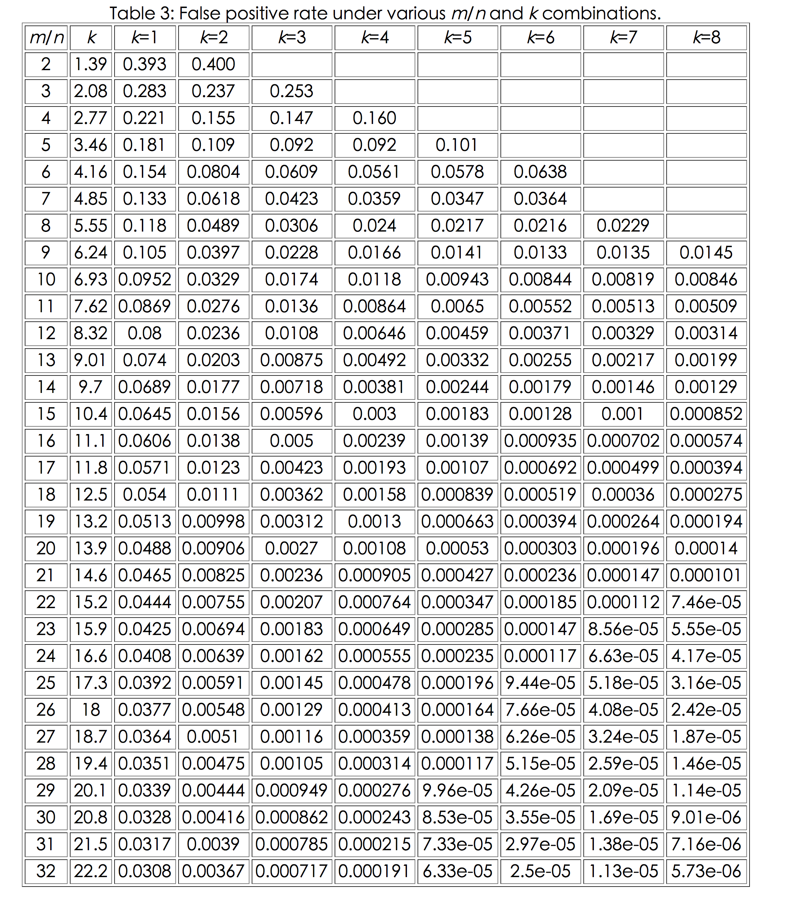

# 前言
sstable 文件的foot， data block 和index block都已经介绍过了，看起来好像已经齐备了，根据footer 能够找到index block，而index记录了data block的索引信息，可以根据index block中的索引，快速定位到某个key（可能）位于which data block。

那么meta block和metaindex block到底是干啥的呢，为什么要有它呢？meta block的左右在于快速的确定，是否存在某个key，如果不存在，就没必要去遍历data block查找该key了。

如何快速判断某个key是否存在？

Bloom Filter这种数据结构就是干这个活的。

# Bloom Filter
Burton Howard Bloom 在1970年设计的数据结构，用来判断某个key是否属于某个集合。它的原理比较简单，首先定义一个很大的数组，作为位图，初始时，位图中的每个元素都是0。向集合添加某个key的时候，计算一组hash值（多个不同的hash函数），根据结果将位图对应位置的位设为1。如下图所示：

当判断某个key，如上图中的bean是否存在时，将key值通过多个hash函数（如上图中的3个hash函数），判断对应位置是否是1，如果不是1，表示该key并不存在。

如果将key值通过多个hash函数，发现每一个对应位置的bit都是1，说明该key值有很大的概率是存在的。

为什么是很大的概率，而不是绝对？因为Bloom Filter可能会出现虚警，发现每个对应位置都是1，但是去查找确实不存在该key，如下图所示：

上图中lucky并不在集合中，但是hash算出来的三个位置，分别有abc leveldb moon将其设置为1，所以lucky被误判成存在集合中，造成false positive，出现虚警。

即bloom filter 有如下的性质：
- 如果bloom filter判断不在集合中，那么一定不在集合中 （Never false negative）
- 如果bloom filter判断在集合中，那么有很大的概率在集合中，但是也有一定的概率不在集合中，即出现虚警 （false positive）

既然会出现false positive，那么虚警概率就很重要了。考虑极端情况，如果位图数组相对于key的个数，太少，势必造成几乎每一个bit都是1，这样虚警的概率是非常高的，整个bloom filter压根就没有存在的价值，因为无论怎么判断，bloom filter总是回答key在集合中。

因此判断集合的大小，选择合适size的bloom filter位图就成了效率的关键。

如果位图中的bit数位为m，集合中的元素为n，hash函数的个数为k，那么虚警概率

如果m 和n 是确定的，那么最优的k为：

m n k 组合下，相关虚警概率的情况如下：

(数据来源于 [Bloom Filters - the math](http://pages.cs.wisc.edu/~cao/papers/summary-cache/node8.html#SECTION00053000000000000000))

很明显，如果hash 函数的个数太多，就会带来更多的运算，这显然是不合理的，因此，要想降低虚警概率，必须要m／n要尽可能的大，

如果m／n等于20的时候，3个hash函数就可以将虚警概率降低到千分之三左右，4个hash 函数就能将虚警概率控制在千分之一左右。

# leveldb 中的 bloom filter
leveldb搞个全局的Bloom Filter是不现实的，因为无法预知客户到底存放多少key，leveldb可能存放百万千万个key－value pair，也可能存放几百 几千个key－value，因为n不能确定范围，因此位图的大小m，也很难事先确定。

如果设置的m过大，势必造成内存浪费，如果设置的m过小，就会造成很大的虚警。

leveldb的设计，并不是全局的bloom filter，而是根据局部的bloom filter，每一部分的数据，设计出一个bloom filter，多个bloom filter来完成任务。

leveldb中的bloom filter有第二个层面的改进，即采用了下面论文中的算法思想：

[Less Hashing, Same Performance: Building a Better Bloom Filter](https://www.eecs.harvard.edu/~michaelm/postscripts/rsa2008.pdf)

这个论文有兴趣的筒子可以读一下，我简单summary一下论文的思想，为了尽可能的降低虚概率，最优的hash函数个数可能很高，比如需要10个hash函数，这势必带来很多的计算，而且要设计多个不同的hash函数，论文提供了一个思想，用1个hash函数，多次移位和加法，达到多个hash 的结果。

levelDB 是先决定 m/n 的值，通过 m/n 的值反过来定 m 和 k 的大小。我们看看是如何做的：
1，m/n
每个 key 所用的位的个数。levelDB 的实现是使用固定值 10。10 是一个好的取值，会产生大约 %1 的虚警（false positive）。下面是源码上的说明(filter_policy.h)：
> A good value for bits_per_key is 10, which yields a filter with ~ 1% false positive rate.

2，n
levelDB 的 bloom filter 是针对固定大小的。这个 n 就是每次生产 bloom filter 的 key 的数量。

3，k
在 `k=m/n*ln2` 的公式中，m/n 和 ln2(~0.69) 都知道了，所以我们就可以算出 k 的值了，key 为 6.9。

4，m
既然`k=m/n*ln2` 中的 k n 都知道了，这样也可以算出位图大小 m 了。m 为 `k * n * ln2`。

一些 keys 是如何保存到位图上的呢？
每一 key 都进行下面的运算。
1，生成 key 的 hash 值。（类似 murmur hash 的算法）

2，计算出一个增量值`delta`。除了`第一次`通过`原始的 hash`结果算出哪个位应该为 1，其它时候都使用`原始 hash值 + 增量（delta）`来算出哪个位应该为 1。
这个增量计算方法为：`(h >> 17) | (h << 15)`。是利用`原始 hash`进行的二次计算。

3，进行 k 次循环，使用`原始 hash`和`增量（delta）`，对位图上的具体位进行设置 1。具体公式如下：
> bitmap |= 1 << ((hash % m) % 8)

上面的公式的意思是：
- 先用 hash 值对 m(位图大小)进行取模
- 然后用前面取模的值，再对 8 进行取模
- 最后把 1 向左移动`最后取模的值`这么多位，通过`|=`把位图这个位设置成 1。

例如：如果 hash 值为 10，m 为 100，则 ((10 % 100) % 8) = 2，`1 << 2` 为 `00000100`，就是把位图的第 3 位设置为 1。

在 k 循环中，除了第 1 次外，每次 hash 的值都要加上 delta。例如：hash = 10，delta = 3。第 1 次 hash 为 10，第 2 次 hash 为 13，第 3 次 hash 为 16。

最后，有两个小细节：
1，最后一个字节保存的是 k（hash 次数）。
在位图的最后一个字节，是用来保存 k（hash 次数）的。这个字节应该不占用 m（位图大小）的空间。

2，在计算 m（位图大小）时使用了`size_t bytes = (bits + 7) / 8`这样的计算。
加这一步的原因是，如果位图大小不是整数个字节的话，就把大小变成整数个字节。例如：如果位图大小为 91 位，占用的空间就是`11字节 + 3位`。这样在使用公式计算后就变成`12字节 + 5位`，然后去掉 5 位，就变成了 12 字节。

如何从位图上查找数据是否可能存在呢？
在查找时，在位图中查找 key 的过程如下。
1，先取得位图的最一个字节，就是 k（hash 循环次数）。

2，取得 key 的 hash 值，和 delta。

3，像保存一样，循环 k 次，计算每一次的应该取得的位。其中有一次取得的位的值为 0，就证明 key 不存在；如果每次取得的值都为 1，那么 key 可能存在，可以进行遍历。

首先定下来 m/n 的值为 10。然后每个 data_block 的 key 的个数是有限的，levelDB 中每 2K 的 key 数据做一次 filter（可能会超过 2K 数据，因为判断是 > 2K，所以 key 过来时可能已经超过 2K 了）。

# 个人总结
1，“size_t bytes = (bits + 7) / 8”中，为什么要“+7”？
如果 bits 不是 8（一个字节） 的整数倍数的话，就要把变成 8 的整数倍数，避免出现申请`9位`这样的内存。

C++ 中的 `/` 法是自动四舍五入的。

2，把做 hash 的数量 k 保存到了 bitmap 的最后一个单位（size_t）。

3，那个 bloom filter 的 hash 算法，很像`算法导论`中`开放hash`那块的东西。hash 算法难的是，生成的 sequence 是能`连续地`，并且是`均匀地`。

4，关于源码
table_builder 是创建 sstable 的？

filter_block.cc
- result_：是用来保存每个 data_block 对应的位图的。每个 filter data（0 ~ k-1） 由两部分组成：bit_array（位图数据）和 k （hash 循环次数）
- filter_offsets_：用来保存`每个 filter data` offset。其实保存的是 bit_array 的大小。例如：filter_block（包括 filter 0 ~ K-1，filter offset 0...crc32）没有数据，准备写入的 filter 0 时，把 filter_block 的 size 当成 offset 保存到 filter_offsets_ 里，这时候 size 为 0。然后再把 filter 0 数据加到 filter_block 中，这时 filter_block 的 size 改变了，变成了 filter 0 的数据大小（假设为 100 Byte）。当再写入 filter 1 时，filter 1 的 offset 为 filter_block 的 size（100），把 100 保存到 filter_offsets_ 里，再把 filter 1 的内容加到 filter_block 里。（在这时，filter 0 ~ K-1 的内容是直接加到 filter_block 里的，而 filter_offset 则是保存到 filter_offsets_ 内存中）

filter 0 的大小：是由 StartBlock 方法里决定的。`uint64_t filter_index = (block_offset / kFilterBase);`决定每个 filter 的大小。

关于 kv 数据 和 filter 的对应关系
block_data 的默认大小为 4K（未压缩），每个 filter 的大小默认是 2K。也就是说 4K 大小的 block_data 中的`所有 key`的对应的位图数据，保存在 2K 的 filter 中。但并不是只占用一个 filter，而是占用两个。只不过第一个 filter 里保存的是实际 keys 的位图，而第二个 filter 里面，保存的是指向第一个 filter 的 offset。处理流程如下：

数据 1
前提：block_data 的大小是 4K
- 如果`block offset / filter 默认大小 > filter_offsets`，说明当前 data_block 中还有数据没有处理完。
- 如果是第一次生成 filter
  * 把 filter_block 的 size 保存到 filter_offsets 中。size 被当成 offset 使用。
  * 根据 data_block 里的所有 keys，做成位图，然后保存到 filter_block 中。
- 如果不是第一次生成 filter，把前一次生成的 filter 的 offset 放到 filter_offsets 中。不生成任何 filter。

=======================
todo 如果是 7K 这样的数据的话，好像只生产一个 filter。filter offset 是生成多个。
=======================

（data_block offset 是 4096，每次 ）

- block offset：没看是绝对 offset，还是相对某个点的 offset。这点在这里不重要，只是好奇。
- filter_offsets：是用来保存 filter_block 中每个 filter 的 offset 的。例如，

options.h 文件 size_t block_size;

 