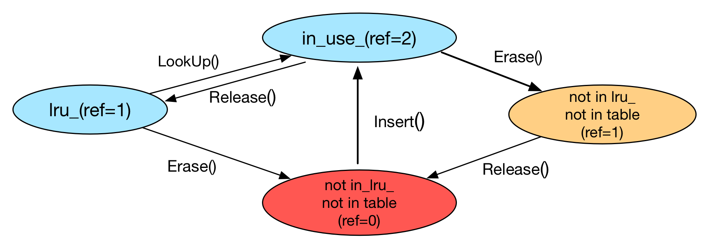

# 前言

# 说明
因为有很多专有名词和类名相同或类似，做以下分区。
- 有空格分隔的单词为专有名词。例如：LRU Cache 是指 LRU 类的 Cache。
- 没有有空格分隔的单词为类名，或其它程序的名字。例如：LRUCache，为程序中的类名。

# 正文
在 levelDB 中，有两个缓存。
- sstable 对象缓存（以下称 Table Cache）：缓存 sstable 文件对象 和 sstable 的 index_block 和 filter_block 的内容。
- data_block 缓存（以下称 Block Cache）：缓存 打开的 sstable 中的 data_block 数据。


各自特点如下：
关于 Table Cache
- 使用 LRU Cache 做为具体实现。
- cache 的 key 为 `file_number 和 file_number 的 size`。`file_number`为一个自增数，每创建一个文件自增一次。
- 每个 DB 只有一个 Table Cache，是 DB 模块的一个属性，在构造函数中被初始化。VersionSet 也有一个 Table Cache，这个 Table Cache 是 DB 模块传过去的`唯一 TableCache 的；引用`。
- 在读取 sstable 时会看是否有 TableCache 存在，如果有就使用，如果没有就加到 TableCache 里。

关于 Block Cache
- 使用 LRU Cache
- cache 的 key 为 `sstable 唯一ID + block offset`。sstable 的 `唯一ID` 并不是 sstable 文件里的内容，而是打开 sstable 时创建的`唯一ID`。也就是说，如果 table 的 cache 被删除掉了，这里的 cache 就没有用了。
- Block Cache 是全局 Options 里的一个属性。所有 DB 共享一个 Block Cache，这点和 Table Cache 不同。
- 在读取 data_block 时，会先看看有没有对应的 cache，如果有就使用，如果没有加到 Block Cache 里。

现在两个缓存的作用大概都清楚了，下面让我们看一下他们都使用的 LRU Cache。

# LRU Cache
简单的说一下这个 LRU Cache 的结构和原理：
- 是由两个类似 Java 的 HashMap 嵌套组成的。HashMap 的组成是一个数组，每个数组结点上是一个链表，链表上保存具体的元素。而 LRU Cache 也是有一数组，只是数组的每个结点是一个 HashMap。
- LRU Cache 的数组的每个结点上的操作，是线程安全的。这点和 Java 的 HashMap 的机制一样。
- 自动扩容是以 LRU Cache 的数组的每个结点为单位进行扩容的。
- LRU Cache 的数组的每个结点上，除了有一个 HashMap，还有两个链表。这两个链表来控制到达 LRU 的限制后，如何删除缓存数据。
- 使用`引用计数`的方式控制元素的删除。

这个结构的优点：
- 在查找时，从 HashMap 进行查找，时间复杂度为：O(n/(s1+s2))。n 为元素的个数，s1 为 LRU Cache 中的数组的个数，s2 为 HashMap 中数组的个数。
- 删除时，从链表进行删除，时间复杂度为 O(1)。因为 1 次就可以定位要删除结点的开始结点。

LRU Cache 很好的利用了 Hash 和 链表的特点，以空间换时间，实现最小时间复杂度。

## LRU Cache 的实现结构
整个 LRU Cache 由 4 个类组成，每个类的作用如下：
- LRUHandle：链表中的每个 node。有 refs(计数引用)、in_cache(是否在那两个链表中) data 等以我自己。
- HandleTable：类似于 HashMap，内部有一个数组，数组每个结点都是一个链表，来保存具体元素。
- LRUCache：是对 HandleTable 的一个包装，并且加入了用作 LRU 操作的两个链表：in_use_ 和 lru_。并且在这里，对并发操作进行同步处理，每次只有一个线程能进行对 HandleTable 的操作。
- ShardedLRUCache：相当于在 HashMap 上又套了一层。内部有一个数组，数组的每一个元素是一个 LRUCache。也就是说，要定位一个 key 时，需要进行至少进行两次定位操作：1，在 ShardedLRUCache 中定位在哪个 LRUCache。2，在 LRUCache 的 HandleTable 中定位在哪个数组结点上。


### ShardedLRUCache
我们先来说说 ShardedLRUCache，这个类的成员比较少：
- LRUCache shard_[kNumShards]：实现 Hash 结构中的数组，每个结点类型为 LRUCache。
- port::Mutex id_mutex_：生成`唯一ID`时所使用的锁。
- uint64_t last_id_：自增的`唯一ID`。在生产新的 Table Cache 时使用，每个 Table Cache 中的 Table 都有一个唯一ID，用作和 Blcok Cache 中的 data_block 进行关联。

#### 1，关于 kNumShards
kNumShards 是数组的个数，这里为 16。

#### 2，关于每个 LRUCache 的 capacity
每个 LRUCache 的 capacity 是指 LRUCache 能保存缓存的总字节数。这个属性是在 ShardedLRUCache 里进行初始化的。当你指定一个大小后，ShardedLRUCache 会把这个数变成能被数组个数（kNumShards）整除的数，然后分成数组个数分，设置每个 LRUCache 的 capacity。

变成能被数组个数整除的方法和 bloom filter 中位图大小取整方法一样，加上一个`比除数小 1`的数，然后除上除数。
> const size_t per_shard = (capacity + (kNumShards - 1)) / kNumShards;

#### 3，如何分桶
ShardedLRUCache 中分桶方法并不是 hash/kNumShards，而是取 hash 值的前 4 位，做为分桶值。（2^4 最大为 16）
> hash >> (32 - kNumShardBits);
> (kNumShardBits 为 4)

#### 4，其它
Insert、Lookup 等方法都调用 LRUCache 的方法。


### LRUCache
LRUCache 是这几个数中比较重要的类，因为它包含了两个链表，正是使用这两个链表实现的 LRU。下面我们看一下这个类的成员：
- size_t capacity_：可以包含缓存的总的字节数。
- mutable port::Mutex mutex_：用来保证变量的线程同步。
- size_t usage_ GUARDED_BY(mutex_)：当前缓存总字节数。一旦比 capacity 大，就要删除最不常被使用的缓存。
- LRUHandle lru_ GUARDED_BY(mutex_)：实现 LRU 机制的链表的头结点。基本上所有缓存都会保存在这个链表中（正在使用的缓存不会保存在这里，稍后说明）。lru.prev 指向最新的缓存，lru.next 指向最旧的缓存。下面会讲到 LRUHandle，这个类中有两个属性：refs 和 in_cache，lru_ 中保存是结点的这两个属性都是：`refs==1 and in_cache==true`。
- LRUHandle in_use_ GUARDED_BY(mutex_)：保存的是正在使用的缓存，这个链表中的缓存是不能被清除掉的，但缓存在这个链表中停留的时间非常短。稍后具体说明什么是`正在使用`。这个链表中的结点，属性都是：`refs >= 2 and in_cache==true.`
- HandleTable table_ GUARDED_BY(mutex_)：HandleTable 的引用。

#### 1，关于 lru_ 和 in_use_
lru_ 是实现 LRU 机制的链表头结点，`非正在使用`的缓存都会保存在这个链表中。在缓存满了的时候，就会从这个链表中删除数据。而 in_use_ 保存的是`正在使用`的缓存。那什么是`正在使用`呢？

我们先说一下具体实现。在 LRU Cache 的实现中，Insert 和 Lookup 的操作都分成两步：
- 实际的操作（例如：Insert 和 Lookup）
- Release

拿 Lookup 举例，在 levelDB 内部调用 ShardedLRUCache 的 Lookup 方法取得数据后，还需要调用调用 ShardedLRUCache 的 Release 方法，才算真正的一次 Lookup 操作完成。Insert 操作也是同理，必须调用一次 Release。

为什么要做 Release 操作呢？在 Insert、Lookup 和 Release 操作中，都涉及到了后面要讲了 LRUHandle 中的一个重要属性：refs。（还和 in_cache 相关，省略 in_cache 说明）
- refs：这个是用来记录 LRUHandle 的引用个数的，例如：如果有两个地方正在引用这个缓存，值就是 2。

Lookup 和 Release 对 refs 的影响是(Insert 同 Lookup)：
- 当缓存没有被 Lookup 时，refs 为 1，放到 lru_ 链表里面，意思是这些缓存是可以随时清除掉的。
- 当被 Lookup 了，但还没有 Release 时，refs 会加 1，变成 2，还要从 lru_ 中移动到 in_use_ 里，表示这些缓存正在使用，不可以被清除。
- 当被 Release 后，refs 会自动减 1，所以又变成了 1，还要放从 in_use_ 中放回到 lru_ 中。

由此可见，`正在使用`的意思是，调用了 Lookup 或 Insert 方法，还没有调用 Release 方法的时间点。

下面是在不同操作时，in_use_、lru_ 和 refs 之间的关系：



#### 2，什么时候清理 lru_
每次 Insert 后，都会判断是否 usage_ > capacity。如果超过 capacity，就删除缓存，一起删除到小于 capactity。


### HandleTable
HandleTable 类似于 HashMap，里面有一个数组，每个数组结点上都是一个链表，来存储具体的数据。而且当元素数量达到一定限度后，进行 resize 操作。具体属性如下：
- uint32_t length_：数组的长度。
- uint32_t elems_：保存的元素的总个数。是所有链表元素的和。
- LRUHandle** list_：数组指针，指向每个数组的第一个结点。其实实现上，没有具体的数组，是用数组指针实现的，但说是数组的话，比较好理解。

#### 1，关于 resize 方法
在 Insert 时，会判断元素数量超过一限定值。如果超过了，为了保存查询的性能，就要对数组进行扩容。那 levelDB 中是如何定义的呢？定义如下：
> 为了加快查询性能，尽量数组每个结点只保存一个元素。

也就是说，如果`保存的元素的总个数(elems_) > 数组的长度(length_)`的话，就要进行扩容。（虽然不太可能完全均匀分布，即每个数组每个结点只保存一个元素）


### LRUHandle
LRUHandle 就是链表的结点。这个类用在两个地方：
- HandleTable 中的数组上的结点。在数组的某个位置上元素有多个的话，是使用 LRUHandle 的 next_hash 属性连接起来的。因为只是从头向后查找，所以不需要 prev 属性。
- LRUCache 中的 _in_use 和 lru_ 的结点。这两条链表是需要可以前后查找的，所以需要 prev 和 next 属性。

刚才开始看这个类的属性时，next_hash 和 next 不知道到底是怎么使用。把单向链表和双向链表功能都放到了 LRUHandle 中。其它属性如下：
- void* value：保存 value 值的指针。
- void (*deleter)(const Slice&, void* value)：当删除 LRUHandle 时的 callback 函数。删除时的后续工作都在这个函数里执行，这个函数是调用者传过来的。
- LRUHandle* next_hash：上面已经说过
- LRUHandle* next：上面已经说过
- LRUHandle* prev：上面已经说过
- size_t charge：缓存的字节数大小
- size_t key_length：key 的长度
- bool in_cache：是否在缓存中。因为 levelDB 有关闭缓存的功能，LRUCache 类中的 capacity 为 0 的话，就代表关闭了缓存。但做为最基础的链表结点类 LRUHandle 无法得知 LRUCache 中的信息，所以就使用 in_cache 属性告诉 LRUHandle 不使用缓存。这样 LRUHandle 就不会对 refs 属性做操作了。
- uint32_t refs：当前使用这个缓存的`引用个数`。如果不为 0，代表有使用这个缓存的地方。在 in_use_ 或 lru_ 链表中的缓存，这个值至少为 1，因为至少被链表引用着。
- uint32_t hash：key 的 hash 值。
- char key_data[1]：key 开始的字节。

#### 1，什么时候 refs 会变成 0
当缓存满了，要从 lru_ 中删除 LRUHandle 时 refs 会变成 0。在删除级时会调用 FinishErase 方法，在 FinishErase 方法中会调用 Unref 方法，在 Unref 方法中会`先进行 refs--`，再判断是 refs 是不是 0。在进行 refs-- 后，refs 就是 0 了。

#### 2，会不会有 Lookup 而不 Release 的情况
不会有这种情况，如果有这种情况的话，缓存基本上无法删除了。


# 细节
## 1，两个缓存的关系
注意，两个缓存虽然在存储上，存在不同的对象中，但两者是有关联的。简单的说，关联是：
> 如果 Table Cache 中的缓存被删除了，Block Cache 中对应的 data_block 的缓存也就无法使用了。

**为什么会这样呢？**
因为在打开 sstable 时，针对打开的 sstable 会创建一个`唯一ID`，这个`唯一ID`是自增长的。就算打开相同 sstable，每次生成的`唯一ID`也是不一样的。这样如果 Table Cache 中的 sstable 缓存被清除掉了， 那在清除之前创建的`该 sstable`的 data_block 的缓存就无法使用了。因为 data_block 是需要`sstable 的唯一ID 和  Key`进行定位的，所以再打开`该 sstable`文件，生成的`唯一ID`是不一样的，无法定位到之前缓存的`相应的 data_block`。

**为什么要这样做呢？**
不太清楚原因，创建`唯一ID`的 NewId 方法上的注释如下：
```
// Return a new numeric id.  May be used by multiple clients who are
// sharing the same cache to partition the key space.  Typically the
// client will allocate a new id at startup and prepend the id to
// its cache keys.
```
上面说是为了`多 client`，但 NewId 是在 sstable 打开时(Table::Open)创建的，如果多个 client 访问 Table 的话，使用的`唯一ID`应该都是相同的才对。


## 3，关于代码的调用关系
Table 的内容的取得（InternalGet 和 NewIterator 方法；），基本上都是在 TableCache 中调用的（只有 dumpfile.cc 中直接调用了 Table::NewIterator 方法），可见 levelDB 的做法不是 Table 包含 TableCache，而是 TableCache 包含 Table。如果 Table 包含 TableCache 的话，外部使用类持有的 Table 的引用；而如果 TableCache 包含 Table 的话，外部使用有持有的是 TableCache 的引用。

## 4，调用完 ShardedLRUCache 的 Lookup（或 Insert）方法后，何时调用 Release？
上面文中说了什么时候进行 refs++，在调用 Release 的时候才会调用 refs--。那什么时候会调用 Release 呢？调用 Release 的时候，会不会造成正在使用的缓存被删除掉了呢？

总的说来，不管什么时候调用 Release，不能在`缓存正在被使用`的时候调用 Release，因为如果这个时候调用 Release，缓存就会被放回到 lru_ 链表中，就有可能随时被删除掉。这样使用时就可能出现`空指针`问题。所以一般会在下面的时刻调用 Release：
- 在使用缓存进行查询，并且查到数据`存在/不存在`的结果后，会进行调用 Release。
- 在使用缓存取得某个 Value，然后把 Value 复制一份后，会进行调用 Release。

### 代码执行过程
在读取数据时，会返回一个 Iterator。在创建 Iterator 之后，返回 Iterator 之前，会注册一个 Iterator 的 Cleanup 函数（使用 RegisterCleanup 注册），函数的内容之中就包含了 Release 方法，Cleanup 函数会在 Iterator 销毁时被调用(delete iter)。也就是说当 Iterator 被使用完了，得到想得到的值后，就会使用 delete 方法销毁它，这时候 Cleanup 会被调用。下面是 Iterator.h 中关于 RegisterCleanup 方法的一段注释：
```
// Clients are allowed to register function/arg1/arg2 triples that
// will be invoked when this iterator is destroyed.
```

例如：在 Table 的 InternalGet 方法中，会先用 BlockReader 取得 Iterator，然后使用它查找值，找到后就保存到参数中，然后销毁 Iterator。


## 5，什么时候删除 LRUCache 呢？如何删除呢？
上面说到，在 Iterator 创建时候，会注册一个 Cleanup 函数（调用 RegisterCleanup 进行注册），在销毁 Iterator 时会调用这个函数。在创建 LRUHandle 时，也会为它设置一个删除函数，这个函数叫 deleter。这个函数也会在 Unref 方法中可能会被调用，每次减少 refs 时，都会看一下是否为 0，如果为 0 就调用 deleter 函数，来删除这个缓存。

和 Iterator 不太相同的是：
- Iterator：在使用 delete 删除 Iterator 时，自动调用 Cleanup 函数。
- LRUCache：在删除时，需要主动调用 deleter 函数。


## 6，为什么要使用 lru_ 和 in_use_ 两个链表呢？使用一个链表行不行？
不行的。举个例子，如果只使用一个链表的话，在查找 key 是否在 data_block 时，可能因为 lru_ 满了，对 lru 删除操作同时进行。如果想正在使用的缓存不被删除，只能使用锁的方式，把缓存锁保护起来，但这样就造成了不能删除问题。

所以，把正在使用的缓存放到另一个链表中，避免锁和空指针问题。

## 7，删除 Table Cache 中的缓存后，Table 相应的 data_block 中的缓存删除吗？
不会立刻删除，因为 Table 的析构函数里，没有删除 options 里的 data_block 的语句。

但会随着超过 LRUCache 的大小时，删除 data_block。


# 个人总线：
## 1，LRUCache 结构的优点
这个结构的优点：
- 在查找时，从 HashMap 进行查找，时间复杂度为：O(n/(s1+s2))。n 为元素的个数，s1 为 LRU Cache 中的数组的个数，s2 为 HashMap 中数组的个数。
- 删除时，从链表进行删除，时间复杂度为 O(1)。因为 1 次就可以定位要删除结点的开始结点。
- 两个链表的插入时间复杂度基本上也是 O(1)，找到数组的结点后，把新元素放到第一个位置。

## 2，关于`引用计数`
使用`引用计数`的方式，主要是怕缓存在使用中时候，被销毁掉，造成空指针问题。如果不使用`引用记数`的方式的话，无法知道当前有多少个地方正在使用缓存。

**如何使用`引用计数`呢？**
引用计数使用方式是，在使用时把引用个数加 1，使用完后引用减 1。基本上不会出现只加不减的情况，但可能会出现只减不加的情况，比如删除时。


**那什么时候删除“使用引用计数的缓存”呢？怎么删除呢？**
1. 可以在要删除时，把引用减 1，然后判断是否还`引用==0`。如果为 0 说明没有地方再引用它了，就删除掉；如果不为 0，就先不管了。
2. 每个地方在使用完这个缓存后，做一次 1 中的`把引用减 1，然后判断 引用==0 ...`的操作。


# 参考：
- [缓存系统 — leveldb-handbook 文档](https://leveldb-handbook.readthedocs.io/zh/latest/cache.html)：用文字和图的方式详解 LRUCache。但其中说这个 LRU Cache 是核心部分是参照《Dynamic-Sized Nonblocking Hash Table》做的，但感觉不太像，而且论文的时间是 2014 年，
- [leveldb 笔记五：LRUCache的实现 - Kaiyuan's Blog | May the force be with me](http://kaiyuan.me/2017/06/12/leveldb-05/)：其中的 ref 变化的状态图挺不错的。
- [leveldb中的LRUCache设计](http://bean-li.github.io/leveldb-LRUCache/)：讲了 LRU Cache 中 4 个类的作用，和一些代码解析。
- [LevelDB源码解析28. Cache的设计 - 知乎](https://zhuanlan.zhihu.com/p/45881976)：讲了 levelDB 的缓存分成两部分缓存，还讲了`深浅拷贝`和`引用计数`的关系，感觉不有点微妙。
- [Leveldb之LRUCache实现 ·](http://kernelmaker.github.io/Leveldb_LRUCache)：有很多代码注释，在没看代码时，可以先看看。
- [读代码：LevelDB中的LRUCache实现 - 简书](https://www.jianshu.com/p/9e7773432772)：讲了一些时间复杂度，和为什么要使用引用计数。
- [读代码：LevelDB中的LRUCache实现 - 简书](https://www.jianshu.com/p/9e7773432772)：有一个 in_use_、lru_ 和 refs 关系图不错
- [leveldb](https://dirtysalt.github.io/html/leveldb.html#org2e948b1)：关于源码的一些类的说明，对于看源码很不错。


# todo
1，删除 Table Cache 中的缓存后，Table 相应的 data_block 中的缓存删除吗？

2，什么 LRUCache 的 FinishErase 方法上有锁，其它方法上没有锁呢？

3，LRUCache 类里的同步，只有 FinishErase 是方法级同步，其它都是变量级同步。所以是不是如果不使用 in_use_ 的话，刚放到或者刚读取的 lru_ 中的缓存，会被别的线程给清除了，造成空引用？


# 关于源码的临时记录
关于源码文件：
1，关于 sstable 的读和写
- 读：使用 Table（table.cc）进行 sstable 的读操作。
- 写：使用 TableBuild（table_builder.cc）进行 sstable 的写操作

2，关于 Cache
- TableCache：table_cache.cc 中的类。

关于 Table Cache（保存 Table 对应的 file 和 sstable 在内存中的对象的引用）
- 使用 LRUCache
- cache 的 key 为 `file_number 和 file_number 的 size`。
- 每个 DB 只有一个 TableCache，是 DB 模块的一个属性，在构造函数中被初始化。VersionSet 也有一个 TableCache，这个 TableCache 是 DB 模块传过去的`唯一 TableCache 的引用`。
- 调用 TableCache 的 FindTable 方法时，就从内存里去查找 table。调用 FindTable 方法有两个方法，全是在 TableCache 的内部进行的：NewIterator 和 Get 方法。至于 哪里会调用 NewIterator 和 Get 方法：
  * 在 db_impl.cc 创建 level0 table 时，在 BuildTable 里会调用 NewIterator 来检查 table 是否可用。
  * 在 VersionSet 中 Get 方法中，会调用 TableCache 的 Get 方法。在其它方法中，还会调用 NewIterator 方法。

关于 block cache（保存在 Options 里）
- 使用 LRUCache
- cache 的 key 为 `sstable 唯一ID + block offset`。sstable 的 `唯一ID` 并不是 sstable 文件里的内容，而是打开 sstable 时创建的`唯一ID`。也就是说，如果 table 的 cache 被删除掉了，这里的 cache 就没有用了。
- block cache 是全局 Options 里的一个属性。所有 DB 共享一个 block cache。
- block cache 会在 Table 调用 BlockReader 方法时被使用。什么地方调用 BlockReader 方法呢？Table 调用 InternalGet 方法时，会调用 BlockReader 方法。InternalGet 方法在 TableCache::Get 方法中会被调用。


TableCache 有 Table 的引用，而 Table 中有 block_cache 的引用。sstable 的 index block 和 filter block 是在 Table 的 Open 方法中读取出来了。对于具体 data_block 读取是在 block.cc 的 Seek 方法中做的。

sstable 中的 number 是生成一个自增数。是由 version_set.h 中的 NewFileNumber 方法生成的。

