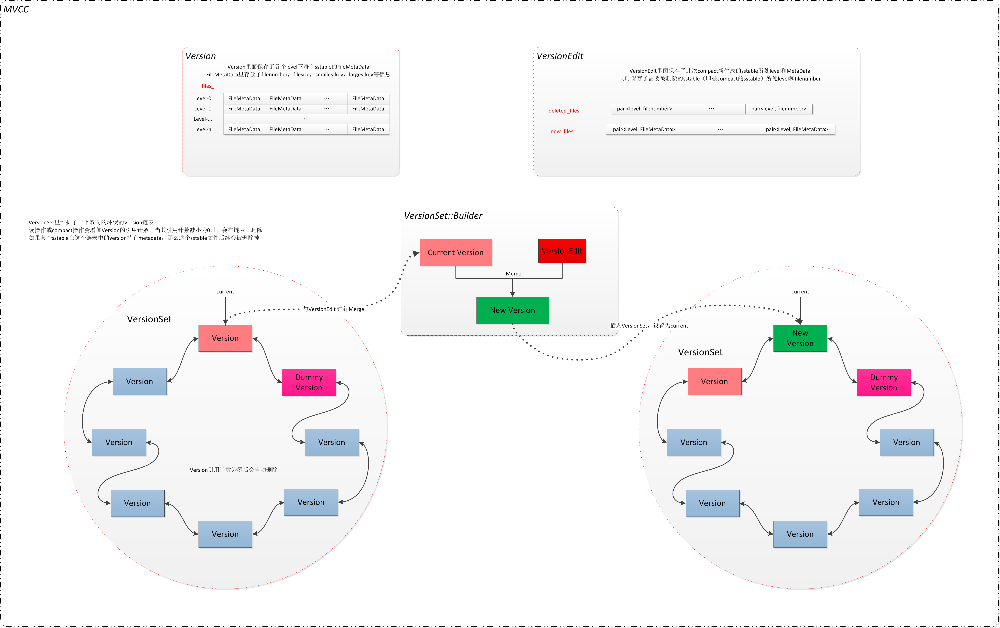
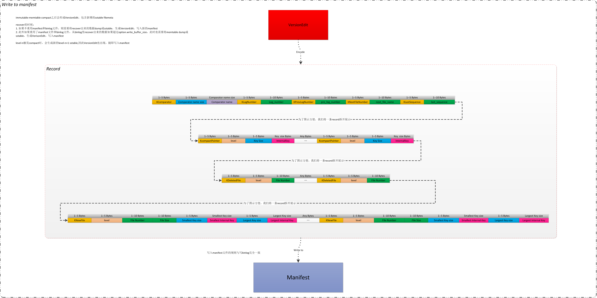

# 什么是版本控制
版本控制是 Compaction 之后要做的事情。在 Compaction 之后，sstable 文件的个数和内容会变化。但变化了会有什么情况呢？请看下面的例子

## 例子
在说明版本控制之前，我们举个例子。

在 levelDB 内部进行查找操作时，会生成一个 Iterator，sstable 的查找操作也是抽象成了 Iterator。有一个线程正在使用 Iterator 对 sstable 011 进行查找，但后面也进行着 Compaction。在 Compaction 处理中，把 sstable 011 给合并到了其它 sstable 中，所以 sstable 011 没有用了，需要删除掉。

上面说了，正有 Iterator 对 sstable 011 进行查找，如果这时把 sstable 011 删除掉，就会出错。这时应该怎么办呢？其实版本控制就是来解决这样的问题的。

## levelDB 解决方法
levelDB 在解决例子中问题时，是使用`版本`的方式来解决的。每次 Compaction 之后，都会创建出一个 Version，这个 Version 包含了 Compaction 之后所能使用的 sstable 列表。Compaction 之前的 Version 包含了 Compaction 之前的 sstable 列表。`新 Version`创建所，也不会立刻删除掉`之前的 Version`，`之前的 Version`确认没有人使用后，才会删除掉。

拿上面的例子来说，sstable 和 Version 变化如下：

No. | Iterator 状态 | compaction 状态 | sstable 状态 | 当前 version | 新 version
---|---|---|---|---|---
1 | 正在查找 sstable 011 |  未进行 | sstable 011, 012, 013 | sstable 011, 012, 013 | -
2 | 正在查找 sstable 011 | 进行中 | sstable 011, 012, 013 正合并生成 014 |  sstable 011, 012, 013 | -
3 | 正在查找 sstable 011 | 完成 | sstable 011, 012, 013, 014 | sstable 011, 012, 013 | sstable 014
4 | 查找完毕 | 完成 | sstable 014 | 当前 version 被删除 | sstable 014

## 版本控制是什么
从上面的例子来看，版本控制是应对 Compaction 后，对 sstable 的管理功能。

# 版本管理结构
levelDB 的版本管理功能，主要由 3 个类来组成：
- Version：Version 主要是用来记录可以的 sstable 列表。每次 Compaction 后都会产生一个 Version。
- VersionEdit：记录发生 Compaction 时，sstable 发生产的增减变化。
- VersionSet：对 Version 和 VersionSet 的管理类。VersionSet 中会管理多个 Version 和一个 VersionEdit。

VersionSet 中会管理多个 Version 和一个 VersionEdit 的原因如下：
每次 Compaction 都会生产一个 Version，如果`新 Version`生成后，`旧 Version`没有使用的话就会删除了，但如果还使用的话就还会存在，所以会同时存在多个 Version。VersionEdit 只有一个的原因是，只有 Compaction 时才会生成它，而 Compaction 是单线程处理，所以只有一个。

VersionSet 中还有一个 current，来指向当前`最新的 Version`。

这三者的结构图如下：

# 版本控制 Add Version 流程

## 1，Compaciton
版本控制是主要是应对 Compaction 后的结果，所以 Compaction 是版本控制的发起者。Compaction 有两种：Minor 和 Major。在这两种 Compaction 后都会调用版本管理的方法（LogAndApply）。

## 2，生成 VersionEdit
在 Compaction 之后，sstable 会产生变化：
- Minor Compaction：会增加 sstable，增加到 level 0~2 层中。
- Major Compaction：会增加或减少 sstable。

这时会生成一个 VersionEdit 对象，来记录 sstable 的变化。VersionEdit 重要属性如下：
- new_files_：记录新增加的 sstable
- deleted_files_：记录要删除的 sstable

## 3，生成`新 Version`
`新 Version`是通过`当前 Version`和 VersionEdit 生成的。即：
> Version0 + VersionEdit = Version1

新建一个 Version，然后根据 VersionEdit 和 current Version 进行设置这个 Version 里的 sstable。

## 4，计算是否需要进行 Major Compaction
这里主要是针对 level0 的文件个数，和 level 1~6 的文件总大小，来计算是否需要 Major Conpaction。

## 5，生成 Manifest 文件
在生成完新的 Version 后，要把 VersionEdit 的内容放到记录到 Manifest 文件中（todo 为什么要记录下来？）。

### （1）先判断是否需要创建新 Manifest 文件
这个判断主要用在 DB 刚启动时。启动时根据 Manifest 文件的大小，来判断是继续使用之前的文件，还是新创建一个文件。主要是因为防止 Manifest 文件过大，因为在其它时候没有删除 Manifest 文件的处理。

### （2）把 VersionEdit 内容写到 Manifest 文件中。
我们先看一下 VersionEdit 要写的内容都有什么。主要内容如下：
- std::string comparator_：比较器的名字。
- uint64_t log_number_：当前时间点，最新的`日志` number。
- uint64_t prev_log_number_：废止
- uint64_t next_file_number_：
- SequenceNumber last_sequence_：当前最新的`sequence number`.
- std::vector< std::pair<int, InternalKey> > compact_pointers_：保存每个 level 最近一次 compaction 到哪个 key。
- DeletedFileSet deleted_files_：删除的 sstable 文件列表。
- std::vector< std::pair<int, FileMetaData> > new_files_：增加的 sstable 文件列表。在写入到 Manifest 文件时，不只写文件名，还有`文件所在 level`、file number、文件大小、最大 key、最小 key。

在写到 Manifest 文件之前，会对这些内容进行整理，整理成一个字符串后写到 Manifest 文件中。写 Manifest 文件时，保存的数据格式是使用的 WAL/journal 格式，就是以 Record 为一个最小单位。

## 6，设置 current 文件
如果 Manifest 文件是新创建的，则把文件名设置到 Current 文件上。Current 文件记录当前最新的 Manifest 文件。

## 7，把新创建的 Version 保存起来
创建完 Version 后需要加到 Version 链表里保存起来。然后设置到 VersionSet 的 current 属性上。因为 VersionSet 的 current 属性保存的是最新的 Version，所以在生成新的 Version 后，需要把这个 Verison 设置到 current 属性上。

# MANIFEST 文件的增长和重新生成
存在一个问题不知道大家有没有意识到，随着时间的流逝，发生Compact的机会越来越多，Version跃升的次数越多，自然VersionEdit出现的次数越来越多，而每一个VersionEdit都会记录到MANIFEST，这必然会造成MANIFEST文件不断变大。

MANIFEST文件和LOG文件一样，只要DB不关闭，这个文件一直在增长。我查看了我一个线上环境，MANIFEST文件已经膨胀到了205MB。

事实上，随着时间的流逝，早期的版本是没有意义的，我们没必要还原所有的版本的情况，我们只需要还原还活着的版本的信息。MANIFEST只有一个机会变小，这个机会就是重新开启DB。

> LevelDB的早期，只要Open DB必然会重新生成MANIFEST，哪怕MANIFEST文件大小比较小，这会给打开DB带来较大的延迟。有一个 commit 将 Open DB 的延迟从80毫秒降低到了0.13ms，效果非常明显，即优化之后，并不是每一次的Open都会带来 MANIFEST的重新生成。

但是如果MANIFEST文件已经太大了，我们没必要保留全部的历史VersionEdit，我们完全可以以当前版本为基准，打一个SnapShot，后续的变化，以该SnapShot为基准，不停追加新的VersionEdit。生成一个新的 MANIFEST 文件后，同时调用 WriteSnapShot 将当前版本情况作为起点记录到MANIFEST文件。

这种情况下，MANIFEST文件的大小会大大减少，就像自我介绍，完全可以自己出生起开始介绍起，完全不必从盘古开天辟地介绍起。

> 注册，新生成 Manifest 文件后，并不是立刻删除上一个 Manifest 文件，是通过 Compaction 后调用 DeleteObsoleteFiles 来删除的。

# 细节
## 1，Version and MVCC
对于同一笔记录，如果读和写同一时间发生，reader可能读到不一致的数据或者是修改了一半的数据。对于这种情况，有三种常见的解决方法：

类型 | 处理
---|---
悲观锁 | 最简单的处理方式，就是加锁保护，写的时候不许读，读的时候不许写。效率低。
乐观锁 | 它假设多用户并发的事物在处理时不会彼此互相影响，各事务能够在不产生锁的的情况下处理各自影响的那部分数据。在提交数据更新之前，每个事务会先检查在该事务读取数据后，有没有其他事务又修改了该数据。如果其他事务有更新的话，正在提交的事务会进行回滚;这样做不会有锁竞争更不会产生死锁，但如果数据竞争的概率较高，效率也会受影响 。
MVCC | MVCC是一个数据库常用的概念。Multiversion concurrency control多版本并发控制。每一个执行操作的用户，看到的都是数据库特定时刻的的快照(snapshot), writer的任何未完成的修改都不会被其他的用户所看到;当对数据进行更新的时候并是不直接覆盖，而是先进行标记, 然后在其他地方添加新的数据，从而形成一个新版本, 此时再来读取的reader看到的就是最新的版本了。所以这种处理策略是维护了多个版本的数据的,但只有一个是最新的。

`Snapshot 的读一致性保证` 和 `Compaction 时 sstable 写并发`都是利用了 MVCC 机制，利用 Version 来实现的。

# 2，关于文件的删除
每一次 Compaction 后都会就是用 DeleteObsoleteFiles 方法，这个方法是用来判断各种类型的文件是否有用，是否需要删除。

# 关于源码
1，Version 的生成和 Manifest 文件的写入。
这两件事都是在 VersionSet::LogAndApply 方法中进行的。Version 的创建和 VersionEdit 的合并，是在 VersionSet 内部的 Builder 做的。

# 参考
- [leveldb之Version VersionEdit and VersionSet](http://bean-li.github.io/leveldb-version/)：主要是参考这个文章
- [leveldb之MANIFEST](http://bean-li.github.io/leveldb-manifest/)：主要是参考这个文章
- [版本控制 — leveldb-handbook 文档](https://leveldb-handbook.readthedocs.io/zh/latest/version.html)：主要是参考这个文章

